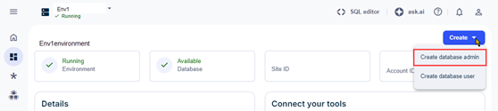

Database administrators (DBAs) are responsible for keeping the database at peak performance, and for ensuring that the data is secure and protected. DBAs are database users who perform a variety of administrative tasks.

As an organization admin, you can create the first DBA for environments by selecting Create database administrator from an environment’s dashboard. Once the primary DBA is created, the DBA user can create any subsequent DBAs and users for the environment.

**Note:** Some options may be pre-selected or unavailable in a VantageCloud Lake trial environment.

1.  From the menu, select an environment from the **Home** page.

1.  Select **Create** > **Create database admin**.

    

1.  Enter the root password.

    The root password belongs to the username DBC and was established when you created the environment. If you have forgotten your password, call your Teradata support representative.

1.  Enter the database admin credentials using the guide for creating a password.

1.  [Optional] Use the **Advanced options** section to specify the amount of [Permanent space](yvc1731523611301.md) and [Character set](hnk1731523638342.md) for the environment.

1.  Select **Create**.

    You can optionally select **Show SQL** to view the assigned privileges before creating the database admin user. This is a view-only screen. If an error occurs, try again or call contact your support administrator.

1.  If relevant, sign out as the organization admin and sign back in as the newly created DBA to continue any other configurations.

