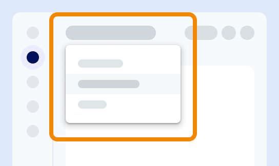

Here, you can access common features including these:

-   SQL editor

-   ask.ai, our AI-powered chatbot

-   Context-specific help

-   User settings

-   Other common tasks

You can use the **Environments** menu to quickly switch between different environments.

---

**Next:** [Explore the learning resources](xex1721168413281.md)

