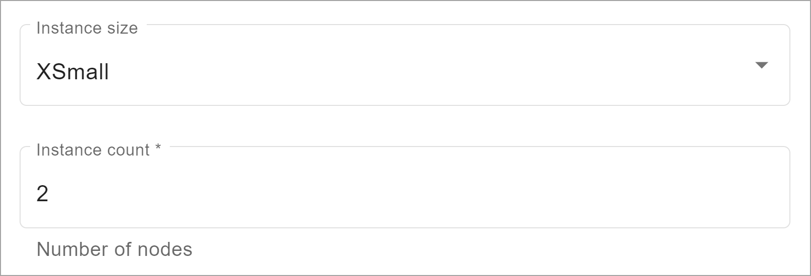
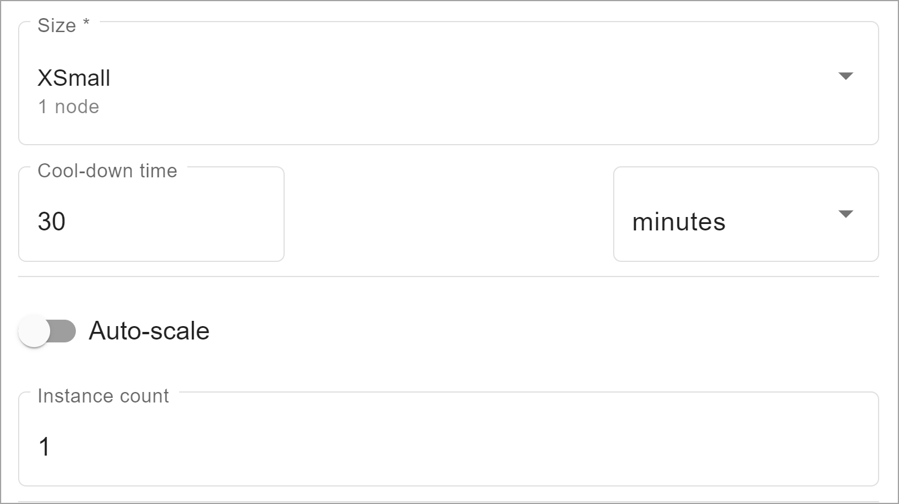

You manage compute consumption two ways.

## Primary cluster

As an organization admin, when you [create an environment](qiv1640281527006.md), you select the **Instance size**, which is the size of each node in the primary cluster. You also select an **Instance count**, the number of nodes.

The units consumed by the **Instance size** multiplied by the **Instance count** are the units the primary cluster consumes per hour.

Units consumed by **Instance size**:

|Instance size|Lake units|Lake+ units|
|-------------|----------|-----------|
|XSmall|2|2.4|
|Small|4|4.8|
|Medium|7|8.4|
|Large|10|12|
|XLarge|13|15.6|
|XXLarge|20|24|
|XXXLarge (on Azure)|27.0|32.4|

## Compute groups

If a compute group has more capacity, more queries can run concurrently. Query concurrency and query size affect the time needed to complete work.

As an organization admin or compute group admin, when you [manage compute profiles](dvl1640281718303.md), you select a **Size**, which is the number of nodes in each compute cluster. You also select an **Instance count**, the number of compute clusters.

The units consumed by that **Size** multiplied by the **Instance count** are the units the compute group consumes per hour while the profile is active.

You can set compute clusters to scale automatically, from a minimum to a maximum instance count, to accommodate changing workloads. If you do, the units consumed per hour varies.

Units consumed by **Size**:

|Node size|Lake units|Lake+ units|
|---------|----------|-----------|
|XSmall (1 node)|10|12|
|Small (2 nodes)|20|24|
|Medium (4 nodes)|40|48|
|Large (8 nodes)|80|96|
|XLarge (16 nodes)|160|192|
|XXLarge (32 nodes)|320|384|

