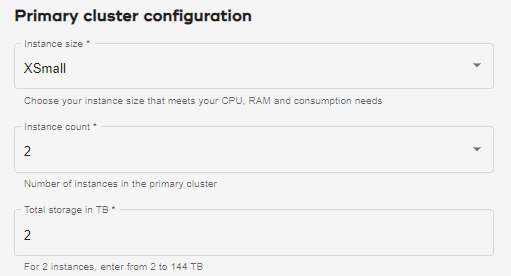

You manage compute consumption two ways.

## Primary cluster

As an organization admin, when you [create an environment](qiv1640281527006.md), you select the **Instance size**, which is the size of each node in the primary cluster. You also select an **Instance count**, the number of nodes on the primary cluster.

The units consumed by the **Instance size** multiplied by the **Instance count** are the units the primary cluster consumes per hour.

After provisioning your environment, you can scale the original instance size up or down by two instance sizes. Scaling requires restarting the primary cluster. Active sessions and queries are held by the Session Manager during the restart.

**Important**: Do not perform this task without the assistance of Teradata Services. Create a change request on [https://support.teradata.com](https://support.teradata.com) and request to have the instance size of your primary cluster changed.

Your cost is impacted based on the size of your instance. Scaling up improves performance when the workload increases short-term or data-intensive tasks are being worked on. However, scaling up increases your cost. Scaling down decreases cost but also reduces memory and compute resources. Scaling down is beneficial when system demand is reduced, such as nonpeak hours or during a slower business season.

## Compute groups

If a compute group has more capacity, more queries can run concurrently. Query concurrency and query size affect the time needed to complete work.

As an organization admin or compute group admin, when you [manage compute profiles](dvl1640281718303.md), you select an **Instance size**, which is the number of nodes in each compute cluster. You also select an **Instance count**, the number of compute clusters.

The units consumed by the **Instance size** multiplied by the **Instance count** are the units the compute group consumes per hour while the profile is active.

You can set compute clusters to scale automatically, from a minimum to a maximum instance count, to accommodate changing workloads. If you do, the units consumed per hour varies.

