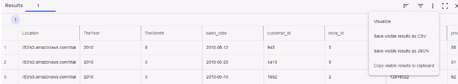

Let’s build a chart to easily see which days have the most sales.

1.  Select  then **Visualize** from the results menu.

    

    The **Results** tab shows basic information about the dataset and helps you identify any missing values.

1.  On the **Visualization** page, select the **Charts** tab.

1.  Under **Properties**, select:

    1.  Select **sales_date** for the X-axis.

    1.  Select **sales_quantit**y for the Series.

    1.  Select **Count** for the function.

1.  You can leave everything else as the default then select **Run**.

Congratulations! You've run your first query and visualized the results.

See [Using the editor](xbg1640280430669.md) to learn more about the SQL editor, visualizations, and analytic functions.

