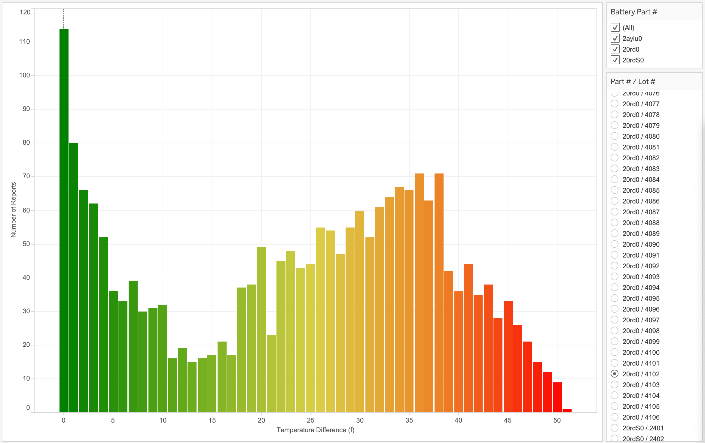

## Manufacturing Defect Analysis


### Introduction

You are an analyst at a major auto manufacturer. While running regular financial reports on Teradata Vantage we have discovered a serious business issue with increasing warranty repairs:


The issue is primarily driven by battery pack replacements. As an EV (electric vehicle) manufacturer these are one of the most expensive and critical components that go into our product. We can use Vantage and the structured and semi-structured data that we capture in the manufacturing process to isolate and address this issue.

### Experience

The Experience section takes about 15 minutes to run.

### Setup

Select **Load Assets** to create the tables and load the data required into your account (Teradata database instance) for this use case.
[Load Assets](#data={"id":"EVCarBattery"})

### Walkthrough
***


#### Step 1: Narrow down the root cause

We have done some preliminary analysis and run a report of all the VIN (vehicle identification numbers) of the cars that we have had to do a battery replacement under warranty:


```sql
SELECT d.company, count(*)
FROM retail_sample_data.ev_dealers d, retail_sample_data.ev_badbatts bb,
retail_sample_data.ev_vehicles v
WHERE bb.vin = v.vin
AND v.dealer_id = d.id
GROUP BY d.company order by 2 desc
```


Next let's look at the various car models the batteries are in. We use the same set of battery parts in several different models across our product line:


```sql
SELECT v.model, count(*)
FROM retail_sample_data.ev_vehicles v, retail_sample_data.ev_badbatts bb
WHERE bb.vin = v.vin
GROUP BY v.model order by 2 desc
```

Nothing significant there, better keep looking...

Now take a look at the assembly plants that the cars are from:


```sql
SELECT mfg.company, count(*)
FROM retail_sample_data.ev_mfg_plants mfg, retail_sample_data.ev_badbatts bb,
retail_sample_data.ev_vehicles v
WHERE bb.vin = v.vin
AND v.mfg_plant_id = mfg.id
GROUP BY mfg.company order by 2 desc
```

A very high number of faulty cars all came from the same assembly plant!

Find out what battery cells are installed in the cars with bad batteries:


```sql
SELECT DISTINCT bom.part_no, p.description, count(*)
FROM retail_sample_data.ev_bom, retail_sample_data.ev_badbatts bb, retail_sample_data.ev_parts p
WHERE bb.vin = bom.vin
AND bom.part_no = p.part_no
AND p.description LIKE 'Battery Cell%'
GROUP BY bom.part_no, p.description
```

Ok, certainly looks like we have an issue with part_no '20rd0'!

We store detailed manufacturing data in our integrated data warehouse. See if there is a correlation to lot numbers for those battery cells:


```sql
SELECT bom.part_no, bom.lot_no, p.description, count(*)
FROM retail_sample_data.ev_bom bom, retail_sample_data.ev_badbatts bb, retail_sample_data.ev_parts p
WHERE bb.vin = bom.vin
AND p.part_no = bom.part_no
AND p.description LIKE 'Battery Cell%'
GROUP BY bom.part_no, bom.lot_no, p.description
ORDER BY count(*) DESC
```

Okay, now we know the underlying issue with part_no '20rd0' - the majority of the failures are frrom battery lot '4012' (which turns out to have been delivered to the Jackson Plant) has a huge number of the faulty batteries that are driving our warranty replacements. These insights show up even better on our dashboard in our favourite BI tool which connects directly to Vantage and allows interactive & iterative analysis:


Our modern connected EV cars provide detailed sensor data as well. We can also look at the temperature sensor data for the battery lot in question:



Compare that to an average battery lot:


You can clearly see the occurances of higher temperatures / overheating in our battery packs depending on the battery pack model / lot no. So we now see what is the underlying cause of our increased warranty costs, but we want to dig deeper into the issue - back when the cars were assembled and tested so we can prevent it in the future.

#### Step 2: We need additional data - Access test results from our Data Lake

Taking this analysis even further, we want to understand how we can detect bad batteries before they end up in our customers' cars. This will help us avoid expensive warranty repair cycles and poor customer satisfaction in the future. When the cars are manufactured we store detailed test reports for the various parts and subsystems that comprise the vehicle. These are voluminous semi-structured data and are loaded directly into our Data Lake which is housed in an object store.

Using Teradata Vantage we can natively pull in this data and use it for our analysis!

Create a foreign table to access the JSON formatted data in Amazon S3:


```sql
CREATE FOREIGN TABLE test_reports
(
    Location VARCHAR(2048) CHARACTER SET UNICODE CASESPECIFIC,
    payload JSON(16776192) INLINE LENGTH 64000 CHARACTER SET LATIN)
USING (
    Location ('/s3/s3.amazonaws.com/trial-datasets/retail_sample_data')
), NO PRIMARY INDEX
```


```sql
SELECT TOP 10 *
FROM test_reports
```

Put a user friendly view on top of the foreign table to shred the files and make the test report data easier to access:


```sql
REPLACE VIEW test_reports_v AS
(SELECT vin, part_no, lot_no, CAST(test_report AS JSON) test_report
FROM TD_JSONSHRED(
    ON (
                SELECT payload.vin as vin, payload
                FROM test_reports)
            USING
            ROWEXPR('parts')
            COLEXPR('part_no', 'lot_no', 'test_report') 
            RETURNTYPES('VARCHAR(17)', 'VARCHAR(1000)', 'VARCHAR(10000)')
        ) AS d1 (vin, part_no, lot_no, test_report)
    )
```

```sql
SELECT TOP 10 *
FROM test_reports_v
```

#### Step 3: Access and join the JSON manufacturing test data natively in Vantage

That looks good, now lets take a look at what is in the test reports. Various parts will have different data that gets reported when testing, the test results for the simplest parts look like this:


```sql
SELECT TOP 1 test_report
FROM test_reports_v
WHERE part_no = '11400zn'
```

In contrast, the test report for a battery has detailed data on the performance of the battery after it is assembled but before it goes into the vehicle:


```sql
SELECT TOP 1 test_report
FROM test_reports_v
WHERE part_no = '20rdS0'
```


We want to compare the rated and measured capacities along with part/lot numbers for just the batteries - we can easily drill into the JSON data using simple dot notation to access the test resuls we need.


```sql
SELECT TOP 10 tr.part_no, p.description, tr.lot_no, 
tr.test_report."Rated Capacity" AS rated_capacity,
tr.test_report."Static Capacity Test"."Measured Average Capacity" AS measured_capacity
FROM retail_sample_data.parts p, test_reports_v tr
WHERE  p.part_no = tr.part_no
AND p.description LIKE 'Battery Cell%'
```

Visualising this in our BI tool we can see that these battery packs are actually within the spec, but the range is much lower than the other battery lots. With this insight we can tighten up our acceptance criteria as well as do proactive analysis like this to identify possible quality issues before the cars are completed and delivered to our customers. These initiatives will increase product quality and make sure this doesn't happen again!


By using Teradata Vantage to analyse both our integrated data and the Data Lake we can get to the bottom of virtually any business problem quickly and easily!

#### Step 4: Clean-up

Drop the objects we created in our own database schema.


```sql
DROP TABLE test_reports;
```

```sql
DROP VIEW test_reports_v;
```


## Dataset
***

<b>bom</b> - Bill of materials - Contains all major parts that make up each vehicle:

- `id`: unique identifier
- `vin`: vehicle identification number
- `part_no`: part number
- `vendor_id`: vendor the part was produced by (unused)
- `lot_no`: lot number from the vendor
- `quantity`: how many of this part are in the vehicle

<b>dealers</b> - Vehicle sales and distributors:

- `id`: unique identifier
- `Company`: company name
- `StreetAddress`: street address
- `City`: city
- `State`: state
- `ZipCode`: postcode
- `Country`: country
- `EmailAddress`: main email address
- `TelephoneNumber`: telephone number
- `DomainName`: URL for company website
- `Latitude`: latitude (location)
- `Longitude`: longitude (location

<b>mfg_plants</b> - Manufacturing facilities:

- `id`: unique identifier
- `Company`: facility name
- `StreetAddress`: street address
- `City`: city
- `State`: state
- `ZipCode`: postcode
- `Country`: country
- `EmailAddress`: main email address
- `TelephoneNumber`: telephone number
- `DomainName`: URL for plant website
- `Latitude`: latitude (location)
- `Longitude`: longitude (location

<b>parts</b> - Master list of parts for all vehicles:

- `part_no`: unique part number
- `description`: part description


<b>vehicles</b> - Vehicles we have built/are building:

- `vin`: unique identifier
- `yr`: model year
- `model`: vehicle model code
- `customer_id`: customer / purchaser
- `dealer_id`: dealer where vehicle was sold/delivered
- `mfg_plant_id`: plant the vehicle was assembled


