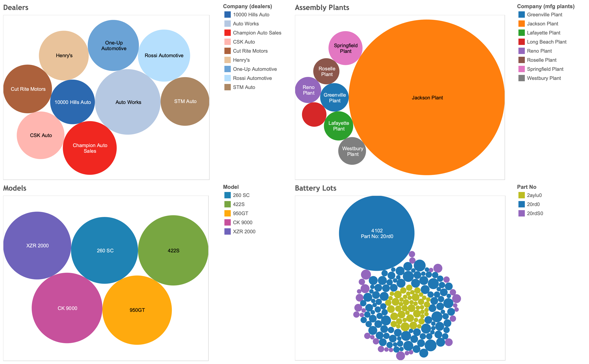

## Manufacturing defect analysis

### Before you begin

Open Editor to proceed with this use case.
[LAUNCH EDITOR](#data={"navigateTo":"editor"})

### Introduction

You are an analyst at a major auto manufacturer. While running regular financial reports on Teradata VantageCloud Lake, we’ve discovered a serious business issue with increasing warranty repairs:


The issue appears to be driven by battery pack replacements—some of the most expensive and critical components that go into our electric vehicle (EV) products. We can use the unique capabilities of VantageCloud Lake to analyze both the structured and semi-structured data captured during the manufacturing process in order to isolate the root cause and ultimately address the issue.

### Experience

The Experience section takes about 15 minutes to run.

### Setup

Select **Load Assets** to create the tables and load the data required into your account (Teradata database instance) for this use case.
[Load Assets](#data={"id":"EVCarBattery"})

### Walk-through
***


#### Step 1: Narrow down the root cause

We’ll run a report of all the vehicles that had their batteries replaced and combine battery and vehicle information with the servicing dealer. For this example, all the data is in the database, but in the real world, combining disparate datasets is a key enabler to effective analytics. VantageCloud Lake allows users to combine data from various third-party systems, data lakes, and object stores at scale to effect rapid and detailed analysis. 


```sql
SELECT d.company, count(*)
FROM ev_dealers d, ev_badbatts bb,
ev_vehicles v
WHERE bb.vin = v.vin
AND v.dealer_id = d.id
GROUP BY d.company order by 2 desc
```


Next, group the data based on the model of vehicle. We use the same set of battery parts in several different models across our product line:


```sql
SELECT v.model, count(*)
FROM ev_vehicles v, ev_badbatts bb
WHERE bb.vin = v.vin
GROUP BY v.model order by 2 desc
```

Nothing significant there. 

Now, group by the assembly plant that the cars are from:


```sql
SELECT mfg.company, count(*)
FROM ev_mfg_plants mfg, ev_badbatts bb,
ev_vehicles v
WHERE bb.vin = v.vin
AND v.mfg_plant_id = mfg.id
GROUP BY mfg.company order by 2 desc
```

We see a very high number of faulty cars from the same assembly plant. 

Now, find out which battery cells are installed in the cars with bad batteries. Use the part number to aggregate the data.


```sql
SELECT DISTINCT bom.part_no, p.description, count(*)
FROM ev_bom bom, ev_badbatts bb, ev_parts p
WHERE bb.vin = bom.vin
AND bom.part_no = p.part_no
AND p.description LIKE 'Battery Cell%'
GROUP BY bom.part_no, p.description
```

After running this query, it looks like we have an issue with part_no 20rd0. 

VantageCloud Lake allows organizations to store and analyze vast amounts of data in performance and cost-optimized object storage. For this demonstration, we store detailed manufacturing data in our integrated data warehouse. See if there is a correlation to lot numbers for those battery cells:


```sql
SELECT bom.part_no, bom.lot_no, p.description, count(*)
FROM ev_bom bom, ev_badbatts bb, ev_parts p
WHERE bb.vin = bom.vin
AND p.part_no = bom.part_no
AND p.description LIKE 'Battery Cell%'
GROUP BY bom.part_no, bom.lot_no, p.description
ORDER BY count(*) DESC
```

The above query shows the underlying issue with part_no 20rd0. Most of the failures are from battery lot 4012 (delivered to the Jackson Plant), which has a huge number of faulty batteries that are driving our warranty replacements. These insights show up even better on our dashboard in our favorite business intelligence (BI) tool, which connects directly to VantageCloud Lake and allows interactive and iterative analysis: 



Our modern connected EV cars provide detailed sensor data as well. We can look at the temperature sensor data for the battery lot in question:


Compare that to an average battery lot:


You can clearly see the occurrences of higher temperatures/overheating in our battery packs depending on the battery pack model/lot number. Now we see the underlying cause of our increased warranty costs, but we want to dig deeper into the issue—looking back to when the cars were assembled and tested.


#### Step 2: We need additional data - Access test results from our Data Lake

Taking this analysis even further, we want to understand how we can detect bad batteries before they end up in our customers’ cars. This will help us avoid expensive warranty repair cycles and customer dissatisfaction in the future.  

When the cars are manufactured, we store detailed test reports for the parts and subsystems that comprise the vehicle. These reports are voluminous, and in a semi-structured format, stored in our data lake housed on an object store. 

Using VantageCloud Lake, we can natively pull in this data at scale and use it for our analysis. 

First, create an authorization object to authenticate to the external object store. In the real world, you would replace the blanks with the proper credentials or identity and access management (IAM) roles to access the protected resources. Here, we’ll create a blank one for accessing a publicly available resource:


```sql
CREATE AUTHORIZATION MyAuth
USER ''
PASSWORD '';
```

Second, create a foreign table to access the JSON-formatted data in Amazon S3. A foreign table allows us to access the remote data as if it is a normal table in the database:

```sql
CREATE FOREIGN TABLE test_reports , FALLBACK ,
     EXTERNAL SECURITY MyAuth
(
    Location VARCHAR(2048) CHARACTER SET UNICODE CASESPECIFIC,
    payload JSON(16776192) INLINE LENGTH 64000 CHARACTER SET LATIN)
USING (
    Location ('/s3/s3.amazonaws.com/trial-datasets/EVCarBattery/')
), NO PRIMARY INDEX;
```

Third, check a sample of ten rows to validate the data:

```sql
SELECT TOP 10 *
FROM test_reports
```

Putting a user-friendly view on top of the foreign table allows us to use JSON processing functions and expose the data in an easier format. These functions are used quite commonly for semi-structured data processing at scale:


```sql
REPLACE VIEW test_reports_v AS
(SELECT vin, part_no, lot_no, CAST(test_report AS JSON) test_report
FROM TD_JSONSHRED(
    ON (
                SELECT payload.vin as vin, payload
                FROM test_reports)
            USING
            ROWEXPR('parts')
            COLEXPR('part_no', 'lot_no', 'test_report') 
            RETURNTYPES('VARCHAR(17)', 'VARCHAR(1000)', 'VARCHAR(10000)')
        ) AS d1 (vin, part_no, lot_no, test_report)
    )
```

Now, check a sample of the processed data by querying the view:

```sql
SELECT TOP 10 *
FROM test_reports_v
```

#### Step 3: Access and join the JSON manufacturing test data natively in Vantage

That looks good. Now, let’s review the test reports. Various parts have different data reported when testing. The test results for the simplest parts look like this:


```sql
SELECT TOP 1 test_report
FROM test_reports_v
WHERE part_no = '11400zn'
```

In contrast, the test report for a battery has detailed data on the performance of the battery after it is assembled but before it goes into the vehicle:


```sql
SELECT TOP 1 test_report
FROM test_reports_v
WHERE part_no = '20rdS0'
```


We want to compare the rated and measured capacities along with part/lot numbers for just the batteries. We can easily drill into the JSON data using simple dot notation to access the test results we need.


```sql
SELECT TOP 10 tr.part_no, p.description, tr.lot_no, 
tr.test_report."Rated Capacity" AS rated_capacity,
tr.test_report."Static Capacity Test"."Measured Average Capacity" AS measured_capacity
FROM ev_parts p, test_reports_v tr
WHERE  p.part_no = tr.part_no
AND p.description LIKE 'Battery Cell%'
```

Visualizing this in our BI tool, we can see these battery packs are within the spec, but the range is much lower than the other battery lots. We can tighten up our acceptance criteria and do proactive analysis like this to identify possible quality issues before the cars are completed and delivered to customers. These initiatives will increase product quality and ensure this doesn’t happen again.


By using VantageCloud Lake to analyze both our integrated data and the data lake, we can get to the bottom of virtually any business problem quickly and easily.

#### Step 4: Clean up

Drop the objects we created in our own database schema.


```sql
DROP TABLE test_reports;
```

```sql
DROP VIEW test_reports_v;
```


## Dataset
***

<b>bom</b> - Bill of materials - Contains all major parts that make up each vehicle:

- `id`: unique identifier
- `vin`: vehicle identification number
- `part_no`: part number
- `vendor_id`: vendor the part was produced by (unused)
- `lot_no`: lot number from the vendor
- `quantity`: how many of this part are in the vehicle

<b>dealers</b> - Vehicle sales and distributors:

- `id`: unique identifier
- `Company`: company name
- `StreetAddress`: street address
- `City`: city
- `State`: state
- `ZipCode`: postcode
- `Country`: country
- `EmailAddress`: main email address
- `TelephoneNumber`: telephone number
- `DomainName`: URL for company website
- `Latitude`: latitude (location)
- `Longitude`: longitude (location

<b>mfg_plants</b> - Manufacturing facilities:

- `id`: unique identifier
- `Company`: facility name
- `StreetAddress`: street address
- `City`: city
- `State`: state
- `ZipCode`: postcode
- `Country`: country
- `EmailAddress`: main email address
- `TelephoneNumber`: telephone number
- `DomainName`: URL for plant website
- `Latitude`: latitude (location)
- `Longitude`: longitude (location

<b>parts</b> - Master list of parts for all vehicles:

- `part_no`: unique part number
- `description`: part description


<b>vehicles</b> - Vehicles we have built/are building:

- `vin`: unique identifier
- `yr`: model year
- `model`: vehicle model code
- `customer_id`: customer / purchaser
- `dealer_id`: dealer where vehicle was sold/delivered
- `mfg_plant_id`: plant the vehicle was assembled


