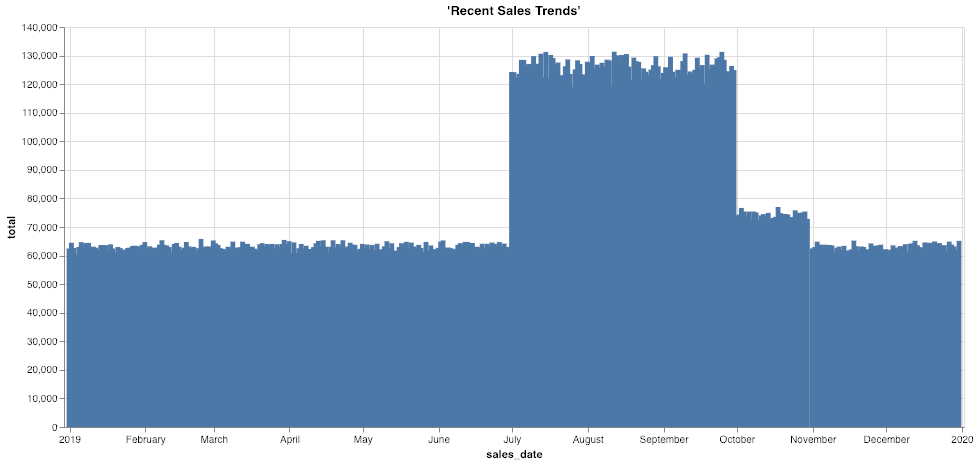

## Deep history: Accessing archive data from object stores 

### Before you begin

Open Editor to proceed with this use case.
[LAUNCH EDITOR](#data={"navigateTo":"editor"})

### Introduction

Increasingly stringent regulations require companies to keep data online and accessible for regulatory compliance over many years. Although the most frequently accessed data is the latest or most current data, that doesn’t mean that the older information is not useful or relevant for business and analytical use cases. Historical data compiled over the years gives a rich perspective of the business, such as long-term trends and cyclical patterns. 

Teradata VantageCloud Lake provides unmatched scalability, concurrency, and performance for the world’s largest and most demanding enterprises to analyze their data. The need for frequent analysis of older information generally decreases as data ages. Over time, more historical data accumulates than current “hot” data, so it makes sense to store it in an architecture with different performance and price characteristics—for example, an object store like Amazon S3 or Microsoft Azure Blob Storage. 

Some insights are only available through analysis of historical and current data together, so storing them in separate systems can pose a challenge for many analytic platforms. Conversely, Teradata VantageCloud Lake can seamlessly join all historical and current information across the data warehouse and object storage, without users having to change their tools or queries. As a result, decision-makers can make better plans by cost-effectively answering questions that couldn’t previously be answered. Analysts and data scientists have seamless access to deep and comprehensive data sets, allowing for more robust advanced analytics and AI/ML outcomes.

### Experience

The Experience section takes about 10 minutes to run.

### Setup

Select **Load Assets** to create the tables and load the data required into your account (Teradata database instance) for this use case.
[Load Assets](#data={"id":"SalesOffload"})

### Walkthrough

#### Step 1: Querying the data

Here is our current sales data. Let’s grab some sample rows: In this example, we have customer, store, basket, and discount information.


```sql
SELECT TOP 10 * 
FROM so_sales_fact
```


```sql
SELECT sales_date, sum(sales_quantity) as total 
FROM so_sales_fact
GROUP BY sales_date
ORDER BY sales_date ASC
```




What time range do we have data for?

```sql
SELECT MIN(sales_date) AS min_date, MAX(sales_date) AS max_date FROM so_sales_fact
```

How many records do we have in the data warehouse (2019 data)?


```sql
SELECT COUNT(*)
FROM so_sales_fact
```


#### Step 2: Explore the offloaded historical data

In our example, we only have one year of sales data in our data warehouse, as this is by far the most queried. For compliance, many companies must keep up to 10 years of historical data. For this scenario, older data has been exported from VantageCloud Lake each month and loaded into Amazon S3 for long-term storage. With VantageCloud Lake, we can seamlessly access this offloaded data and join it with the rest of the data to review long-term trends and easily handle analytics needs, like audit requests. This includes using existing queries and reports that would otherwise need to be rewritten. 

We already know where the bucket containing offloaded sales data is located, so let’s review some of its data. With the READ_NOS function, we can get the list of files and their sizes. The RETURNTYPE element in the FROM clause allows us to direct the function to return the object metadata, schema, or values themselves. 

Note this S3 bucket is publicly readable. If we were using a protected object store, we could modify the AUTHORIZATION element to contain the proper authentication values or make use of an authorization object containing this information. 


```sql
SELECT location(char(255)), ObjectLength 
FROM (
 LOCATION='/s3/s3.amazonaws.com/trial-datasets/SalesOffload'
 AUTHORIZATION='{"ACCESS_ID":"","ACCESS_KEY":""}'
 RETURNTYPE='NOSREAD_KEYS'
) as d 
ORDER BY 1
```


How many files and directories are there total?


```sql
SELECT COUNT(location(char(255))) as NumFiles
FROM (
 LOCATION='/s3/s3.amazonaws.com/trial-datasets/SalesOffload'
 AUTHORIZATION='{"ACCESS_ID":"","ACCESS_KEY":""}'
 RETURNTYPE='NOSREAD_KEYS'
) as d 
ORDER BY 1
```


Let’s inspect one of the files to get a better understanding of the file format: 


```sql
SELECT * FROM (
      LOCATION='/s3/s3.amazonaws.com/trial-datasets/SalesOffload/2010/1/object_33_0_1.parquet'
      AUTHORIZATION='{"ACCESS_ID":"","ACCESS_KEY":""}'
      RETURNTYPE='NOSREAD_PARQUET_SCHEMA'
      )
AS d
```


#### Step 3: Create a simple abstraction layer for easy access

To create an authorization object, use the following statement to contain the credentials to your external object store.  For this use case, keep the USER and PASSWORD fields blank as shown.

```sql
CREATE AUTHORIZATION MyAuth
USER ''
PASSWORD '';
```

Create a foreign table and a view in VantageCloud Lake to allow business analysts and other users to easily access the offloaded historical data. A foreign table is an object in the database that can act like a normal database table but points to data in a different location. Foreign table definitions also contain extended syntax that can help optimize data transfer, convert data on the fly, etc. 

The below SQL creates a simple table that relies on automatic column and datatype detection: 


```sql
CREATE FOREIGN TABLE sales_fact_offload
, EXTERNAL SECURITY MyAuth 
USING
       (
LOCATION  ('/s3/s3.amazonaws.com/trial-datasets/SalesOffload')
STOREDAS  ('PARQUET')
       )
NO PRIMARY INDEX
PARTITION BY COLUMN;
```

Let’s inspect some of the rows in the offloaded files. 


```sql
SELECT TOP 10 *
FROM sales_fact_offload;
```

How much data do we have there?


```sql
SELECT COUNT(*)
FROM sales_fact_offload;
```


OK—we’re close! We want the data to look like a native table. So, let’s put a view on top to split it out into columns.


```sql
REPLACE VIEW sales_fact_offload_v as (  
SELECT 
    sales_date,
    customer_id,
    store_id,
    basket_id,
    product_id,
    sales_quantity,
    discount_amount
FROM sales_fact_offload);
```


Now we can query the data like any other table in VantageCloud Lake, but the data is pulled at query runtime directly from the object store. We now have a seamless analytics experience by supporting the correlation of object store-based datasets with structured datasets in Teradata relational tables using existing SQL skills and workflows.


```sql
SELECT TOP 10 *
FROM sales_fact_offload_v;
```

Now, users can access all the historical data in the object store. By using a database view, we can abstract away any of the underlying complexity of accessing the object store. Users will see the data as if it’s any other object in the database, and VantageCloud Lake will automatically optimize the query execution and data transfer, optimizing performance and response time. 

We often need to be able to review a portion of the vast amount of data. In our use case, we have assumed some common filters, including the year and month of the transactions. This is why we have stored it by year and month keys in the object store. We can redefine the foreign table to prefilter the data when reading it based on these common conditions.

#### Step 4: Optimize the foreign table and view for efficient access

There is a lot of data in S3. Let’s optimize the foreign table so that we minimize the data we must read when querying in the object store. Designing an object store bucket and path structure is an important first step when planning how to store the data. It requires knowledge of the business needs, the expected patterns in accessing the data, an understanding of the data, and a sensitivity to the tradeoffs. In our case, we often know the approximate date we’re looking at, so let's use this to our advantage.


```sql
DROP TABLE sales_fact_offload;
CREATE FOREIGN TABLE sales_fact_offload
, EXTERNAL SECURITY MyAuth 
USING
       (
LOCATION  ('/s3/s3.amazonaws.com/trial-datasets/SalesOffload')
PATHPATTERN ('$dir1/$year/$month')
STOREDAS  ('PARQUET')
       )
NO PRIMARY INDEX
PARTITION BY COLUMN;
```

We’ve redefined our foreign table to include a __PATHPATTERN__ element. When reviewing historical data by date, this allows us to read only the files we need. 

Now, let’s recreate our user-friendly view that allows for this path filtering. As discussed above, database views allow us to abstract away the underlying complexity. In this case, we are mapping an object path to columns, so when users use these columns as filter values, VantageCloud Lake will automatically minimize data transfer. 


```sql
REPLACE VIEW sales_fact_offload_v as (  
SELECT 
    CAST($path.$year AS CHAR(4)) sales_year,
    CAST($path.$month AS CHAR(2)) sales_month,
    sales_date,
    customer_id,
    store_id,
    basket_id,
    product_id,
    sales_quantity,
    discount_amount
FROM sales_fact_offload);
```


```sql
SELECT TOP 10 *
FROM sales_fact_offload_v
WHERE sales_year = '2010'
AND sales_month = '9';
```

This is great for use cases in which we know the month. Suppose we need to see what a customer bought many years ago. Or maybe we want to report on historical store sales. A business analyst can easily query this without IT intervention, backups, or other hard-to-reach data silos.  

Let’s look at Store 6 sales from August 2012:


```sql
SELECT store_id, SUM(sales_quantity)
FROM sales_fact_offload_v
WHERE store_id = 6
AND sales_year = '2012'
AND sales_month = '8'
GROUP BY 1;
```


Let's join the historical data with the current data so we can see the full picture:


```sql
REPLACE VIEW sales_fact_all as (
SELECT sales_date,
    customer_id,
    store_id,
    basket_id,
    product_id,
    sales_quantity,
    discount_amount
    FROM so_sales_fact
    UNION ALL
SELECT 
    sales_date,
    customer_id,
    store_id,
    basket_id,
    product_id,
    sales_quantity,
    discount_amount
FROM sales_fact_offload_v);
```


Finally, let’s rerun our sales-over-time report. The code is unchanged from the one above, so we can analyze all sales data beyond the most recent year.


```sql
SELECT sales_date, sum(sales_quantity) as total 
FROM sales_fact_all
GROUP BY sales_date
ORDER BY sales_date ASC;
```


We can see that 2019 was an off year, so we need to dig deeper to see what happened. But thanks to VantageCloud Lake, we can cost-effectively analyze all our data by offloading the colder, less queried data to object storage for safekeeping. 

#### Step 5: Clean up

Drop the objects we created in our own database schema.


```sql
DROP VIEW sales_fact_all;
```


```sql
DROP VIEW sales_fact_offload_v;
```


```sql
DROP TABLE sales_fact_offload;
```

## Dataset
***

The <b>sales_fact</b> dataset has approximately 43 million rows of sample sales data:

- `sales_date`: date the order was processed
- `customer_id`: customer identifier
- `store_id`: store identifier where the order was taken
- `basket_id`: grouping or order number
- `product_id`: identifier of the product
- `sales_quantity`: quantity of the product sold
- `discount_amount`: how much of a discount was given on this line item

