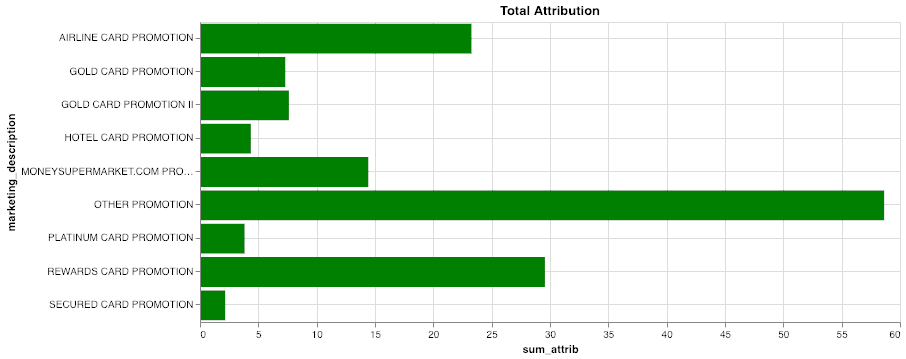

Recorrido del cliente de servicios financieros
----------------------------------------------

### Antes de empezar

Abra el editor para continuar con este caso de uso. [INICIAR EDITOR](#data=%7B%22navigateTo%22:%22editor%22%7D)

### Introducción

En este caso de uso, mostraremos varias técnicas para analizar aspectos del recorrido de un cliente mediante Teradata VantageCloud Lake. En concreto, utilizaremos las funciones Attribution y nPath.

Este es el escenario que cubriremos: revisaremos las interacciones importantes que los clientes tienen con un banco minorista para mostrar cómo podemos usar VantageCloud Lake para descubrir nuevos conocimientos en varios pasos del recorrido del cliente.

Empezando por la **adquisición de clientes**, descubriremos cómo hacer lo siguiente: - Encontrar nuevos clientes - Medir la atribución de marketing - Aumentar el retorno de la inversión (ROI) y maximizar la eficacia del marketing - Minimizar el tiempo de conversión

A continuación, **revisaremos la adopción por parte del cliente:** ¿qué lleva a los clientes a optar por productos adicionales de alta gama, como las cuentas de gestión patrimonial?

Los clientes interactúan con el banco de muchas maneras, tanto en línea como fuera de línea. Existen muchas fuentes de datos diferentes, como las interacciones en la sucursal con los cajeros, la banca en línea, el correo electrónico y los registros del centro de llamadas. Es necesario analizarlas todas para tener una visión completa.

VantageCloud Lake ofrece las mejores capacidades de su clase para combinar y agregar datos a cualquier escala. Proporciona conectividad optimizada para el rendimiento con sistemas de bases de datos de terceros y almacenes de objetos abiertos a través de la tecnología patentada QueryGrid para crear una estructura de consulta única, agregada y optimizada, que abarca datos de una gran variedad de sistemas, nubes y ubicaciones físicas. Otras demostraciones cubren los pasos de integración y agregación, pero esto está fuera del alcance en nuestro caso.

Veremos más adelante en esta demostración que estos datos multicanal son clave para obtener información más precisa y procesable.

Experiencia
-----------

El caso de uso completo tarda unos 10 minutos en ejecutarse.

### Configuración

Seleccione **Cargar activos** para crear las tablas y cargar los datos necesarios en su cuenta (instancia de base de datos de Teradata) para este caso de uso. [Cargar activos](#data=%7B%22id%22:%22FSCustomerJourney%22%7D)

### Adquisición de clientes

El canal de adquisición de clientes es el primer paso de nuestro análisis. Nos centraremos en analizar la eficacia de varios programas de marketing para que los clientes abran una nueva cuenta de tarjeta de crédito. Queremos entender de qué canal provienen nuestros clientes y cómo maximizar el retorno de la inversión en marketing. Utilizaremos la potente función de atribución de marketing de VantageCloud Lake para analizar los datos multicanal.

Esto nos permitirá cuantificar rápidamente la efectividad de marketing de nuestras promociones y canales (en línea y fuera de línea). Comprender qué promociones son más efectivas nos permitirá optimizar el gasto de marketing y la ubicación de las promociones.

Para analizar de manera eficiente muchos parámetros variables utilizando la función de atribución, crearemos varias tablas de dimensiones:

```sql
--DATABASE <database_name>;

CREATE TABLE FSCJ_conversion_events
   (conversion_event   VARCHAR(55))
NO PRIMARY INDEX;
```

Queremos determinar cuándo las personas han reservado cuentas tanto en línea como fuera de línea y utilizar eso como nuestro criterio de éxito:

```sql
INSERT INTO FSCJ_conversion_events VALUES('ACCOUNT_BOOKED_ONLINE');
INSERT INTO FSCJ_conversion_events VALUES('ACCOUNT_BOOKED_OFFLINE');
```

VantageCloud Lake nos permite especificar qué tipo de modelo de atribución aplicar. Para simplificar, elegiremos un modelo UNIFORM básico. Los modelos UNIFORM aplican un peso igual a cada paso precedente antes del resultado deseado.

```sql
CREATE TABLE FSCJ_attribution_model
   (id    INTEGER,
    model VARCHAR(100))
NO PRIMARY INDEX;
```

```sql
INSERT INTO FSCJ_attribution_model VALUES(0, 'SIMPLE');
INSERT INTO FSCJ_attribution_model VALUES(1, 'UNIFORM:NA');
```

Ahora estamos listos para invocar la función de atribución en nuestro conjunto de datos. El conjunto de datos contiene muchos tipos de interacciones de clientes en varios canales que podemos analizar. La función de atribución utilizará los datos de eventos agregados como entrada, así como las tablas de dos dimensiones que creamos anteriormente. Los argumentos de función adicionales ayudan a definir la cantidad máxima de eventos que han de procesarse, así como información sobre el orden temporal y las columnas de identificación de eventos.

```sql
CREATE TABLE FSCJ_marketing_attribution AS (
    SELECT * FROM Attribution (
                ON (
          SELECT
                customer_identifier, interaction_timestamp, interaction_type, customer_days_active, customer_type,
                marketing_placement, marketing_description, marketing_category,
                interaction_type || product_category AS interaction_product
            FROM fscj_ich_banking
            WHERE
                interaction_type IN ('ACCOUNT_BOOKED_OFFLINE','ACCOUNT_BOOKED_ONLINE','CLICK','REFERRAL','BROWSE')
                AND product_category <> '-1'
        ) 
        PARTITION BY customer_identifier
        ORDER BY interaction_timestamp
        ON FSCJ_conversion_events AS ConversionEventTable DIMENSION
        ON FSCJ_attribution_model AS FirstModel DIMENSION
        USING
        EventColumn ('interaction_type')
        TimestampColumn ('interaction_timestamp')
        WindowSize('rows:10')
    ) as attrib)
    WITH DATA
```

Este análisis de atribución tiene como objetivo identificar los eventos que conducen a la apertura de una cuenta de tarjeta de crédito y asignarles un valor. Los eventos de conversión específicos en los datos son ACCOUNT\_BOOKED\_ONLINE y ACCOUNT\_BOOKED\_OFFLINE, calculando así los eventos y canales más influyentes que impulsan la adquisición de clientes. La función de atribución en VantageCloud Lake admite diferentes modelos de atribución estándar. Con VantageCloud Lake, podemos ver rápidamente cómo los cambios en el modelo de atribución/parámetros afectarán nuestro análisis.

Ahora, veamos algunas estadísticas resumidas de los resultados:

```sql
SELECT marketing_description, AVG(attribution) AS avg_attrib, SUM(attribution) AS sum_attrib, AVG(-time_to_conversion)/3600 AS time_to_conversion
FROM FSCJ_marketing_attribution 
WHERE marketing_description NOT IN ('\N', '-1')
GROUP BY marketing_description;
```





La primera visualización ilustra la puntuación de atribución promedio de cada promoción. Cuanto más grande sea la barra, mayor será la influencia que tuvo la promoción en la apertura de una cuenta por parte de un cliente.

El segundo gráfico muestra la puntuación total de atribución de cada promoción. La promoción con mayor impacto en términos de conversiones totales estará representada por las barras más grandes.

El tercer gráfico muestra el tiempo promedio de conversión de clientes en horas para cada promoción. Cuanto más corto es el tiempo (en la parte inferior del gráfico), más rápido reaccionan las personas. Podemos ver que “Promoción de tarjeta dorada II” proporcionó el tiempo de conversión más corto, seguida de “Promoción de tarjeta de hotel” y “Promoción de MoneySupermarket.com”.

### Análisis de canales

Contamos con diferentes promociones y redes publicitarias, así que veamos el impacto que estamos obteniendo con las distintas promociones en los diferentes canales:

```sql
SELECT marketing_category, marketing_placement, SUM(attribution) AS total_attribution 
FROM FSCJ_marketing_attribution 
WHERE marketing_description NOT IN ('\N', '-1')
GROUP BY 1, 2;
```


La siguiente visualización ilustra la atribución total en función de cada canal en el que se ejecutaron las promociones. La longitud total de la barra muestra la atribución total a ese canal. Los colores corresponden a las promociones que analizamos en la vista superior, por lo que podemos ver qué promociones se realizaron en qué canales y el rendimiento de cada una. En el conjunto de resultados de datos, puede ver que hay correo electrónico, en rama (sin conexión) y web.

En cuanto a los canales digitales, podemos observar que los anuncios en la página de inicio obtuvieron mejores resultados, seguidos por el correo electrónico y las búsquedas en Google.

Utilizando una herramienta de inteligencia empresarial (BI), podemos crear este tipo de análisis en función del resultado de la función de atribución:


Esta visualización nos brinda información más detallada sobre nuestras promociones de marketing y su ubicación en varios canales. Por ejemplo, podemos ver que “Promoción MoneySupermarket.com” y “Promoción de tarjeta dorada II” fueron nuestras promociones más efectivas. Podemos ver que “Promoción de tarjeta dorada” solo se ejecutó por correo electrónico, mientras que “Promoción de tarjeta dorada II” se ejecutó en varios canales y fue más efectiva.

Con este panel y el poder de VantageCloud Lake, puede comparar fácilmente las diferentes promociones y ver que la promoción especial “Promoción MoneySupermarket.com” fue particularmente efectiva. Esta promoción solo se ejecutó en ese canal en particular y tuvo un tiempo de conversión rápido y una atribución promedio sólida.

Podemos ver que la promoción de tarjetas de recompensas tuvo un buen desempeño en todos los canales, pero fue particularmente eficaz a través de las referencias en las sucursales. La promoción de tarjetas de aerolíneas tuvo un mejor desempeño en la página de inicio y en Google.

Camino hacia la adopción
------------------------

A continuación, queremos ver cómo los clientes abren cuentas de mayor nivel, como las de gestión patrimonial. Muchos bancos minoristas han descubierto que la gestión patrimonial es un factor clave de ganancias, por lo que buscan desarrollar su negocio en esta área.

Podemos utilizar la potente función analítica nPath de VantageCloud Lake para realizar un análisis combinado de patrones y ordenado por tiempo, algo que resulta muy difícil de hacer en SQL. En este caso de uso, queremos ver las rutas comunes que siguen los clientes cuando abren una cuenta de gestión patrimonial. También analizaremos la afiliación entre las otras cuentas que tienen los clientes de gestión patrimonial.

La función nPath toma varias entradas clave para definir cómo construirá la ruta ordenada por tiempo para cada usuario. En el código que se muestra aquí, puede ver algunos elementos clave. Primero, limpiamos los datos de entrada para facilitar el análisis. A continuación, definimos los patrones que se deben buscar para ensamblar la ruta: 1. En los datos de entrada, concatenamos la interacción y la categoría de producto para crear eventos únicos. 2. También en los datos de entrada, filtramos el inicio/finalización de la aplicación de gestión de patrimonio. Todos hacen eso por definición y, en este caso, queremos reducir el ruido. Se podrían realizar análisis adicionales en aplicaciones incompletas u otros escenarios. 3. En el elemento **‘PATTERN’**, usamos la sintaxis para buscar cuatro eventos seguidos de la apertura (ACCOUNT\_BOOKED) de una cuenta de gestión de patrimonio.  
4. Los dos **‘SYMBOLS’** se definen como cualquier evento excepto la apertura de una cuenta de gestión de patrimonio como EVENT y la apertura de dicha cuenta como ADOPTION. 5. La cláusula **‘RESULT’** indica a la función cómo mostrar los resultados. En este caso, estamos creando una cadena larga de eventos que representan la ruta, así como otra información, como la cantidad de eventos, el ID del cliente y la categoría del producto.

```sql
SELECT * FROM nPath (
        ON (
        SELECT customer_identifier, interaction_timestamp, interaction_type, product_category, interaction_type || '_' || product_category AS event, 
                marketing_category, marketing_description, marketing_placement, sales_channel, 
                conversion_sales, conversion_cost, conversion_margin
            FROM fscj_ich_banking
            WHERE
                product_category <> '-1'
                AND interaction_type || '_' || product_category <> 'STARTS_APPLICATION_WEALTH MANAGEMENT'
                AND interaction_type || '_' || product_category <> 'COMPLETE_APPLICATION_WEALTH MANAGEMENT'
        )
        PARTITION BY customer_identifier
        ORDER BY interaction_timestamp
        USING
        MODE (NONOVERLAPPING)
        -- Limit to a depth of 4
        PATTERN ('(EVENT){4}.ADOPTION')
        SYMBOLS (
            event NOT LIKE 'ACCOUNT_BOOKED%_WEALTH MANAGEMENT' AS EVENT,
            event LIKE 'ACCOUNT_BOOKED%' AND product_category = 'WEALTH MANAGEMENT' AS ADOPTION
        )
        RESULT (
            ACCUMULATE( event OF ANY(EVENT,ADOPTION) )  AS interaction_type_list,
            COUNT( event OF ANY(EVENT,ADOPTION) )       AS click_depth,

            FIRST( customer_identifier of ADOPTION )  AS customer_identifier,
            FIRST( product_category OF ADOPTION )     AS product_category
        )
    ) a;
```

Al utilizar las visualizaciones de la consola VantageCloud Lake u otra herramienta de BI, podemos crear un gráfico especializado llamado Sankey, que brinda información sobre las rutas más comunes que toman los usuarios al abrir cuentas de administración de patrimonio:


Podemos filtrarlo hasta las rutas más populares:


Ahora que tenemos una mejor visión de lo que está sucediendo, repasemos los principales impulsores en cada caso.

Comencemos por analizar los factores que impulsan las cuentas de gestión patrimonial en línea. Podemos ver que la herramienta de comparación que el banco tiene en su sitio web es un paso fundamental para abrir una cuenta. Esto permite a los clientes comparar sus ofertas de gestión patrimonial con las de la competencia. Se ha demostrado que es convincente: los clientes exploran las ofertas, luego usan la herramienta de comparación y, finalmente, reservan.

Los otros principales impulsores de las inscripciones en cuentas en línea son las personas que se inscriben en un plan de ahorro automático. Las personas con mentalidad ahorradora tienden a abrir cuentas de gestión de patrimonio. Además, en general, explorar las ofertas y abrir un certificado de depósito (CD) también parecen ser caminos secundarios.

Podemos ver que el mercado offline tiene diferentes motivaciones: predominantemente personas que abren otros tipos de cuentas, así como CD y cuentas de corretaje, tanto en línea como fuera de línea. Las referencias en sucursales son las principales vías para reservar una cuenta de gestión patrimonial fuera de línea. Las personas visitan una sucursal y abren otro tipo de cuenta, y se les recomienda que abran una cuenta de gestión patrimonial.

### Limpiar

```sql
DROP TABLE FSCJ_conversion_events;
```

```sql
DROP TABLE FSCJ_attribution_model;
```

```sql
DROP TABLE FSCJ_marketing_attribution;
```

### Conjunto de datos

Los datos de este caso de uso, FSCustomerJourney, se almacenan en la base de datos `retail_sample_data`.

#### Historial de contactos integrado

Esta es la tabla principal que utilizamos en este caso de uso. Son datos de varios sistemas y canales de origen ya combinados y colocados en una gran tabla. Se trata de todas las interacciones con los clientes; en un sistema de clientes. Esta podría ser una vista sobre varias tablas de origen.

`fscj_ich_banking`

-   `customer_skey`: clave del cliente
-   `customer_identifier`: identificador único de cliente
-   `customer_cookie`: cookie colocada en el dispositivo del cliente
-   `customer_online_id`: booleano - ¿el cliente tiene una cuenta en línea?
-   `customer_offline_id`: número de cuenta del cliente
-   `customer_type`: ¿es este un cliente de alto valor o simplemente un visitante que navega por el sitio web?
-   `customer_days_active`: ¿cuánto tiempo ha estado activo el cliente?
-   `interaction_session_number`: identificador de sesión
-   `interaction_timestamp`: marca de tiempo para este evento
-   `interaction_source`: canal del que proviene este evento (en línea/fuera de línea, en sucursal, etc.)
-   `interaction_type`: tipo de evento
-   `sales_channel`: canal en el que se produjo un evento de ventas
-   `conversion_id`: identificador de conversión de ventas
-   `product_category`: ¿de qué tipo de producto se trata en el evento (cuenta corriente, de ahorros, CD, etc.)?
-   `product_type`: sin usar
-   `conversion_sales`: sin usar
-   `conversion_cost`: sin usar
-   `conversion_margin`: sin usar
-   `conversion_units`: sin usar
-   `marketing_code`: identificador de marketing
-   `marketing_category`: canal de marketing (sucursal, sitio web, correo electrónico, etc.)
-   `marketing_description`: nombre de la campaña de marketing
-   `marketing_placement`: punto de venta específico (Google, Bloomberg.com, etc.)
-   `mobile_flag`: el booleano estaba en un dispositivo móvil
-   `updt`: sin usar
