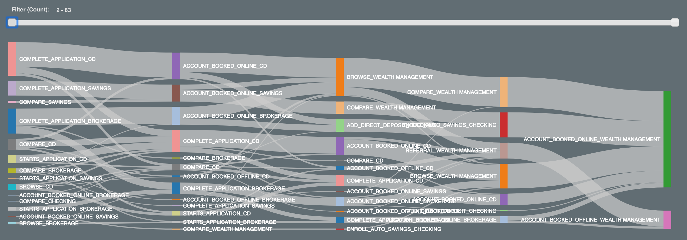

Customer Journey im Finanzdienstleistungsbereich
------------------------------------------------

### Bevor Sie beginnen

Öffnen Sie den Editor, um mit diesem Anwendungsfall fortzufahren. [EDITOR STARTEN](#data=%7B%22navigateTo%22:%22editor%22%7D)

### Einführung

In diesem Anwendungsfall zeigen wir verschiedene Techniken zur Analyse von Aspekten einer Customer Journey mithilfe von Teradata VantageCloud Lake. Insbesondere verwenden wir die Funktionen „Attribution“ und „nPath“.

Folgendes Szenario wird behandelt: Wir überprüfen die wichtigen Interaktionen, die Kunden mit einer Privatkundenbank haben, um zu zeigen, wie wir VantageCloud Lake nutzen können, um in verschiedenen Schritten einer Customer Journey neue Erkenntnisse zu gewinnen.

Beginnend mit **Neukundengewinnung** erfahren Sie, wie Sie: – neue Kunden finden – die Marketing-Attribution messen – den Return on Investment (ROI) steigern und die Marketingeffektivität maximieren – die Zeit bis zur Konversion minimieren

Als Nächstes **überprüfen wir die Kundenakzeptanz:** Was führt Kunden zu zusätzlichen hochwertigen Produkten wie Vermögensverwaltungskonten?

Kunden interagieren mit der Bank auf vielfältige Weise, sowohl online als auch offline. Es gibt viele verschiedene Datenquellen, wie z. B. Interaktionen mit Bankangestellten in der Filiale, Online-Banking, E-Mail und Callcenter-Protokolle. Um das Gesamtbild zu sehen, müssen alle diese Quellen betrachtet werden.

VantageCloud Lake bietet erstklassige Funktionen für die Kombination und Aggregation von Daten in jeder Größenordnung. Die Lösung bietet eine leistungsoptimierte Konnektivität zu offenen Objektspeichern und Datenbanksystemen von Drittanbietern über die patentierte QueryGrid-Technologie, um eine einzige, aggregierte und optimierte Abfrageinfrastruktur zu erstellen, die Daten aus einer Vielzahl von Systemen, Clouds und physischen Standorten umfasst. Andere Demos decken die Integrations- und Aggregationsschritte ab, aber das ist in unserem Fall nicht relevant.

Später in dieser Demonstration werden wir sehen, dass diese Multikanal-Daten der Schlüssel zu den genauesten und umsetzbarsten Einblicken sind.

Erfahrungswerte
---------------

Die Ausführung des gesamten Anwendungsfalls dauert etwa 10 Minuten.

### Einrichtung

Wählen Sie **Objekte laden** aus, um die Tabellen zu erstellen und die für diesen Anwendungsfall erforderlichen Daten in Ihr Konto (Teradata-Datenbankinstanz) zu laden. [Objekte laden](#data=%7B%22id%22:%22FSCustomerJourney%22%7D)

### Neukundengewinnung

Der Kanal zur Neukundengewinnung ist der erste Schritt in unserer Analyse. Wir konzentrieren uns auf die Analyse der Wirksamkeit verschiedener Marketingprogramme für Kunden, die ein neues Kreditkartenkonto eröffnen. Wir möchten verstehen, über welchen Kanal unsere Kunden zu uns kommen und wie wir den Marketing-ROI maximieren können. Wir verwenden die leistungsstarke Marketing-Attributionsfunktion in VantageCloud Lake, um die Multikanal-Daten zu betrachten.

Dadurch können wir die Marketingeffektivität unserer Werbeaktionen und Kanäle (online und offline) schnell quantifizieren. Wenn wir wissen, welche Werbeaktionen am effektivsten sind, können wir unsere Marketingausgaben und die Platzierung der Werbeaktionen optimieren.

Zur effizienten Analyse vieler variabler Parameter mithilfe der Attributionsfunktion erstellen wir verschiedene Dimensionstabellen:

``` sourceCode
--DATABASE <database_name>;

CREATE TABLE FSCJ_conversion_events
   (conversion_event   VARCHAR(55))
NO PRIMARY INDEX;
```

Wir möchten feststellen, wann Personen sowohl online als auch offline Konten gebucht haben, und dies als unser Erfolgskriterium verwenden:

``` sourceCode
INSERT INTO FSCJ_conversion_events VALUES('ACCOUNT_BOOKED_ONLINE');
INSERT INTO FSCJ_conversion_events VALUES('ACCOUNT_BOOKED_OFFLINE');
```

Mit VantageCloud Lake können wir angeben, welche Art von Attributionsmodell angewendet werden soll. Der Einfachheit halber wählen wir ein einfaches UNIFORM-Modell. UNIFORM-Modelle gewichten jeden Schritt vor dem gewünschten Ergebnis gleichermaßen.

``` sourceCode
CREATE TABLE FSCJ_attribution_model
   (id    INTEGER,
    model VARCHAR(100))
NO PRIMARY INDEX;
```

``` sourceCode
INSERT INTO FSCJ_attribution_model VALUES(0, 'SIMPLE');
INSERT INTO FSCJ_attribution_model VALUES(1, 'UNIFORM:NA');
```

Jetzt können wir die Attributionsfunktion auf unseren Dataset anwenden. Der Dataset enthält viele Arten von kanalübergreifenden Kundeninteraktionen, die wir analysieren können. Die Attributionsfunktion verwendet die aggregierten Ereignisdaten als Eingabe sowie die zweidimensionalen Tabellen, die wir oben erstellt haben. Zusätzliche Funktionsargumente helfen dabei, die maximale Anzahl der zu verarbeitenden Ereignisse sowie Informationen zu Spalten für die zeitliche Reihenfolge und Ereignisidentifizierung zu definieren.

``` sourceCode
CREATE TABLE FSCJ_marketing_attribution AS (
    SELECT * FROM Attribution (
                ON (
          SELECT
                customer_identifier, interaction_timestamp, interaction_type, customer_days_active, customer_type,
                marketing_placement, marketing_description, marketing_category,
                interaction_type || product_category AS interaction_product
            FROM fscj_ich_banking
            WHERE
                interaction_type IN ('ACCOUNT_BOOKED_OFFLINE','ACCOUNT_BOOKED_ONLINE','CLICK','REFERRAL','BROWSE')
                AND product_category <> '-1'
        ) 
        PARTITION BY customer_identifier
        ORDER BY interaction_timestamp
        ON FSCJ_conversion_events AS ConversionEventTable DIMENSION
        ON FSCJ_attribution_model AS FirstModel DIMENSION
        USING
        EventColumn ('interaction_type')
        TimestampColumn ('interaction_timestamp')
        WindowSize('rows:10')
    ) as attrib)
    WITH DATA
```

Diese Attributionsanalyse zielt darauf ab, die Ereignisse zu identifizieren, die zur Eröffnung eines Kreditkartenkontos führen, und ihnen einen Wert zuzuweisen. Die spezifischen Konversionsereignisse in den Daten sind ACCOUNT\_BOOKED\_ONLINE und ACCOUNT\_BOOKED\_OFFLINE, wodurch die einflussreichsten Ereignisse und Kanäle für die Kundengewinnung berechnet werden. Die Attributionsfunktion in VantageCloud Lake unterstützt eine Vielzahl von Standard-Attributionsmodellen. Mit VantageCloud Lake können wir schnell erkennen, wie sich Änderungen am Attributionsmodell/den Parametern auf unsere Analyse auswirken.

Lassen Sie uns nun einige zusammenfassende Statistiken zu den Ergebnissen erstellen:

``` sourceCode
SELECT marketing_description, AVG(attribution) AS avg_attrib, SUM(attribution) AS sum_attrib, AVG(-time_to_conversion)/3600 AS time_to_conversion
FROM FSCJ_marketing_attribution 
WHERE marketing_description NOT IN ('\N', '-1')
GROUP BY marketing_description;
```


Die erste Visualisierung zeigt den durchschnittlichen Attributions-Score für jede Aktion. Je größer der Balken, desto mehr Einfluss hatte die Aktion auf die Kontoeröffnung eines Kunden.

Das zweite Diagramm zeigt den Gesamtattributions-Score für jede Aktion. Die Aktion mit der insgesamt größten Wirkung im Hinblick auf die Gesamtzahl der Konversionen wird durch die größten Balken dargestellt.

Das dritte Diagramm zeigt die durchschnittliche Zeit bis zur Kundenkonversion in Stunden für jede Werbeaktion. Je kürzer die Zeit – je weiter unten in der Tabelle – desto schneller wurden Maßnahmen ergriffen. Wir können sehen, dass die „Gold Card Promotion II“ die kürzeste Zeit bis zur Konversion aufwies, gefolgt von der „Hotel Card Promotion“ und der „MoneySupermarket.com Promotion“.

### Kanalanalyse

Wir verfügen über unterschiedliche Werbeaktionen und Werbenetzwerke. Sehen wir uns also an, welche Resonanz wir mit den verschiedenen Werbeaktionen über die unterschiedlichen Kanäle erzielen:

``` sourceCode
SELECT marketing_category, marketing_placement, SUM(attribution) AS total_attribution 
FROM FSCJ_marketing_attribution 
WHERE marketing_description NOT IN ('\N', '-1')
GROUP BY 1, 2;
```


Die folgende Visualisierung veranschaulicht die Gesamtattribution basierend auf jedem Kanal, auf dem die Werbeaktionen durchgeführt wurden. Die Gesamtlänge des Balkens zeigt die Gesamtattribution zu diesem Kanal. Die Farben entsprechen den Werbeaktionen, die wir in der oberen Ansicht betrachtet haben, sodass wir sehen können, welche Werbeaktionen auf welchen Kanälen liefen und wie die Leistung der einzelnen Kanäle war. In der Datenergebnismenge sehen Sie, dass „E-Mail“, „in der Filiale“ (offline) und „Internet“ vorhanden sind.

Bei den digitalen Kanälen schnitten die Anzeigen auf der Startseite am besten ab, gefolgt von E-Mail- und Google-Suchen.

Mithilfe eines Business-Intelligence-Tools (BI) können wir auf Grundlage der Ergebnisse der Attributionsfunktion folgende Analyse erstellen:


Diese Visualisierung gibt uns tiefere Einblicke in unsere Marketingaktionen und ihre Platzierung auf verschiedenen Kanälen. Wir können beispielsweise sehen, dass „MoneySupermarket.com Promotion“ und „Gold Card Promotion II“ unsere effektivsten Werbeaktionen waren. Wir können sehen, dass „Gold Card Promotion“ nur per E-Mail geschaltet wurde, während „Gold Card Promotion II“ auf mehreren Kanälen geschaltet wurde und effektiver war.

Mithilfe dieses Dashboards und der Leistungsfähigkeit von VantageCloud Lake können Sie die verschiedenen Werbeaktionen problemlos vergleichen und feststellen, dass die spezielle „MoneySupermarket.com-Werbeaktion“ besonders effektiv war. Diese Kampagne lief nur auf diesem einen Kanal und hatte sowohl eine schnelle Konversionszeit als auch eine starke durchschnittliche Attribution.

Wir können sehen, dass die „Rewards Card Promotion“ über alle Kanäle hinweg erfolgreich war. Besonders effektiv war sie jedoch durch Empfehlungen in den Filialen. „Airline Card Promotion“ schnitt auf der Startseite und bei Google am besten ab.

Schritte zur Annahme
--------------------

Als Nächstes wollen wir sehen, wie Kunden höherwertige Konten eröffnen, beispielsweise für die Vermögensverwaltung. Viele Privatkundenbanken haben die Vermögensverwaltung als wichtiges Standbein erkannt und möchten ihr Geschäft in diesem Bereich ausbauen.

Wir können die leistungsstarke nPath-Analysefunktion in VantageCloud Lake verwenden, um eine kombinierte Analyse von Mustern und zeitlicher Abfolge durchzuführen, die in SQL nur sehr schwer möglich ist. In diesem Anwendungsfall möchten wir die üblichen Vorgehensweisen von Kunden bei der Eröffnung eines Vermögensverwaltungskontos untersuchen. Wir werden uns auch die Verbindung zwischen den anderen Konten ansehen, die Vermögensverwaltungskunden führen.

Die nPath-Funktion benötigt mehrere Schlüsselinformationen, um zu definieren, wie sie den zeitlichen Pfad für jeden Benutzer erstellt. Im Code hier können Sie einige wichtige Elemente sehen. Zuerst bereinigen wir die Eingabedaten, um die Analyse zu erleichtern. Als Nächstes definieren wir die Muster, die zum Zusammenstellen des Pfads abgeglichen werden sollen: 1. In den Eingabedaten verknüpfen wir die Interaktion und die Produktkategorie, um eindeutige Ereignisse zu erstellen. 2. Außerdem filtern wir in den Eingabedaten das Starten/Abschließen der Vermögensverwaltungsanwendung heraus. Diese Schritte werden per Definition von jedem durchgeführt. In diesem Fall möchten wir die Störfaktoren reduzieren. Weitere Analysen könnten für unvollständige Anwendungen oder andere Szenarien durchgeführt werden. 3. Im Element **‘PATTERN’** verwenden wir eine Syntax, um nach vier Ereignissen zu suchen, gefolgt von der Eröffnung (ACCOUNT\_BOOKED) eines Vermögensverwaltungskontos.  
4. Die beiden **‘SYMBOLS’**sind definiert als ein beliebiges Ereignis, mit Ausnahme der Eröffnung eines Vermögensverwaltungskontos als EVENT und der Eröffnung dieses Kontos als ADOPTION. 5. Die Klausel **‘RESULT’** regelt die Funktion zur Anzeige der Ergebnisse. In diesem Fall erstellen wir eine lange Zeichenfolge von Ereignissen, die den Weg darstellen, sowie weitere Informationen, wie die Anzahl der Ereignisse, die Kunden-ID und die Produktkategorie.

``` sourceCode
SELECT * FROM nPath (
        ON (
        SELECT customer_identifier, interaction_timestamp, interaction_type, product_category, interaction_type || '_' || product_category AS event, 
                marketing_category, marketing_description, marketing_placement, sales_channel, 
                conversion_sales, conversion_cost, conversion_margin
            FROM fscj_ich_banking
            WHERE
                product_category <> '-1'
                AND interaction_type || '_' || product_category <> 'STARTS_APPLICATION_WEALTH MANAGEMENT'
                AND interaction_type || '_' || product_category <> 'COMPLETE_APPLICATION_WEALTH MANAGEMENT'
        )
        PARTITION BY customer_identifier
        ORDER BY interaction_timestamp
        USING
        MODE (NONOVERLAPPING)
        -- Limit to a depth of 4
        PATTERN ('(EVENT){4}.ADOPTION')
        SYMBOLS (
            event NOT LIKE 'ACCOUNT_BOOKED%_WEALTH MANAGEMENT' AS EVENT,
            event LIKE 'ACCOUNT_BOOKED%' AND product_category = 'WEALTH MANAGEMENT' AS ADOPTION
        )
        RESULT (
            ACCUMULATE( event OF ANY(EVENT,ADOPTION) )  AS interaction_type_list,
            COUNT( event OF ANY(EVENT,ADOPTION) )       AS click_depth,

            FIRST( customer_identifier of ADOPTION )  AS customer_identifier,
            FIRST( product_category OF ADOPTION )     AS product_category
        )
    ) a;
```

Mit VantageCloud Lake Console Visualizations oder einem anderen BI-Tool können wir ein spezielles Diagramm erstellen, das als Sankey-Diagramm bezeichnet wird und Einblicke in die häufigsten Vorgehensweisen von Benutzern beim Eröffnen von Vermögensverwaltungskonten bietet:



Dabei können wir die beliebtesten Vorgehensweisen herausfiltern:


Da wir nun einen besseren Überblick über die Geschehnisse haben, lassen Sie uns die Hauptfaktoren in jedem Fall überprüfen.

Beginnen Sie mit der Betrachtung wichtiger Antriebsfaktoren für die Eröffnung von Vermögensverwaltungskonten im Internet. Wir sehen, dass das Vergleichstool, das die Bank auf ihrer Website anbietet, ein wichtiger Schritt bei der Kontoeröffnung ist. Damit können Kunden die Vermögensverwaltungsangebote der Bank mit denen der Konkurrenz vergleichen. Die Methode hat sich als überzeugend erwiesen: Kunden durchsuchen die Angebote, nutzen dann das Vergleichstool und nehmen schließlich die Buchung vor.

Die anderen Hauptgründe für die Eröffnung eines Online-Kontos sind Anmeldungen für einen automatischen Sparplan. Menschen, die gerne sparen, eröffnen in der Regel Vermögensverwaltungskonten. Auch das allgemeine Durchstöbern der Angebote und die Eröffnung eines Einlagenzertifikats (CD) scheinen nachrangige Schritte zu sein.

Wir können sehen, dass Offline-Geschäfte andere Treiber haben – vor allem Menschen, die andere Arten von Konten eröffnen, sowie Einlagenzertifikate und Maklerkonten – sowohl online als auch offline. Durch Empfehlungen innerhalb der Filiale wird ein Vermögensverwaltungskonto hauptsächlich offline eröffnet. Kunden besuchen eine Filiale und eröffnen eine andere Art von Konto. Sie werden dann an die Vermögensverwaltung verwiesen.

### Bereinigen

``` sourceCode
DROP TABLE FSCJ_conversion_events;
```

``` sourceCode
DROP TABLE FSCJ_attribution_model;
```

``` sourceCode
DROP TABLE FSCJ_marketing_attribution;
```

### Dataset

Die Daten für diesen Anwendungsfall, FSCustomerJourney, sind in der Datenbank `retail_sample_data` gespeichert.

#### Integrierter Kontaktverlauf

Dies ist die Haupttabelle, die wir in diesem Anwendungsfall verwenden. Es handelt sich um Daten aus verschiedenen Quellsystemen und Kanälen, die bereits kombiniert und in einer großen Tabelle zusammengefasst wurden. Hierbei handelt es sich um alle Kundeninteraktionen. In einem Kundensystem kann dies eine Ansicht sein, die auf verschiedenen Quelltabellen basiert.

`fscj_ich_banking`

-   `customer_skey`: Kundenschlüssel
-   `customer_identifier`: Eindeutige Kundenkennung
-   `customer_cookie`: Cookie, das auf dem Gerät des Kunden platziert wird
-   `customer_online_id`: Boolesch – hat der Kunde ein Online-Konto
-   `customer_offline_id`: Kundenkontonummer
-   `customer_type`: Handelt es sich hier um einen wichtigen Kunden oder nur um einen Besucher, der die Website durchsucht?
-   `customer_days_active`: Wie lange ist der Kunde bereits aktiv
-   `interaction_session_number`: Sitzungskennung
-   `interaction_timestamp`: Zeitstempel für dieses Ereignis
-   `interaction_source`: Kanal, aus dem dieses Ereignis stammt (online/offline, in der Filiale usw.)
-   `interaction_type`: Art des Ereignisses
-   `sales_channel`: Kanal, in dem eine Verkaufsveranstaltung stattfand
-   `conversion_id`: Verkaufskonversionskennung
-   `product_category`: Um welche Art von Produkt ging es bei der Veranstaltung (Schecks, Spareinlagen, CD usw.)
-   `product_type`: unbenutzt
-   `conversion_sales`: unbenutzt
-   `conversion_cost`: unbenutzt
-   `conversion_margin`: unbenutzt
-   `conversion_units`: unbenutzt
-   `marketing_code`: Marketingkennung
-   `marketing_category`: Marketingkanal (Filiale, Website, E-Mail usw.)
-   `marketing_description`: Name der Marketingkampagne
-   `marketing_placement`: Spezifischer Marketingkanal (Google, Bloomberg.com usw.)
-   `mobile_flag`: Boolesch – war auf einem Mobilgerät
-   `updt`: unbenutzt
