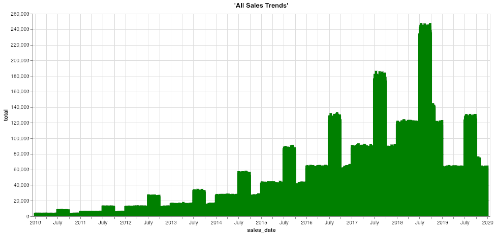

Tiefgehende Historie: Zugreifen auf Archivdaten aus Objektspeichern
-------------------------------------------------------------------

### Bevor Sie beginnen

Öffnen Sie den Editor, um mit diesem Anwendungsfall fortzufahren. [EDITOR STARTEN](#data=%7B%22navigateTo%22:%22editor%22%7D)

### Einführung

Aufgrund immer strengerer Vorschriften müssen Unternehmen Daten über viele Jahre hinweg online speichern und für die Einhaltung von Vorschriften zugänglich halten. Obwohl die am häufigsten abgerufenen Daten die neuesten oder aktuellsten sind, bedeutet das nicht, dass die älteren Informationen für geschäftliche und analytische Anwendungsfälle nicht nützlich oder relevant sind. Historische Daten, die im Laufe der Jahre zusammengetragen wurden, bieten einen umfassenden Einblick in die Geschäftstätigkeit, wie z. B. langfristige Trends und zyklische Muster.

Teradata VantageCloud Lake bietet den größten und anspruchsvollsten Unternehmen der Welt eine unübertroffene Skalierbarkeit, Parallelität und Leistung für die Analyse ihrer Daten. Der Bedarf an häufigen Analysen älterer Informationen nimmt im Allgemeinen mit zunehmendem Alter der Daten ab. Im Laufe der Zeit sammeln sich mehr historische Daten an als aktuelle „heiße“ Daten, sodass es sinnvoll ist, sie in einer Architektur mit unterschiedlichen Leistungs- und Preismerkmalen zu speichern – beispielsweise in einem Objektspeicher wie Amazon S3 oder Microsoft Azure Blob Storage.

Einige Einblicke sind nur durch die gemeinsame Analyse historischer und aktueller Daten möglich, sodass die Speicherung in separaten Systemen für viele Analyseplattformen eine Herausforderung darstellen kann. Im Gegensatz dazu kann Teradata VantageCloud Lake alle historischen und aktuellen Informationen im gesamten Data Warehouse und im Objektspeicher nahtlos zusammenführen, ohne dass Benutzer ihre Tools oder Abfragen ändern müssen. Dadurch können Entscheidungsträger bessere Pläne erstellen, indem sie Fragen, die zuvor nicht beantwortet werden konnten, kosteneffizient beantworten. Analysten und Data Scientists haben nahtlosen Zugriff auf tiefe und umfassende Datasets, was robustere erweiterte Analysen und KI/ML-Ergebnisse ermöglicht.

### Erfahrungswerte

Die Ausführung des Abschnitts „Erfahrungswerte“ dauert etwa 10 Minuten.

### Einrichtung

Wählen Sie **Objekte laden** aus, um die Tabellen zu erstellen und die für diesen Anwendungsfall erforderlichen Daten in Ihr Konto (Teradata-Datenbankinstanz) zu laden. [Objekte laden](#data=%7B%22id%22:%22SalesOffload%22%7D)

### Exemplarische Vorgehensweise

#### Schritt 1: Abfragen der Daten

Hier sind unsere aktuellen Verkaufsdaten. Nehmen wir einige Beispielzeilen: In diesem Beispiel haben wir Informationen zu Kunde, Geschäft, Warenkorb und Rabatt.

``` sourceCode
SELECT TOP 10 * 
FROM so_sales_fact
```

``` sourceCode
SELECT sales_date, sum(sales_quantity) as total 
FROM so_sales_fact
GROUP BY sales_date
ORDER BY sales_date ASC
```


Für welchen Zeitraum liegen uns Daten vor?

``` sourceCode
SELECT MIN(sales_date) AS min_date, MAX(sales_date) AS max_date FROM so_sales_fact
```

Wie viele Datensätze haben wir im Data Warehouse (Daten von 2019)?

``` sourceCode
SELECT COUNT(*)
FROM so_sales_fact
```

#### Schritt 2: Ausgelagerte historische Daten erkunden

In unserem Beispiel haben wir in unserem Data Warehouse nur Verkaufsdaten für ein Jahr, da diese bei weitem am häufigsten abgefragt werden. Aus Compliance-Gründen müssen viele Unternehmen bis zu 10 Jahre historische Daten aufbewahren. Für dieses Szenario wurden ältere Daten jeden Monat aus VantageCloud Lake exportiert und zur langfristigen Speicherung in Amazon S3 geladen. Mit VantageCloud Lake können wir nahtlos auf diese ausgelagerten Daten zugreifen und sie mit den übrigen Daten zusammenführen, um langfristige Trends zu überprüfen und Analyseanforderungen wie Audit-Anfragen problemlos zu erfüllen. Dazu gehört die Verwendung vorhandener Abfragen und Berichte, die andernfalls neu geschrieben werden müssten.

Wir wissen bereits, wo sich der Bucket mit den ausgelagerten Verkaufsdaten befindet; überprüfen wir nun einige seiner Daten. Mit der Funktion READ\_NOS können wir eine Liste der Dateien und ihrer Größe abrufen. Das RETURNTYPE-Element in der FROM-Klausel ermöglicht es uns, die Funktion so zu steuern, dass sie die Objektmetadaten, das Schema oder die Werte selbst zurückgibt.

Beachten Sie, dass dieser S3-Bucket öffentlich lesbar ist. Wenn wir einen geschützten Objektspeicher verwenden würden, könnten wir das AUTHORIZATION-Element so ändern, dass es die richtigen Authentifizierungswerte enthält, oder ein Autorisierungsobjekt verwenden, das diese Informationen enthält.

``` sourceCode
SELECT location(char(255)), ObjectLength 
FROM (
 LOCATION='/s3/s3.amazonaws.com/trial-datasets/SalesOffload'
 AUTHORIZATION='{"ACCESS_ID":"","ACCESS_KEY":""}'
 RETURNTYPE='NOSREAD_KEYS'
) as d 
ORDER BY 1
```

Wie viele Dateien und Verzeichnisse gibt es insgesamt?

``` sourceCode
SELECT COUNT(location(char(255))) as NumFiles
FROM (
 LOCATION='/s3/s3.amazonaws.com/trial-datasets/SalesOffload'
 AUTHORIZATION='{"ACCESS_ID":"","ACCESS_KEY":""}'
 RETURNTYPE='NOSREAD_KEYS'
) as d 
ORDER BY 1
```

Sehen wir uns eine der Dateien an, um das Dateiformat besser zu verstehen:

``` sourceCode
SELECT * FROM (
      LOCATION='/s3/s3.amazonaws.com/trial-datasets/SalesOffload/2010/1/object_33_0_1.parquet'
      AUTHORIZATION='{"ACCESS_ID":"","ACCESS_KEY":""}'
      RETURNTYPE='NOSREAD_PARQUET_SCHEMA'
      )
AS d
```

#### Schritt 3: Einfache Abstraktionsschicht für einfachen Zugriff erstellen

Um ein Autorisierungsobjekt zu erstellen, verwenden Sie die folgende Anweisung für die Aufnahme der Anmeldeinformationen für Ihren externen Objektspeicher. Lassen Sie für diesen Anwendungsfall die Felder USER und PASSWORD wie gezeigt leer.

``` sourceCode
CREATE AUTHORIZATION MyAuth
USER ''
PASSWORD '';
```

Erstellen Sie eine Fremdtabelle und eine Ansicht in VantageCloud Lake, damit Geschäftsanalysten und andere Benutzer problemlos auf die ausgelagerten historischen Daten zugreifen können. Eine Fremdtabelle ist ein Objekt in der Datenbank, das wie eine normale Datenbanktabelle agieren kann, aber auf Daten an einem anderen Speicherort verweist. Fremdtabellendefinitionen enthalten auch eine erweiterte Syntax, die zur Optimierung der Datenübertragung, zur sofortigen Datenkonvertierung usw. beitragen kann.

Die folgende SQL-Anweisung erstellt eine einfache Tabelle, die auf der automatischen Spalten- und Datentypenerkennung basiert:

``` sourceCode
CREATE FOREIGN TABLE sales_fact_offload
, EXTERNAL SECURITY MyAuth 
USING
       (
LOCATION  ('/s3/s3.amazonaws.com/trial-datasets/SalesOffload')
STOREDAS  ('PARQUET')
       )
NO PRIMARY INDEX
PARTITION BY COLUMN;
```

Lassen Sie uns einige Zeilen in den ausgelagerten Dateien untersuchen.

``` sourceCode
SELECT TOP 10 *
FROM sales_fact_offload;
```

Wie viele Daten haben wir dort?

``` sourceCode
SELECT COUNT(*)
FROM sales_fact_offload;
```

OK, wir sind nah dran! Wir möchten, dass die Daten wie eine native Tabelle aussehen. Also, setzen wir oben eine Ansicht ein, um sie in Spalten aufzuteilen.

``` sourceCode
REPLACE VIEW sales_fact_offload_v as (  
SELECT 
    sales_date,
    customer_id,
    store_id,
    basket_id,
    product_id,
    sales_quantity,
    discount_amount
FROM sales_fact_offload);
```

Jetzt können wir die Daten wie jede andere Tabelle in VantageCloud Lake abfragen. Die Daten werden jedoch zur Abfragezeit direkt aus dem Objektspeicher abgerufen. Wir haben jetzt eine nahtlose Analyseerfahrung, indem wir die Korrelation von Objektspeicher-basierten Datensätzen mit strukturierten Datensätzen in relationalen Teradata-Tabellen unter Verwendung vorhandener SQL-Kenntnisse und -Arbeitsabläufe unterstützen.

``` sourceCode
SELECT TOP 10 *
FROM sales_fact_offload_v;
```

Jetzt können Benutzer auf alle historischen Daten im Objektspeicher zugreifen. Durch die Verwendung einer Datenbankansicht können wir die zugrunde liegende Komplexität des Zugriffs auf den Objektspeicher abstrahieren. Benutzer sehen die Daten, als wären sie jedes andere Objekt in der Datenbank, und VantageCloud Lake optimiert automatisch die Abfrageausführung und Datenübertragung und optimiert so Leistung und Reaktionszeit.

Wir müssen oft in der Lage sein, einen Teil der riesigen Datenmenge zu überprüfen. In unserem Anwendungsfall haben wir einige allgemeine Filter angenommen, darunter das Jahr und den Monat der Transaktionen. Aus diesem Grund haben wir sie nach Jahres- und Monatsschlüsseln im Objektspeicher gespeichert. Wir können die Fremdtabelle neu definieren, um die Daten beim Lesen basierend auf diesen allgemeinen Bedingungen vorab zu filtern.

#### Schritt 4: Fremdtabelle und Ansicht für einen effizienten Zugriff optimieren

S3 enthält eine Menge Daten. Lassen Sie uns die Fremdtabelle optimieren, damit wir die Daten minimieren, die wir beim Abfragen im Objektspeicher lesen müssen. Der Entwurf eines Objektspeicher-Buckets und einer Pfadstruktur ist ein wichtiger erster Schritt bei der Planung der Datenspeicherung. Dazu sind Kenntnisse der geschäftlichen Anforderungen, der erwarteten Muster beim Zugriff auf die Daten, ein Verständnis der Daten und ein Gespür für Kompromisse erforderlich. In unserem Fall kennen wir oft das ungefähre Datum, das wir betrachten, also nutzen wir dies zu unserem Vorteil.

``` sourceCode
DROP TABLE sales_fact_offload;
CREATE FOREIGN TABLE sales_fact_offload
, EXTERNAL SECURITY MyAuth 
USING
       (
LOCATION  ('/s3/s3.amazonaws.com/trial-datasets/SalesOffload')
PATHPATTERN ('$dir1/$year/$month')
STOREDAS  ('PARQUET')
       )
NO PRIMARY INDEX
PARTITION BY COLUMN;
```

Wir haben unsere Fremdtabelle neu definiert, um ein **PATHPATTERN**-Element einzuschließen. Wenn wir historische Daten nach Datum überprüfen, können wir so nur die Dateien lesen, die wir benötigen.

Lassen Sie uns nun unsere benutzerfreundliche Ansicht neu erstellen, die diese Pfadfilterung ermöglicht. Wie oben erläutert, können wir mit Datenbankansichten die zugrunde liegende Komplexität abstrahieren. In diesem Fall ordnen wir einem Objektpfad Spalten zu. Wenn Benutzer diese Spalten als Filterwerte verwenden, minimiert VantageCloud Lake automatisch die Datenübertragung.

``` sourceCode
REPLACE VIEW sales_fact_offload_v as (  
SELECT 
    CAST($path.$year AS CHAR(4)) sales_year,
    CAST($path.$month AS CHAR(2)) sales_month,
    sales_date,
    customer_id,
    store_id,
    basket_id,
    product_id,
    sales_quantity,
    discount_amount
FROM sales_fact_offload);
```

``` sourceCode
SELECT TOP 10 *
FROM sales_fact_offload_v
WHERE sales_year = '2010'
AND sales_month = '9';
```

Dies ist ideal für Anwendungsfälle, bei denen wir den Monat kennen. Nehmen wir an, wir müssen herausfinden, was ein Kunde vor vielen Jahren gekauft hat. Oder vielleicht möchten wir einen Bericht über die historischen Ladenverkäufe schreiben. Ein Business-Analyst kann diese Daten problemlos abfragen, ohne dass die IT-Abteilung eingreifen muss, ohne Sicherungen oder andere schwer zugängliche Datensilos.

Schauen wir uns die Verkäufe von Geschäft 6 im August 2012 an:

``` sourceCode
SELECT store_id, SUM(sales_quantity)
FROM sales_fact_offload_v
WHERE store_id = 6
AND sales_year = '2012'
AND sales_month = '8'
GROUP BY 1;
```

Lassen Sie uns die historischen Daten mit den aktuellen Daten verknüpfen, um das Gesamtbild zu sehen:

``` sourceCode
REPLACE VIEW sales_fact_all as (
SELECT sales_date,
    customer_id,
    store_id,
    basket_id,
    product_id,
    sales_quantity,
    discount_amount
    FROM so_sales_fact
    UNION ALL
SELECT 
    sales_date,
    customer_id,
    store_id,
    basket_id,
    product_id,
    sales_quantity,
    discount_amount
FROM sales_fact_offload_v);
```

Lassen Sie uns zum Schluss noch einmal unseren Umsatzbericht über einen längeren Zeitraum betrachten. Der Code ist gegenüber dem obigen unverändert, sodass wir alle Verkaufsdaten über das letzte Jahr hinaus analysieren können.

``` sourceCode
SELECT sales_date, sum(sales_quantity) as total 
FROM sales_fact_all
GROUP BY sales_date
ORDER BY sales_date ASC;
```



Wir sehen, dass 2019 ein schlechtes Jahr war. Wir müssen also genauer hinschauen, um zu sehen, was passiert ist. Aber dank VantageCloud Lake können wir all unsere Daten kostengünstig analysieren, indem wir die weniger abgefragten, älteren Daten zur sicheren Aufbewahrung in den Objektspeicher auslagern.

#### Schritt 5: Bereinigen

Löschen Sie die Objekte, die wir in unserem eigenen Datenbankschema erstellt haben.

``` sourceCode
DROP VIEW sales_fact_all;
```

``` sourceCode
DROP VIEW sales_fact_offload_v;
```

``` sourceCode
DROP TABLE sales_fact_offload;
```

Dataset
-------

------------------------------------------------------------------------

Der Dataset **sales\_fact** enthält ungefähr 43 Millionen Zeilen mit Beispiel-Verkaufsdaten:

-   `sales_date`: Datum, an dem die Bestellung bearbeitet wurde
-   `customer_id`: Kundenkennung
-   `store_id`: Kennung der Filiale, in der die Bestellung aufgegeben wurde
-   `basket_id`: Gruppierungs- oder Bestellnummer
-   `product_id`: Kennung des Produkts
-   `sales_quantity`: Menge des verkauften Produkts
-   `discount_amount`: wie hoch der Rabatt auf diese Position war
