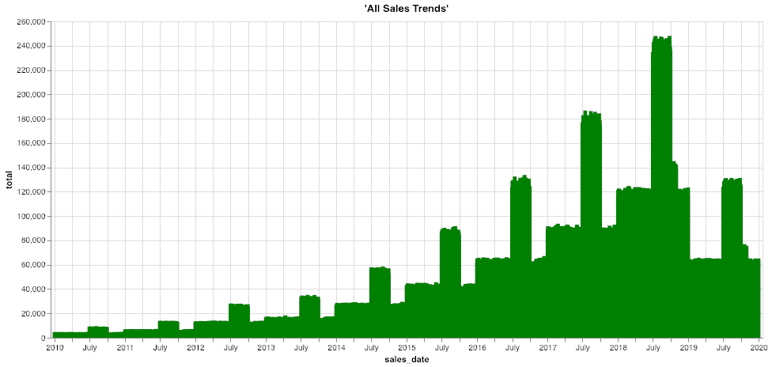

Historial profundo: acceso a datos de archivo desde almacenes de objetos
------------------------------------------------------------------------

### Antes de empezar

Abra el editor para continuar con este caso de uso. [INICIAR EDITOR](#data=%7B%22navigateTo%22:%22editor%22%7D)

### Introducción

Las regulaciones cada vez más estrictas exigen que las empresas mantengan los datos en línea y accesibles para cumplir con las normas durante muchos años. Aunque los datos a los que se accede con más frecuencia son los más recientes o actuales, eso no significa que la información más antigua no sea útil o relevante para los casos de uso comerciales y analíticos. Los datos históricos recopilados a lo largo de los años brindan una perspectiva rica del negocio, como tendencias a largo plazo y patrones cíclicos.

Teradata VantageCloud Lake ofrece escalabilidad, concurrencia y rendimiento inigualables para que las empresas más grandes y exigentes del mundo analicen sus datos. La necesidad de realizar análisis frecuentes de información antigua generalmente disminuye a medida que los datos envejecen. Con el tiempo, se acumulan más datos históricos que datos actuales “activos”, por lo que tiene sentido almacenarlos en una arquitectura con diferentes características de rendimiento y precio, por ejemplo, un almacén de objetos como Amazon S3 o Microsoft Azure Blob Storage.

Algunos conocimientos solo están disponibles mediante el análisis conjunto de datos históricos y actuales, por lo que almacenarlos en sistemas separados puede suponer un desafío para muchas plataformas analíticas. Por el contrario, Teradata VantageCloud Lake puede unir sin problemas toda la información histórica y actual en el almacén de datos y el almacenamiento de objetos, sin que los usuarios tengan que cambiar sus herramientas o consultas. Como resultado, los responsables de la toma de decisiones pueden elaborar mejores planes al responder de manera rentable preguntas que antes no se podían responder. Los analistas y científicos de datos tienen acceso sin problemas a conjuntos de datos profundos y completos, lo que permite obtener resultados más sólidos de IA/ML y análisis avanzados.

### Experiencia

La sección Experiencia tarda unos 10 minutos en ejecutarse.

### Configuración

Seleccione **Cargar activos** para crear las tablas y cargar los datos necesarios en su cuenta (instancia de base de datos de Teradata) para este caso de uso. [Cargar activos](#data=%7B%22id%22:%22SalesOffload%22%7D)

### Tutorial

#### Paso 1: Consultar los datos

Aquí están nuestros datos de ventas actuales. Tomemos algunas filas de muestra: En este ejemplo, tenemos información sobre clientes, tiendas, carritos y descuentos.

``` sourceCode
SELECT TOP 10 * 
FROM so_sales_fact
```

``` sourceCode
SELECT sales_date, sum(sales_quantity) as total 
FROM so_sales_fact
GROUP BY sales_date
ORDER BY sales_date ASC
```


¿Para qué rango de tiempo tenemos datos?

``` sourceCode
SELECT MIN(sales_date) AS min_date, MAX(sales_date) AS max_date FROM so_sales_fact
```

¿Cuántos registros tenemos en el almacén de datos (datos de 2019)?

``` sourceCode
SELECT COUNT(*)
FROM so_sales_fact
```

#### Paso 2: Explorar los datos históricos descargados

En nuestro ejemplo, solo tenemos un año de datos de ventas en nuestro almacén de datos, ya que es, de lejos, el más consultado. Para cumplir con las normas, muchas empresas deben conservar hasta 10 años de datos históricos. Para este escenario, los datos más antiguos se han exportado desde VantageCloud Lake cada mes y se han cargado en Amazon S3 para su almacenamiento a largo plazo. Con VantageCloud Lake, podemos acceder sin problemas a estos datos descargados y unirlos con el resto de los datos para revisar las tendencias a largo plazo y gestionar fácilmente las necesidades de análisis, como las solicitudes de auditoría. Esto incluye el uso de consultas e informes existentes que, de lo contrario, tendrían que reescribirse.

Ya sabemos dónde se encuentra el depósito que contiene los datos de ventas descargados, así que revisemos algunos de sus datos. Con la función READ\_NOS, podemos obtener la lista de archivos y sus tamaños. El elemento RETURNTYPE de la cláusula FROM nos permite indicarle a la función que devuelva los metadatos, el esquema o los valores del objeto.

Tenga en cuenta que este depósito S3 es de lectura pública. Si estuviéramos usando un almacén de objetos protegido, podríamos modificar el elemento AUTHORIZATION para que contenga los valores de autenticación adecuados o utilizar un objeto de autorización que contenga esta información.

``` sourceCode
SELECT location(char(255)), ObjectLength 
FROM (
 LOCATION='/s3/s3.amazonaws.com/trial-datasets/SalesOffload'
 AUTHORIZATION='{"ACCESS_ID":"","ACCESS_KEY":""}'
 RETURNTYPE='NOSREAD_KEYS'
) as d 
ORDER BY 1
```

¿Cuántos archivos y directorios hay en total?

``` sourceCode
SELECT COUNT(location(char(255))) as NumFiles
FROM (
 LOCATION='/s3/s3.amazonaws.com/trial-datasets/SalesOffload'
 AUTHORIZATION='{"ACCESS_ID":"","ACCESS_KEY":""}'
 RETURNTYPE='NOSREAD_KEYS'
) as d 
ORDER BY 1
```

Inspeccionemos uno de los archivos para comprender mejor su formato:

``` sourceCode
SELECT * FROM (
      LOCATION='/s3/s3.amazonaws.com/trial-datasets/SalesOffload/2010/1/object_33_0_1.parquet'
      AUTHORIZATION='{"ACCESS_ID":"","ACCESS_KEY":""}'
      RETURNTYPE='NOSREAD_PARQUET_SCHEMA'
      )
AS d
```

#### Paso 3: Crear una capa de abstracción simple para facilitar el acceso

Para crear un objeto de autorización, utilice la siguiente declaración para incluir las credenciales de su almacén de objetos externo. Para este caso de uso, deje los campos USER y PASSWORD en blanco, como se muestra.

``` sourceCode
CREATE AUTHORIZATION MyAuth
USER ''
PASSWORD '';
```

Cree una tabla externa y una vista en VantageCloud Lake para permitir que los analistas de negocios y otros usuarios accedan fácilmente a los datos históricos descargados. Una tabla externa es un objeto en la base de datos que puede actuar como una tabla de base de datos normal, pero que apunta a datos de una ubicación diferente. Las definiciones de tabla externa también contienen sintaxis extendida que puede ayudar a optimizar la transferencia de datos, convertir datos sobre la marcha, etc.

El siguiente SQL crea una tabla simple que se basa en la detección automática de columnas y tipos de datos:

``` sourceCode
CREATE FOREIGN TABLE sales_fact_offload
, EXTERNAL SECURITY MyAuth 
USING
       (
LOCATION  ('/s3/s3.amazonaws.com/trial-datasets/SalesOffload')
STOREDAS  ('PARQUET')
       )
NO PRIMARY INDEX
PARTITION BY COLUMN;
```

Inspeccionemos algunas de las filas en los archivos descargados.

``` sourceCode
SELECT TOP 10 *
FROM sales_fact_offload;
```

¿Cuántos datos tenemos ahí?

``` sourceCode
SELECT COUNT(*)
FROM sales_fact_offload;
```

¡Muy bien, ya casi lo logramos! Queremos que los datos se vean como una tabla nativa. Por lo tanto, coloquemos una vista en la parte superior para dividirla en columnas.

``` sourceCode
REPLACE VIEW sales_fact_offload_v as (  
SELECT 
    sales_date,
    customer_id,
    store_id,
    basket_id,
    product_id,
    sales_quantity,
    discount_amount
FROM sales_fact_offload);
```

Ahora podemos consultar los datos como cualquier otra tabla de VantageCloud Lake, pero los datos se extraen en el momento de ejecución de la consulta directamente desde el almacén de objetos. Ahora tenemos una experiencia de análisis perfecta al admitir la correlación de conjuntos de datos basados ​en el almacén de objetos con conjuntos de datos estructurados en tablas relacionales de Teradata mediante habilidades y flujos de trabajo de SQL existentes.

``` sourceCode
SELECT TOP 10 *
FROM sales_fact_offload_v;
```

Ahora, los usuarios pueden acceder a todos los datos históricos en el almacén de objetos. Al usar una vista de base de datos, podemos abstraer la complejidad subyacente del acceso al almacén de objetos. Los usuarios verán los datos como si fueran cualquier otro objeto en la base de datos, y VantageCloud Lake optimizará automáticamente la ejecución de consultas y la transferencia de datos, optimizando el rendimiento y el tiempo de respuesta.

A menudo necesitamos poder revisar una parte de una gran cantidad de datos. En nuestro caso de uso, hemos asumido algunos filtros comunes, incluidos el año y el mes de las transacciones. Por eso, los hemos guardado por claves de año y mes en el almacén de objetos. Podemos redefinir la tabla externa para filtrar previamente los datos al leerlos en función de estas condiciones comunes.

#### Paso 4: Optimizar la tabla externa y la vista para un acceso eficiente

Hay una gran cantidad de datos en S3. Optimicemos la tabla externa para minimizar los datos que debemos leer al realizar consultas en el almacén de objetos. Diseñar una estructura de ruta y depósito de almacén de objetos es un primer paso importante al planificar cómo almacenar los datos. Requiere conocimiento de las necesidades comerciales, los patrones esperados en el acceso a los datos, una comprensión de los datos y una sensibilidad a los compromisos. En nuestro caso, a menudo sabemos la fecha aproximada que estamos viendo, así que usemos esto a nuestro favor.

``` sourceCode
DROP TABLE sales_fact_offload;
CREATE FOREIGN TABLE sales_fact_offload
, EXTERNAL SECURITY MyAuth 
USING
       (
LOCATION  ('/s3/s3.amazonaws.com/trial-datasets/SalesOffload')
PATHPATTERN ('$dir1/$year/$month')
STOREDAS  ('PARQUET')
       )
NO PRIMARY INDEX
PARTITION BY COLUMN;
```

Hemos redefinido nuestra tabla externa para incluir un elemento **PATHPATTERN**. Al revisar datos históricos por fecha, esto nos permite leer solo los archivos que necesitamos.

Ahora, vamos a recrear nuestra vista fácil de usar que permite este filtrado de rutas. Como se mencionó anteriormente, las vistas de bases de datos nos permiten abstraer la complejidad subyacente. En este caso, estamos asignando una ruta de objeto a columnas, por lo que cuando los usuarios usen estas columnas como valores de filtro, VantageCloud Lake minimizará automáticamente la transferencia de datos.

``` sourceCode
REPLACE VIEW sales_fact_offload_v as (  
SELECT 
    CAST($path.$year AS CHAR(4)) sales_year,
    CAST($path.$month AS CHAR(2)) sales_month,
    sales_date,
    customer_id,
    store_id,
    basket_id,
    product_id,
    sales_quantity,
    discount_amount
FROM sales_fact_offload);
```

``` sourceCode
SELECT TOP 10 *
FROM sales_fact_offload_v
WHERE sales_year = '2010'
AND sales_month = '9';
```

Esto es ideal para casos de uso en los que conocemos el mes. Supongamos que necesitamos ver lo que compró un cliente hace muchos años. O tal vez queremos informar sobre las ventas históricas de la tienda. Un analista de negocios puede consultar esto fácilmente sin intervención de TI, copias de seguridad ni otros silos de datos difíciles de alcanzar.

Veamos las ventas de la Tienda 6 en agosto de 2012:

``` sourceCode
SELECT store_id, SUM(sales_quantity)
FROM sales_fact_offload_v
WHERE store_id = 6
AND sales_year = '2012'
AND sales_month = '8'
GROUP BY 1;
```

Unamos los datos históricos con los datos actuales para poder ver el panorama completo:

``` sourceCode
REPLACE VIEW sales_fact_all as (
SELECT sales_date,
    customer_id,
    store_id,
    basket_id,
    product_id,
    sales_quantity,
    discount_amount
    FROM so_sales_fact
    UNION ALL
SELECT 
    sales_date,
    customer_id,
    store_id,
    basket_id,
    product_id,
    sales_quantity,
    discount_amount
FROM sales_fact_offload_v);
```

Por último, volvamos a ejecutar nuestro informe de ventas a lo largo del tiempo. El código no ha cambiado con respecto al anterior, por lo que podemos analizar todos los datos de ventas posteriores al año más reciente.

``` sourceCode
SELECT sales_date, sum(sales_quantity) as total 
FROM sales_fact_all
GROUP BY sales_date
ORDER BY sales_date ASC;
```



Podemos ver que 2019 fue un año malo, por lo que debemos investigar más a fondo para ver qué sucedió. Pero gracias a VantageCloud Lake, podemos analizar de manera rentable todos nuestros datos al descargar los datos más fríos y menos consultados en el almacenamiento de objetos para su custodia.

#### Paso 5: Limpiar

Elimine los objetos que hemos creado en nuestro propio esquema de base de datos.

``` sourceCode
DROP VIEW sales_fact_all;
```

``` sourceCode
DROP VIEW sales_fact_offload_v;
```

``` sourceCode
DROP TABLE sales_fact_offload;
```

Conjunto de datos
-----------------

------------------------------------------------------------------------

El conjunto de datos **sales\_fact** tiene aproximadamente 43 millones de filas de datos de ventas de muestra:

-   `sales_date`: fecha en la que se procesó el pedido
-   `customer_id`: identificador del cliente
-   `store_id`: identificador de la tienda donde se realizó el pedido
-   `basket_id`: número de agrupación u orden
-   `product_id`: identificador del producto
-   `sales_quantity`: cantidad del producto vendido
-   `discount_amount`: ¿cuánto descuento se otorgó en esta línea de artículo?
