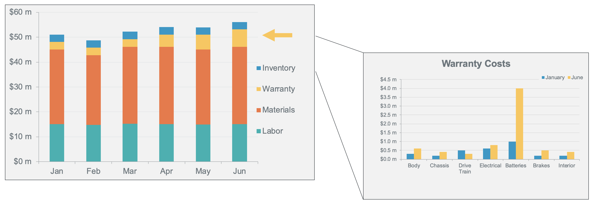
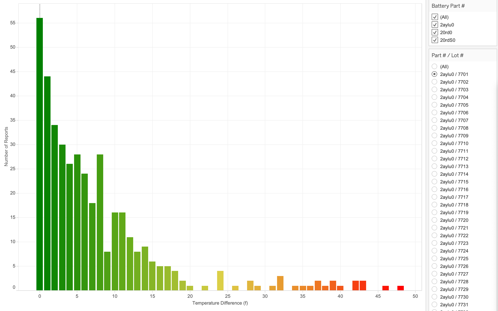

Análisis de defectos de fabricación
-----------------------------------

### Antes de empezar

Abra el editor para continuar con este caso de uso. [INICIAR EDITOR](#data=%7B%22navigateTo%22:%22editor%22%7D)

### Introducción

Usted es analista de un importante fabricante de automóviles. Mientras ejecutábamos informes financieros periódicos en Teradata VantageCloud Lake, descubrimos un problema empresarial grave con el aumento de las reparaciones en garantía:



El problema parece deberse a la sustitución de las baterías, uno de los componentes más caros y críticos de nuestros vehículos eléctricos. Podemos utilizar las capacidades únicas de VantageCloud Lake para analizar los datos estructurados y semiestructurados capturados durante el proceso de fabricación a fin de aislar la causa raíz y, finalmente, solucionar el problema.

### Experiencia

La sección Experiencia tarda unos 15 minutos en ejecutarse.

### Configuración

Seleccione **Cargar activos** para crear las tablas y cargar los datos necesarios en su cuenta (instancia de base de datos de Teradata) para este caso de uso. [Cargar activos](#data=%7B%22id%22:%22EVCarBattery%22%7D)

### Tutorial paso a paso

------------------------------------------------------------------------

#### Paso 1: Identifique la causa raíz

Generaremos un informe de todos los vehículos a los que se les reemplazó la batería y combinaremos la información de la batería y del vehículo con el concesionario que realizó el servicio. En este ejemplo, todos los datos están en la base de datos, pero en el mundo real, la combinación de conjuntos de datos dispares es un factor clave para lograr un análisis eficaz. VantageCloud Lake permite a los usuarios combinar datos de varios almacenes de objetos, Data Lakes y sistemas de terceros a escala para realizar un análisis rápido y detallado.

```sql
SELECT d.company, count(*)
FROM ev_dealers d, ev_badbatts bb,
ev_vehicles v
WHERE bb.vin = v.vin
AND v.dealer_id = d.id
GROUP BY d.company order by 2 desc
```

A continuación, agrupamos los datos según el modelo del vehículo. Utilizamos el mismo conjunto de piezas de batería en varios modelos diferentes de nuestra línea de productos:

```sql
SELECT v.model, count(*)
FROM ev_vehicles v, ev_badbatts bb
WHERE bb.vin = v.vin
GROUP BY v.model order by 2 desc
```

No hay nada significativo allí.

Ahora, agrupe por la planta de ensamblaje de donde provienen los automóviles:

```sql
SELECT mfg.company, count(*)
FROM ev_mfg_plants mfg, ev_badbatts bb,
ev_vehicles v
WHERE bb.vin = v.vin
AND v.mfg_plant_id = mfg.id
GROUP BY mfg.company order by 2 desc
```

Vemos un número muy elevado de coches defectuosos procedentes de la misma planta de montaje.

Ahora, averigüe qué baterías están instaladas en los automóviles con baterías defectuosas. Utilice el número de pieza para agregar los datos.

```sql
SELECT DISTINCT bom.part_no, p.description, count(*)
FROM ev_bom bom, ev_badbatts bb, ev_parts p
WHERE bb.vin = bom.vin
AND bom.part_no = p.part_no
AND p.description LIKE 'Battery Cell%'
GROUP BY bom.part_no, p.description
```

Después de ejecutar esta consulta, parece que tenemos un problema con part\_no 20rd0.

VantageCloud Lake permite a las organizaciones almacenar y analizar grandes cantidades de datos en un almacenamiento de objetos optimizado en términos de rendimiento y costes. Para esta demostración, almacenamos datos de fabricación detallados en nuestro almacén de datos integrado. Vea si existe una correlación con los números de lote de esas baterías:

```sql
SELECT bom.part_no, bom.lot_no, p.description, count(*)
FROM ev_bom bom, ev_badbatts bb, ev_parts p
WHERE bb.vin = bom.vin
AND p.part_no = bom.part_no
AND p.description LIKE 'Battery Cell%'
GROUP BY bom.part_no, bom.lot_no, p.description
ORDER BY count(*) DESC
```

La consulta anterior muestra el problema subyacente con part\_no 20rd0. La mayoría de los errores se deben al lote de baterías 4012 (entregado a la planta de Jackson), que tiene una gran cantidad de baterías defectuosas que impulsan nuestros reemplazos de garantía. Estos datos se muestran aún mejor en nuestro panel de control de la herramienta de inteligencia empresarial (BI) favorita, que se conecta directamente a VantageCloud Lake y permite un análisis interactivo e iterativo:


Nuestros modernos vehículos eléctricos conectados también proporcionan datos detallados de los sensores. Podemos ver los datos del sensor de temperatura del lote de baterías en cuestión:


Compare esto con un lote de baterías promedio:



Se pueden ver claramente las ocurrencias de temperaturas más altas o sobrecalentamiento en nuestras baterías según el modelo o el número de lote de estas. Ahora vemos la causa subyacente de nuestros mayores costes de garantía, pero queremos profundizar en el problema, mirando hacia atrás, al momento en que se ensamblaron y probaron los automóviles.

#### Paso 2: Necesitamos datos adicionales: acceder a los resultados de las pruebas desde nuestro Data Lake

Llevando este análisis aún más lejos, queremos entender cómo podemos detectar baterías defectuosas antes de que acaben en los coches de nuestros clientes. Esto nos ayudará a evitar costosos ciclos de reparación en garantía y la insatisfacción de los clientes en el futuro.

Cuando se fabrican los coches, almacenamos informes de pruebas detallados de las piezas y subsistemas que componen el vehículo. Estos informes son voluminosos y tienen un formato semiestructurado, y se almacenan en nuestro Data Lake alojado en un almacén de objetos.

Al utilizar VantageCloud Lake, podemos extraer estos datos de forma nativa a escala y usarlos para nuestro análisis.

En primer lugar, cree un objeto de autorización para autenticarse en el almacén de objetos externo. En el mundo real, reemplazaría los espacios en blanco con las credenciales o los roles de Identity and Access Management (IAM) adecuados para acceder a los recursos protegidos. Aquí, crearemos uno en blanco para acceder a un recurso disponible públicamente:

```sql
CREATE AUTHORIZATION MyAuth
USER ''
PASSWORD '';
```

En segundo lugar, cree una tabla externa para acceder a los datos con formato JSON en Amazon S3. Una tabla externa nos permite acceder a los datos remotos como si fueran una tabla normal en la base de datos:

```sql
CREATE FOREIGN TABLE test_reports , FALLBACK ,
     EXTERNAL SECURITY MyAuth
(
    Location VARCHAR(2048) CHARACTER SET UNICODE CASESPECIFIC,
    payload JSON(16776192) INLINE LENGTH 64000 CHARACTER SET LATIN)
USING (
    Location ('/s3/s3.amazonaws.com/trial-datasets/EVCarBattery/')
), NO PRIMARY INDEX;
```

En tercer lugar, verifique una muestra de diez filas para validar los datos:

```sql
SELECT TOP 10 *
FROM test_reports
```

Colocar una vista fácil de usar sobre la tabla externa nos permite usar funciones de procesamiento JSON y exponer los datos en un formato más sencillo. Estas funciones se usan con bastante frecuencia para el procesamiento de datos semiestructurados a gran escala:

```sql
REPLACE VIEW test_reports_v AS
(SELECT vin, part_no, lot_no, CAST(test_report AS JSON) test_report
FROM TD_JSONSHRED(
    ON (
                SELECT payload.vin as vin, payload
                FROM test_reports)
            USING
            ROWEXPR('parts')
            COLEXPR('part_no', 'lot_no', 'test_report') 
            RETURNTYPES('VARCHAR(17)', 'VARCHAR(1000)', 'VARCHAR(10000)')
        ) AS d1 (vin, part_no, lot_no, test_report)
    )
```

Ahora, verifique una muestra de los datos procesados consultando la vista:

```sql
SELECT TOP 10 *
FROM test_reports_v
```

#### Paso 3: Acceder a los datos de prueba de fabricación JSON o unirlos de forma nativa en Vantage

Eso se ve bien. Ahora, revisemos los informes de prueba. En las pruebas se notifican diferentes datos de las distintas piezas. Los resultados de las pruebas de las piezas más simples se ven así:

```sql
SELECT TOP 1 test_report
FROM test_reports_v
WHERE part_no = '11400zn'
```

Por el contrario, el informe de prueba de una batería contiene datos detallados sobre el rendimiento de esta después de ensamblarla, pero antes de instalarla en el vehículo:

```sql
SELECT TOP 1 test_report
FROM test_reports_v
WHERE part_no = '20rdS0'
```

Queremos comparar las capacidades nominales y medidas junto con los números de pieza/lote solo de las baterías. Podemos acceder fácilmente a los datos JSON mediante una simple notación de puntos para acceder a los resultados de las pruebas que necesitamos.

```sql
SELECT TOP 10 tr.part_no, p.description, tr.lot_no, 
tr.test_report."Rated Capacity" AS rated_capacity,
tr.test_report."Static Capacity Test"."Measured Average Capacity" AS measured_capacity
FROM ev_parts p, test_reports_v tr
WHERE  p.part_no = tr.part_no
AND p.description LIKE 'Battery Cell%'
```

Al visualizar esto en nuestra herramienta de inteligencia empresarial, podemos ver que estos paquetes de baterías cumplen con las especificaciones, pero su autonomía es mucho menor que la de otros lotes de baterías. Podemos ajustar nuestros criterios de aceptación y realizar análisis proactivos como este para identificar posibles problemas de calidad antes de que los automóviles estén terminados y entregados a los clientes. Estas iniciativas aumentarán la calidad del producto y garantizarán que esto no vuelva a suceder.


Al utilizar VantageCloud Lake para analizar nuestros datos integrados y el Data Lake, podemos llegar al fondo de prácticamente cualquier problema empresarial de forma rápida y sencilla.

#### Paso 4: Limpiar

Elimine los objetos que hemos creado en nuestro propio esquema de base de datos.

```sql
DROP TABLE test_reports;
```

```sql
DROP VIEW test_reports_v;
```

Conjunto de datos
-----------------

------------------------------------------------------------------------

**bom** - Lista de materiales - Contiene todas las partes principales que componen cada vehículo:

-   `id`: identificador único
-   `vin`: número de identificación del vehículo
-   `part_no`: número de pieza
-   `vendor_id`: proveedor que produjo la pieza (sin usar)
-   `lot_no`: número de lote del proveedor
-   `quantity`: ¿cuántas de esta pieza hay en el vehículo?

**dealers**: venta y distribución de vehículos:

-   `id`: identificador único
-   `Company`: nombre de la empresa
-   `StreetAddress`: dirección postal
-   `City`: ciudad
-   `State`: estado
-   `ZipCode`: código postal
-   `Country`: país
-   `EmailAddress`: dirección de correo electrónico principal
-   `TelephoneNumber`: número de teléfono
-   `DomainName`: URL del sitio web de la empresa
-   `Latitude`: latitud (ubicación)
-   `Longitude`: longitud (ubicación

**mfg\_plants**: instalaciones de fabricación:

-   `id`: identificador único
-   `Company`: nombre de la instalación
-   `StreetAddress`: dirección postal
-   `City`: ciudad
-   `State`: estado
-   `ZipCode`: código postal
-   `Country`: país
-   `EmailAddress`: dirección de correo electrónico principal
-   `TelephoneNumber`: número de teléfono
-   `DomainName`: URL del sitio web de la planta
-   `Latitude`: latitud (ubicación)
-   `Longitude`: longitud (ubicación

**parts**: lista maestra de piezas para todos los vehículos:

-   `part_no`: número de pieza único
-   `description`: descripción de la pieza

**vehicles**: vehículos que hemos fabricado/estamos fabricando:

-   `vin`: identificador único
-   `yr`: año del modelo
-   `model`: código del modelo del vehículo
-   `customer_id`: cliente/comprador
-   `dealer_id`: concesionario donde se vendió/entregó el vehículo
-   `mfg_plant_id`: planta donde se montó el vehículo
