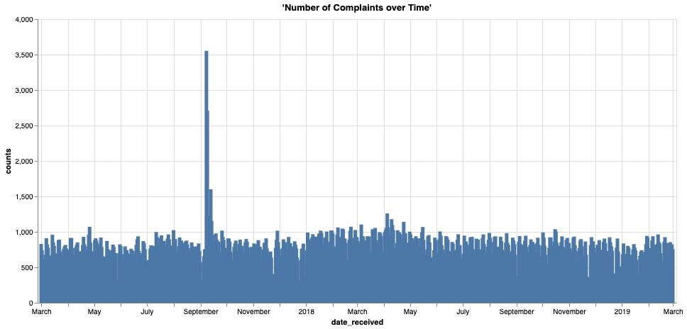
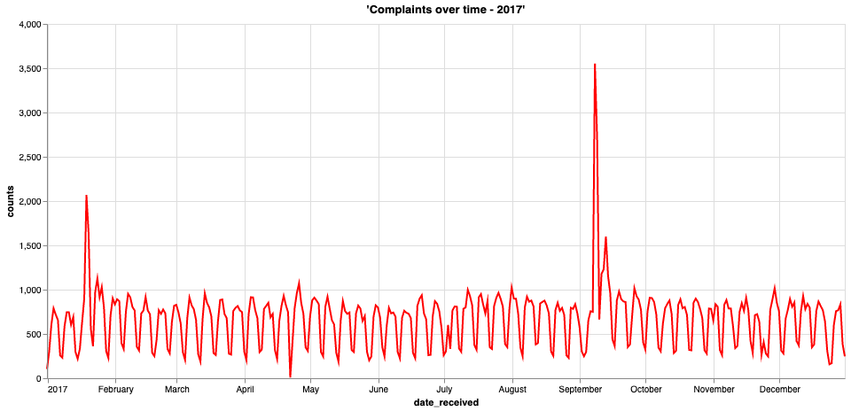

Análisis de series temporales: análisis de quejas de consumidores a lo largo del tiempo
---------------------------------------------------------------------------------------

### Antes de empezar

Abra el editor para continuar con este caso de uso. [INICIAR EDITOR](#data=%7B%22navigateTo%22:%22editor%22%7D)

### Introducción

En este ejemplo analizaremos la cantidad de quejas a lo largo del tiempo recibidas por la Oficina de Protección Financiera del Consumidor (CFPB).

¿Cómo podemos usar Vantage para extraer información y contar una historia detrás de un conjunto de datos? En este caso de uso, verá lo poderoso y simple que es extraer respuestas de un conjunto de datos públicos disponibles a través de [Data.gov](http://data.gov). Usamos SQL y una herramienta de visualización para analizar la cantidad de quejas a lo largo del tiempo para responder las siguientes preguntas:

*¿Cuáles son las tendencias de las quejas a lo largo del tiempo? ¿Cómo podemos interpretar los valores atípicos en el conjunto de datos?*

Al responder preguntas como las anteriores, obtenemos una comprensión más profunda del conjunto de datos y podemos explicar en un lenguaje sencillo cómo evoluciona la cantidad de quejas a lo largo del tiempo. En la sección Explorar, nos centramos en analizar la cantidad de quejas a lo largo del tiempo e identificar tendencias y valores atípicos en la serie temporal para responder las preguntas anteriores.

### Experiencia

La sección Experiencia tarda unos 5 minutos en ejecutarse.

### Configuración

Seleccione **Cargar activos** para crear las tablas y cargar los datos necesarios en su cuenta (instancia de base de datos de Teradata) para este caso de uso. [Cargar activos](#data=%7B%22id%22:%22FinancialProtection%22%7D)

### Tutorial

#### Paso 1: Consultar los datos

Comience contando el número de filas de la tabla.

```sql
select count(*) from fp_consumer_complaints;
```

Hay poco menos de 1,3 millones de filas. No es un problema analizar grandes conjuntos de datos con Vantage. Veamos una muestra de los datos.

```sql
select TOP 100 * from fp_consumer_complaints;
```

#### Paso 2: Visualizar los datos

De la consulta anterior, observamos que este conjunto de datos tiene mucha información. Para obtener más información, debemos comenzar a agrupar los datos.

La primera columna es **date\_received**. Esta es la fecha en la que se recibieron las quejas y significa que podemos ver un gráfico de series temporales de los datos. Comencemos agrupando los recuentos de **complaint\_id** a lo largo del tiempo, utilizando **date\_received** como nuestro eje temporal.

```sql
select date_received, count(complaint_id) as counts
from fp_consumer_complaints
where date_received BETWEEN DATE '2017-03-01'
AND DATE '2019-03-01'
group by date_received;
```

Esto es genial; ahora tenemos la cantidad de quejas (**counts**) por tiempo (**date\_received**), pero ¿cómo podemos interpretar estos datos? Dibujemos esta serie temporal en un gráfico.



Al visualizar los datos anteriores, podemos ver que la cantidad de quejas varía mucho a lo largo del tiempo y que también parece haber más quejas a medida que pasa el tiempo. También hay algunos picos inusuales en 2017. Entendamos mejor nuestros datos. Empecemos por observar la tendencia general.

Agrupemos los datos por mes y volvamos a trazar el gráfico de arriba.

```sql
select extract(year from date_received) || extract(month from date_received) as month_date, count(complaint_id) as counts
from fp_consumer_complaints
group by month_date
order by month_date;
```


Si analizamos las quejas a lo largo de meses y años, vemos que hay una clara tendencia al alza. Una hipótesis es que, a medida que pasa el tiempo, la gente se vuelve más consciente y difunde la información. Los medios de comunicación también pueden publicitar los canales de quejas a lo largo del tiempo. A través de este gráfico, podemos ver claramente que los picos que vimos anteriormente se produjeron en enero y septiembre de 2017. Profundicemos en estas fechas y extraigamos algunas ideas sobre el siguiente paso.

#### Paso 3: Extraer información de los datos

Acotemos los dos picos anteriores y veamos exactamente dónde se producen. Podemos hacerlo trazando otro gráfico de series temporales, esta vez solo en 2017.

```sql
select date_received, count(complaint_id) as counts
from fp_consumer_complaints
where year(date_received) = 2017
group by date_received
order by date_received;
```



Si analizamos los picos, vemos que se produjeron entre el 15 y el 21 de enero y durante la primera semana de septiembre. Para encontrar las fechas reales de los picos, podemos limitar la consulta para recoger al menos 1500 denuncias al día.

```sql
select date_received,
    month(date_received) as month_date,
    count(complaint_id) as counts
from fp_consumer_complaints
where year(date_received) = 2017 and month_date in (1, 9)
group by date_received
having counts >= 1500
order by month_date, counts desc;
```

Veamos algunos de los problemas que se reportaron durante estas fechas.

```sql
select date_received, company, count(company) as counts
from fp_consumer_complaints
where date_received in (
    date '2017-01-19',
    date '2017-01-20',
    date '2017-09-08',
    date '2017-09-09',
    date '2017-09-13'
)
group by date_received, company
having counts > 500
order by date_received, counts desc;
```

Curiosamente, podemos ver que la gran mayoría de las quejas estaban dirigidas a dos empresas: Navient Solutions y EQUIFAX. Estas parecen estar altamente correlacionadas con la demanda de Navient y los incidentes de filtraciones de Equifax que ocurrieron en esas fechas, respectivamente. Recapitulemos lo que sucedió:

> Demanda contra Navient: En enero de 2017, la Oficina de Protección Financiera del Consumidor (CFPB) de los EE. UU. y los fiscales generales de Illinois y Washington demandaron a Navient Solutions. Navient es un importante proveedor de préstamos estudiantiles privados y federales. Según la CFPB, al menos desde enero de 2010, “Navient ha asignado pagos de manera incorrecta, ha hecho que los prestatarios con dificultades tuvieran que afrontar múltiples indulgencias en lugar de acercarles planes de pago basados en los ingresos y ha proporcionado información poco clara sobre cómo volver a inscribirse en planes de este tipo y cómo calificar para una liberación de cosignatario”.
>
> Filtración de Equifax: El 7 de septiembre de 2017, Equifax anunció que se había producido una infracción de seguridad cibernética, una de las más grandes de la historia, desde mediados de mayo hasta julio de 2017. Algunos de los datos personales a los que se accedió incluían nombres, números de seguridad social, fechas de nacimiento, direcciones y números de licencia de conducir.

Veamos ahora los principales problemas de Navient Solutions y Equifax durante esos períodos para confirmar nuestra hipótesis.

```sql
-- analyze top issues reported agains Navient Soultions on 2017-01-19 and 2017-01-20
select company, product, issue, count(issue) as counts
from fp_consumer_complaints
where date_received in (
    date '2017-01-19',
    date '2017-01-20') and
    company like 'Navient Solutions%'
group by company, product, issue
order by counts desc;
```

Podemos ver que los dos problemas principales representan la mayoría de las quejas contra Navient Solutions. Además, al observar las columnas de productos y problemas, podemos inferir que, de hecho, están relacionados con la demanda por préstamos estudiantiles. Ahora hagamos el mismo análisis para los problemas de Equifax.

```sql
-- analyze top issues reported agains Navient Soultions on 2017-01-19 and 2017-01-20
select
    company,
    product,
    issue,
    count(issue) as counts
from fp_consumer_complaints
where date_received in (
    date '2017-09-08',
    date '2017-09-09',
    date '2017-09-13') and
        company like 'EQUIFAX%'
group by company, product, issue
order by counts desc;
```

En este punto también podemos confirmar nuestra hipótesis. Los problemas más importantes se refieren al uso indebido del informe crediticio, alertas de fraude, robo de identidad, etc. Todo esto parece estar relacionado con la filtración de datos de Equifax que ocurrió en la misma época.

Conjunto de datos
-----------------

------------------------------------------------------------------------

La base de datos de quejas de consumidores contiene datos de quejas recibidas por la Oficina de Protección Financiera del Consumidor (CFPB) sobre productos y servicios financieros, que incluyen, entre otros, cuentas bancarias, tarjetas de crédito, informes crediticios, cobro de deudas, transferencias de dinero, hipotecas, préstamos estudiantiles y otros tipos de crédito al consumidor. El conjunto de datos se actualiza diariamente y contiene información sobre el proveedor, la queja, la fecha, el código postal y más. Puede encontrar más información sobre el conjunto de datos en la sección Consumidor del sitio web [Data.gov](data.gov).

El conjunto de datos **fp\_consumer\_complaints** tiene 1 273 782 filas, cada una de las cuales representa una queja única del consumidor, y 18 columnas, que representan las siguientes características:

-   `date_received`: fecha en que la CFPB recibió la queja
-   `product`: tipo de producto que el consumidor identificó en la queja
-   `sub_product`: tipo de subproducto que el consumidor identificó en la queja
-   `issue`: problema del consumidor identificado en la queja
-   `sub_issue`: subtema del consumidor identificado en la queja
-   `consumer_complaint_narrative`: descripción presentada por el consumidor de “lo que sucedió” en la queja
-   `company_public_response`: respuesta pública y opcional de la empresa a la queja de un consumidor
-   `company`: la queja es sobre esta empresa
-   `state`: estado de la dirección postal proporcionada por el consumidor
-   `zip_code`: código postal de envío proporcionado por el consumidor
-   `tags`: datos que facilitan la búsqueda y clasificación de quejas presentadas por los consumidores o en su nombre
-   `consumer_consent_provided`: identifica si la opción del consumidor es publicar la descripción de su queja
-   `submitted_via`: cómo se presentó la queja ante la CFPB
-   `date_sent_to_company`: fecha en la que la CFBP envió la queja a la empresa
-   `company_response_to_consumer`: cómo respondió la empresa
-   `timely_response`: si la empresa dio una respuesta oportuna
-   `consumer_disputed`: si la empresa impugnó la respuesta de la empresa
-   `complaint_id`: número de identificación único para una queja

Explorar
--------

A través de este ejemplo, vimos el poder y la simplicidad de ejecutar consultas en Vantage y cómo se puede aprovechar para extraer información de los datos y contar la historia detrás de un conjunto de datos. Esperamos que haya notado lo fácil que es usar Vantage para escribir sus propias consultas SQL.

Puede seguir explorando Vantage para extraer más información y encontrar respuestas a otras preguntas utilizando el conjunto de datos precargado. A continuación, se ofrecen algunas sugerencias:

-   ¿Cuáles son los tipos de quejas más comunes? Si agrupamos la categoría **producto**, podemos llegar a esta respuesta. ¿Cómo cambia esto con el tiempo?
-   ¿Cómo envían los clientes sus quejas? La columna **submitted\_via** también se puede agrupar para responder a esta pregunta.
-   ¿Qué proporción de las quejas de los clientes son objeto de controversia? Si sumamos los recuentos de **customer\_disputed**, podemos responder a esta pregunta.
-   ¿Existe estacionalidad en los datos? ¿A qué se debe la estacionalidad? Si restamos la tendencia a la serie podemos analizar la estacionalidad en el conjunto de datos. ¿La mayoría de las denuncias se presentan entre semana o en fin de semana?
