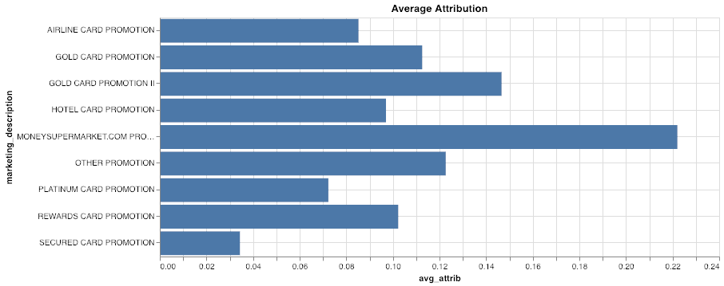
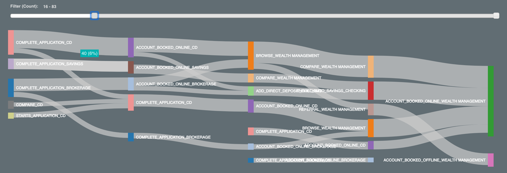

Parcours client des services financiers
---------------------------------------

### Avant de commencer

Ouvrez l'éditeur pour poursuivre ce cas d'utilisation. [LANCER L'ÉDITEUR](#data=%7B%22navigateTo%22:%22editor%22%7D)

### Introduction

Dans ce cas d'utilisation, nous allons présenter plusieurs techniques permettant d'analyser les aspects d'un parcours client à l'aide de Teradata VantageCloud Lake. Plus précisément, nous allons utiliser les fonctions Attribution et nPath.

Voici le scénario que nous allons aborder : nous allons examiner les interactions importantes que les clients ont avec une banque de détail pour montrer comment nous pouvons utiliser VantageCloud Lake pour découvrir de nouvelles informations à travers différentes étapes du parcours client.

À partir de **acquisition de clients**, nous allons découvrir comment : - Trouver de nouveaux clients - Mesurer l'attribution marketing - Augmenter le retour sur investissement (RSI) et maximiser l'efficacité du marketing - Minimiser le temps de conversion

Ensuite, nous allons **examiner l'adoption par les clients :** Qu'est-ce qui amène les clients à choisir des produits haut de gamme supplémentaires, tels que les comptes de gestion de patrimoine ?

Les clients interagissent avec la banque de nombreuses manières, en ligne et hors ligne. Il existe de nombreuses sources de données différentes, telles que les interactions dans l'agence avec les caissiers, les opérations bancaires en ligne, les e-mails et les journaux des centres d'appels. Il est nécessaire de les examiner toutes pour avoir une vue d'ensemble.

VantageCloud Lake offre les meilleures fonctionnalités de sa catégorie pour combiner et agréger des données à n'importe quelle échelle. Il offre une connectivité optimisée en termes de performances aux banques d'objets ouverts et aux systèmes de bases de données tiers par le biais de la technologie brevetée QueryGrid pour créer une infrastructure de requête unique, agrégée et optimisée, qui englobe les données de nombreux systèmes, de clouds et d'emplacements physiques. D'autres démos couvrent les étapes d'intégration et d'agrégation, mais cela ne concerne pas notre cas.

Nous verrons plus tard dans cette démonstration que ces données multicanaux sont essentielles pour obtenir les informations les plus précises et exploitables.

Expérience
----------

L'ensemble du cas d'utilisation dure environ 10 minutes.

### Configuration

Sélectionnez **Charger les actifs** pour créer les tables et charger les données requises dans votre compte (instance de base de données Teradata) pour ce cas d'utilisation. [Charger les actifs](#data=%7B%22id%22:%22FSCustomerJourney%22%7D)

### Acquisition de clients

Le canal d'acquisition de clients est la première étape de notre analyse. Nous allons nous concentrer sur l'analyse de l'efficacité de divers programmes marketing sur les clients qui ouvrent un nouveau compte de carte de crédit. Nous voulons comprendre de quel canal proviennent nos clients et comment maximiser le RSI marketing. Nous allons utiliser la puissante fonction d'attribution marketing de VantageCloud Lake pour examiner les données multicanaux.

Cela va nous permettre de quantifier rapidement l'efficacité marketing de nos promotions et de nos canaux (en ligne et hors ligne). Comprendre quelles promotions sont les plus efficaces va nous permettre d'optimiser les dépenses marketing et le placement des promotions.

Pour analyser efficacement de nombreux paramètres de variables à l'aide de la fonction d'attribution, nous allons créer différentes tables de dimensions :

```sql
--DATABASE <database_name>;

CREATE TABLE FSCJ_conversion_events
   (conversion_event   VARCHAR(55))
NO PRIMARY INDEX;
```

Nous souhaitons déterminer dans quels cas les gens ont réservé des comptes en ligne et hors ligne, et utiliser cela comme critère de réussite :

```sql
INSERT INTO FSCJ_conversion_events VALUES('ACCOUNT_BOOKED_ONLINE');
INSERT INTO FSCJ_conversion_events VALUES('ACCOUNT_BOOKED_OFFLINE');
```

VantageCloud Lake nous permet de spécifier le type de modèle d'attribution à appliquer. Pour plus de simplicité, nous allons choisir un modèle UNIFORME de base. Les modèles UNIFORMES appliquent une pondération égale à chaque étape précédente avant le résultat souhaité.

```sql
CREATE TABLE FSCJ_attribution_model
   (id    INTEGER,
    model VARCHAR(100))
NO PRIMARY INDEX;
```

```sql
INSERT INTO FSCJ_attribution_model VALUES(0, 'SIMPLE');
INSERT INTO FSCJ_attribution_model VALUES(1, 'UNIFORM:NA');
```

À présent, nous sommes prêts à appeler la fonction d'attribution sur notre ensemble de données. L'ensemble de données contient de nombreux types d'interactions client multicanaux que nous pouvons analyser. La fonction d'attribution utilise les données d'événements agrégées comme entrée, ainsi que les tables à deux dimensions que nous avons créées ci-dessus. Des arguments de fonctions supplémentaires permettent de définir le nombre maximal d'événements à traiter, ainsi que des informations sur les colonnes de chronologie et d'identification des événements.

```sql
CREATE TABLE FSCJ_marketing_attribution AS (
    SELECT * FROM Attribution (
                ON (
          SELECT
                customer_identifier, interaction_timestamp, interaction_type, customer_days_active, customer_type,
                marketing_placement, marketing_description, marketing_category,
                interaction_type || product_category AS interaction_product
            FROM fscj_ich_banking
            WHERE
                interaction_type IN ('ACCOUNT_BOOKED_OFFLINE','ACCOUNT_BOOKED_ONLINE','CLICK','REFERRAL','BROWSE')
                AND product_category <> '-1'
        ) 
        PARTITION BY customer_identifier
        ORDER BY interaction_timestamp
        ON FSCJ_conversion_events AS ConversionEventTable DIMENSION
        ON FSCJ_attribution_model AS FirstModel DIMENSION
        USING
        EventColumn ('interaction_type')
        TimestampColumn ('interaction_timestamp')
        WindowSize('rows:10')
    ) as attrib)
    WITH DATA
```

Cette analyse d'attribution vise à identifier les événements conduisant à l'ouverture d'un compte de carte de crédit et à leur attribuer une valeur. Les événements de conversion spécifiques dans les données sont ACCOUNT\_BOOKED\_ONLINE et ACCOUNT\_BOOKED\_OFFLINE, calculant ainsi les événements et les canaux les plus influents favorisant l'acquisition de clients. La fonction d'attribution de VantageCloud Lake prend en charge divers modèles d'attribution standard. Grâce à VantageCloud Lake, nous constatons rapidement comment les modifications apportées au modèle ou aux paramètres d'attribution vont affecter notre analyse.

À présent, examinons quelques statistiques récapitulatives à partir des résultats :

```sql
SELECT marketing_description, AVG(attribution) AS avg_attrib, SUM(attribution) AS sum_attrib, AVG(-time_to_conversion)/3600 AS time_to_conversion
FROM FSCJ_marketing_attribution 
WHERE marketing_description NOT IN ('\N', '-1')
GROUP BY marketing_description;
```




La première visualisation illustre le score d'attribution moyen pour chaque promotion. Plus la barre est grande, plus la promotion a eu d'incidence sur l'ouverture d'un compte par un client.

Le deuxième graphique montre le score d'attribution total pour chaque promotion. La promotion ayant le plus d'incidence en termes de conversions totales est représentée par les barres les plus grandes.

Le troisième graphique montre le temps moyen de conversion des clients en heures pour chaque promotion. Plus le délai est court (en bas du graphique), plus les gens agissent rapidement. Nous constatons que la « Promotion II de la carte Gold » a généré le temps de conversion le plus court, suivie de la « Promotion de l'HotelCard » et de la « Promotion MoneySupermarket.com. »

### Analyse des canaux

Nous disposons de différents réseaux de promotion et de publicité, Voyons donc quelle est l'influence des différentes promotions sur les différents canaux :

```sql
SELECT marketing_category, marketing_placement, SUM(attribution) AS total_attribution 
FROM FSCJ_marketing_attribution 
WHERE marketing_description NOT IN ('\N', '-1')
GROUP BY 1, 2;
```


La visualisation ci-dessous illustre l'attribution totale en fonction de chaque canal sur lequel les promotions ont été diffusées. La longueur totale de la barre indique l'attribution totale à ce canal. Les couleurs correspondent aux promotions que nous avons examinées dans la vue supérieure, ce qui nous permet de voir quelles promotions ont été diffusées sur quels canaux et les performances de chacune. Dans l'ensemble des résultats de données, vous trouverez l'e-mail, l'agence (hors ligne) et le Web.

Pour les canaux numériques, nous constatons que les publicités sur la page d'accueil ont obtenu les meilleurs résultats, suivies de l’e-mail et des recherches sur Google.

À l'aide d'un outil de veille stratégique (BI), nous pouvons créer ce type d'analyse en fonction du résultat de la fonction d'attribution :


Cette visualisation nous donne un aperçu plus détaillé de nos promotions marketing et de leur placement sur différents canaux. Par exemple, nous constatons que « Promotion MoneySupermarket.com » et « Promotion II de la carte Gold » ont été nos promotions les plus efficaces. Nous constatons que « Promotion de la carte Gold » n'a été diffusée que par e-mail, tandis que « Promotion II de la carte Gold » l'a été sur plusieurs canaux et s'est avérée plus efficace.

Grâce à ce tableau de bord et à la puissance de VantageCloud Lake, vous pouvez facilement comparer les différentes promotions et constater que la « promotion MoneySupermarket.com » spéciale a été particulièrement efficace. Elle n'a été diffusée que sur ce canal particulier et a permis à la fois un temps de conversion rapide et une attribution moyenne élevée.

Nous constatons que la « Promotion de la carte de fidélité » a bien fonctionné sur tous les canaux, mais qu'elle a été particulièrement efficace par le biais des recommandations en agence. La « Promotion de la carte de compagnie aérienne » a connu les meilleurs résultats sur la page d'accueil et sur Google.

Chemin vers l'adoption
----------------------

Ensuite, nous voulons voir comment les clients ouvrent des comptes haut de gamme, comme la gestion de patrimoine. De nombreuses banques de détail ont découvert que la gestion de patrimoine était un centre de profit essentiel et cherchent donc à développer leur activité dans ce domaine.

Nous pouvons utiliser la puissante fonction d'analyse nPath de VantageCloud Lake pour effectuer une analyse combinée basée sur les tendances et la chronologie, ce qui est très difficile à réaliser dans SQL. Dans ce cas d'utilisation, nous souhaitons voir les chemins courants empruntés par les clients lorsqu'ils souhaitent ouvrir un compte de gestion de patrimoine. Nous allons examiner également l'affiliation entre les autres comptes détenus par les clients de gestion de patrimoine.

La fonction nPath utilise plusieurs entrées clés pour définir comment elle construira le chemin chronologique pour chaque utilisateur. Dans le code ici, vous pouvez voir quelques éléments clés. Tout d'abord, nous nettoyons les données d'entrée pour faciliter l'analyse. Ensuite, nous définissons les tendances à faire correspondre pour assembler le chemin : 1. Dans les données d'entrée, nous concaténons l'interaction et la catégorie de produit pour créer des événements uniques. 2. Dans les données d'entrée, nous filtrons également le démarrage/l'arrêt de l'application de gestion de patrimoine. Tout le monde le fait par définition et, dans ce cas, nous voulons en réduire l'incidence. Une analyse plus approfondie peut être effectuée sur des applications incomplètes ou d'autres scénarios. 3. Dans l'élément **‘PATTERN’**, nous utilisons la syntaxe pour rechercher quatre événements suivis de l'ouverture (ACCOUNT\_BOOKED) d'un compte de gestion de patrimoine.  
4. Les deux **‘SYMBOLS’** sont définis comme n'importe quel événement, à l'exception de l'ouverture d'un compte de gestion de patrimoine comme ÉVÉNEMENT et de l'ouverture dudit compte comme ADOPTION. 5. La clause **‘RESULT’** indique à la fonction comment afficher les résultats. Dans ce cas, nous créons une longue chaîne d'événements représentant le chemin, ainsi que d'autres informations, comme le nombre d'événements, l'ID de client et la catégorie de produit.

```sql
SELECT * FROM nPath (
        ON (
        SELECT customer_identifier, interaction_timestamp, interaction_type, product_category, interaction_type || '_' || product_category AS event, 
                marketing_category, marketing_description, marketing_placement, sales_channel, 
                conversion_sales, conversion_cost, conversion_margin
            FROM fscj_ich_banking
            WHERE
                product_category <> '-1'
                AND interaction_type || '_' || product_category <> 'STARTS_APPLICATION_WEALTH MANAGEMENT'
                AND interaction_type || '_' || product_category <> 'COMPLETE_APPLICATION_WEALTH MANAGEMENT'
        )
        PARTITION BY customer_identifier
        ORDER BY interaction_timestamp
        USING
        MODE (NONOVERLAPPING)
        -- Limit to a depth of 4
        PATTERN ('(EVENT){4}.ADOPTION')
        SYMBOLS (
            event NOT LIKE 'ACCOUNT_BOOKED%_WEALTH MANAGEMENT' AS EVENT,
            event LIKE 'ACCOUNT_BOOKED%' AND product_category = 'WEALTH MANAGEMENT' AS ADOPTION
        )
        RESULT (
            ACCUMULATE( event OF ANY(EVENT,ADOPTION) )  AS interaction_type_list,
            COUNT( event OF ANY(EVENT,ADOPTION) )       AS click_depth,

            FIRST( customer_identifier of ADOPTION )  AS customer_identifier,
            FIRST( product_category OF ADOPTION )     AS product_category
        )
    ) a;
```

À l'aide des visualisations de VantageCloud Lake Console ou d'un autre outil de veille stratégique, nous pouvons créer un graphique spécialisé appelé Sankey, qui fournit un aperçu des chemins les plus courants empruntés par les utilisateurs lors de l'ouverture de comptes de gestion de patrimoine :


Nous pouvons le filtrer jusqu'aux chemins les plus populaires :



À présent que nous avons une meilleure vision de ce qui se passe, examinons les principaux facteurs dans chaque cas.

Commencez par examiner les facteurs qui motivent les comptes de gestion de patrimoine en ligne. Nous constatons que l'outil de comparaison que la banque propose sur son site Web est une étape essentielle pour ouvrir un compte. Il permet aux clients de comparer ses offres de gestion de patrimoine à celles de ses concurrents. Il s'avère convaincant : les clients parcourent les offres, puis utilisent l'outil de comparaison et, finalement, effectuent une réservation.

Les autres principaux facteurs qui incitent les personnes à ouvrir un compte en ligne sont les personnes qui s'inscrivent à un plan d'épargne automatique. Les personnes ayant l’intention d’épargner ont tendance à ouvrir des comptes de gestion de patrimoine. En outre, la consultation des offres et l'ouverture d'un certificat de dépôt (CD) semblent également être des chemins secondaires.

Nous constatons que les facteurs hors ligne sont différents, principalement les personnes qui ouvrent d'autres types de comptes, ainsi que des certificats de dépôt et des comptes de courtage, à la fois en ligne et hors ligne. Les recommandations en agence sont le principal moyen de réserver un compte de gestion de patrimoine hors ligne. Les personnes qui se rendent dans une agence et ouvrent un autre type de compte sont orientées vers l'ouverture d'un compte de gestion de patrimoine.

### Nettoyer

```sql
DROP TABLE FSCJ_conversion_events;
```

```sql
DROP TABLE FSCJ_attribution_model;
```

```sql
DROP TABLE FSCJ_marketing_attribution;
```

### Ensemble de données

Les données de ce cas d'utilisation, FSCustomerJourney, sont stockées dans la base de données `retail_sample_data`.

#### Historique des contacts intégré

Il s'agit de la table principale que nous utilisons dans ce cas d'utilisation. Il s'agit de données provenant de divers systèmes et canaux sources déjà combinés et regroupés dans une seule grande table. Il s'agit de toutes les interactions avec les clients. Dans un système client, il peut s'agir d'une vue au-dessus de diverses tables sources.

`fscj_ich_banking`

-   `customer_skey` : clé client
-   `customer_identifier` : identifiant client unique
-   `customer_cookie` : cookie placé sur l'appareil du client
-   `customer_online_id` : booléen : le client possède-t-il un compte en ligne ?
-   `customer_offline_id` : numéro de compte client
-   `customer_type` : s'agit-il d'un client à forte valeur ajoutée ou simplement d'un visiteur qui parcourt le site Web ?
-   `customer_days_active` : depuis combien de temps le client est-il actif ?
-   `interaction_session_number` : identifiant de la session
-   `interaction_timestamp` : horodatage de cet événement
-   `interaction_source` : canal d'où provient cet événement (en ligne/hors ligne, en agence, etc.)
-   `interaction_type` : type d'événement
-   `sales_channel` : canal dans lequel s'est déroulé un événement commercial
-   `conversion_id` : identifiant de conversion commerciale
-   `product_category` : quel était le type de produit concerné par l'événement (chèque, épargne, compte de dépôt, etc.)
-   `product_type` : inutilisé
-   `conversion_sales` : inutilisé
-   `conversion_cost` : inutilisé
-   `conversion_margin` : inutilisé
-   `conversion_units` : inutilisé
-   `marketing_code` : identifiant de marketing
-   `marketing_category` : canal de marketing (en agence, site Web, e-mail, etc.)
-   `marketing_description` : nom de la campagne de marketing
-   `marketing_placement` : point de vente spécifique (Google, Bloomberg.com, etc.)
-   `mobile_flag` : la valeur booléenne se trouvait sur un appareil mobile
-   `updt` : inutilisé
