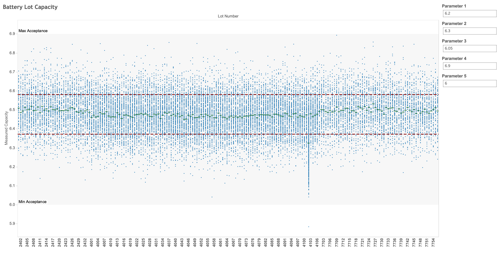

Analyse des défauts de fabrication
----------------------------------

### Avant de commencer

Ouvrez l'éditeur pour poursuivre ce cas d'utilisation. [LANCER L'ÉDITEUR](#data=%7B%22navigateTo%22:%22editor%22%7D)

### Introduction

Vous êtes analyste chez un grand constructeur automobile. En exécutant des rapports financiers réguliers sur Teradata VantageCloud Lake, nous avons découvert un problème commercial grave lié à l'augmentation des réparations sous garantie :


Le problème semble être lié au remplacement de blocs-batteries, l'un des composants les plus coûteux et les plus critiques de nos véhicules électriques (VE). Nous pouvons utiliser les capacités uniques de VantageCloud Lake pour analyser les données structurées et semi-structurées capturées pendant le processus de fabrication afin d'isoler la cause première et de résoudre finalement le problème.

### Expérience

La section Expérience dure environ 15 minutes.

### Configuration

Sélectionnez **Charger les actifs** pour créer les tables et charger les données requises dans votre compte (instance de base de données Teradata) pour ce cas d'utilisation. [Charger les actifs](#data=%7B%22id%22:%22EVCarBattery%22%7D)

### Procédure pas à pas

------------------------------------------------------------------------

#### Étape 1 : Identifier la cause première

Nous allons exécuter un rapport sur tous les véhicules dont la batterie a été remplacée et combiner les informations sur la batterie et le véhicule avec celles du réparateur. Dans cet exemple, toutes les données se trouvent dans la base de données, mais en réalité, la combinaison d'ensembles de données distincts est un élément clé pour permettre des analyses efficaces. VantageCloud Lake permet aux utilisateurs de combiner des données provenant de divers systèmes tiers, instances de Data Lake et banques d'objets à grande échelle pour effectuer une analyse rapide et détaillée.

```sql
SELECT d.company, count(*)
FROM ev_dealers d, ev_badbatts bb,
ev_vehicles v
WHERE bb.vin = v.vin
AND v.dealer_id = d.id
GROUP BY d.company order by 2 desc
```

Ensuite, regroupez les données en fonction du modèle de véhicule. Nous utilisons le même ensemble d'éléments de batteries dans plusieurs modèles différents de notre gamme de produits :

```sql
SELECT v.model, count(*)
FROM ev_vehicles v, ev_badbatts bb
WHERE bb.vin = v.vin
GROUP BY v.model order by 2 desc
```

Rien d'important à signaler.

À présent, regroupez les voitures par usine de montage :

```sql
SELECT mfg.company, count(*)
FROM ev_mfg_plants mfg, ev_badbatts bb,
ev_vehicles v
WHERE bb.vin = v.vin
AND v.mfg_plant_id = mfg.id
GROUP BY mfg.company order by 2 desc
```

Nous constatons un nombre très élevé de voitures défectueuses provenant d'une même usine de montage.

À présent, découvrez quels éléments de batteries sont installés dans les voitures avec des batteries défectueuses. Utilisez la référence pour regrouper les données.

```sql
SELECT DISTINCT bom.part_no, p.description, count(*)
FROM ev_bom bom, ev_badbatts bb, ev_parts p
WHERE bb.vin = bom.vin
AND bom.part_no = p.part_no
AND p.description LIKE 'Battery Cell%'
GROUP BY bom.part_no, p.description
```

Après avoir exécuté cette requête, il semble que nous ayons un problème avec la pièce part\_no 20rd0.

VantageCloud Lake permet aux entreprises de stocker et d'analyser de vastes quantités de données dans un stockage d'objets optimisé en termes de performances et de coûts. Dans cette démonstration, nous stockons des données de fabrication détaillées dans notre entrepôt de données intégré. Vérifiez s'il existe une corrélation avec les numéros de lots de ces éléments de batteries :

```sql
SELECT bom.part_no, bom.lot_no, p.description, count(*)
FROM ev_bom bom, ev_badbatts bb, ev_parts p
WHERE bb.vin = bom.vin
AND p.part_no = bom.part_no
AND p.description LIKE 'Battery Cell%'
GROUP BY bom.part_no, bom.lot_no, p.description
ORDER BY count(*) DESC
```

La requête ci-dessus montre le problème sous-jacent avec la pièce part\_no 20rd0. La plupart des défaillances proviennent du lot de batteries 4012 (livré à l'usine de Jackson), qui contient un grand nombre de batteries défectueuses qui sont à l'origine de nos remplacements sous garantie. Ces informations s'affichent encore mieux sur notre tableau de bord dans notre outil de veille stratégique préféré, qui se connecte directement à VantageCloud Lake et permet une analyse interactive et itérative :


Nos voitures électriques (VE) connectées modernes fournissent également des données de capteurs détaillées. Nous pouvons examiner les données du capteur de température pour le lot de batteries en question :


Comparez-le à un lot de batteries moyen :


Vous pouvez clairement constater les occurrences de températures plus élevées/surchauffes dans nos blocs-batteries en fonction du modèle/numéro de ceux-ci. Nous constatons à présent la cause sous-jacente de nos coûts de garantie accrus, mais nous voulons approfondir le problème en remontant à la période de montage et de test des véhicules.

#### Étape 2 : Nous avons besoin de données supplémentaires – Accédez aux résultats de test à partir de notre Data Lake

En approfondissant cette analyse, nous souhaitons comprendre comment détecter les batteries défectueuses avant qu'elles ne se retrouvent dans les voitures de nos clients. Cela va nous aider à éviter des cycles de réparation sous garantie coûteux et le mécontentement des clients à l'avenir.

Lors de la fabrication des voitures, nous stockons des rapports de test détaillés pour les pièces et les sous-systèmes qui composent le véhicule. Ces rapports sont volumineux et dans un format semi-structuré, stockés dans notre instance de Data Lake hébergée sur une banque d'objets.

Grâce à VantageCloud Lake, nous pouvons extraire nativement ces données à grande échelle et les utiliser pour notre analyse.

Tout d'abord, créez un objet d'autorisation pour vous authentifier auprès de la banque d'objets externes. En réalité, vous remplaceriez les espaces vides par des identifiants ou les rôles Identity and Access Management (IAM) appropriés pour accéder aux ressources protégées. Ici, nous allons créer un espace vide pour accéder à une ressource accessible au public :

```sql
CREATE AUTHORIZATION MyAuth
USER ''
PASSWORD '';
```

Deuxièmement, créez une table étrangère pour accéder aux données au format JSON dans Amazon S3. Une table étrangère nous permet d'accéder aux données distantes comme s'il s'agissait d'une table normale dans la base de données :

```sql
CREATE FOREIGN TABLE test_reports , FALLBACK ,
     EXTERNAL SECURITY MyAuth
(
    Location VARCHAR(2048) CHARACTER SET UNICODE CASESPECIFIC,
    payload JSON(16776192) INLINE LENGTH 64000 CHARACTER SET LATIN)
USING (
    Location ('/s3/s3.amazonaws.com/trial-datasets/EVCarBattery/')
), NO PRIMARY INDEX;
```

Troisièmement, vérifiez un échantillon de dix lignes pour valider les données :

```sql
SELECT TOP 10 *
FROM test_reports
```

Le fait de placer une vue conviviale au-dessus de la table étrangère nous permet d'utiliser des fonctions de traitement JSON et d'afficher les données dans un format simplifié. Ces fonctions sont utilisées assez couramment pour le traitement de données semi-structurées à grande échelle :

```sql
REPLACE VIEW test_reports_v AS
(SELECT vin, part_no, lot_no, CAST(test_report AS JSON) test_report
FROM TD_JSONSHRED(
    ON (
                SELECT payload.vin as vin, payload
                FROM test_reports)
            USING
            ROWEXPR('parts')
            COLEXPR('part_no', 'lot_no', 'test_report') 
            RETURNTYPES('VARCHAR(17)', 'VARCHAR(1000)', 'VARCHAR(10000)')
        ) AS d1 (vin, part_no, lot_no, test_report)
    )
```

À présent, vérifiez un échantillon des données traitées en interrogeant la vue :

```sql
SELECT TOP 10 *
FROM test_reports_v
```

#### Étape 3 : Accéder aux données de test de fabrication JSON et les joindre nativement dans Vantage

Cela semble correct. Examinons à présent les rapports de test. Des données différentes sont signalées pour différentes pièces lors des tests. Les résultats des tests pour les pièces les plus simples ressemblent à ceci :

```sql
SELECT TOP 1 test_report
FROM test_reports_v
WHERE part_no = '11400zn'
```

Par contre, le rapport de test d'une batterie contient des données détaillées sur les performances de celle-ci après son montage, mais avant son installation dans le véhicule :

```sql
SELECT TOP 1 test_report
FROM test_reports_v
WHERE part_no = '20rdS0'
```

Nous souhaitons comparer les capacités nominales et mesurées, ainsi que les références/numéros de lots pour les batteries uniquement. Nous pouvons facilement explorer les données JSON à l'aide d'une simple notation par points pour accéder aux résultats de tests dont nous avons besoin.

```sql
SELECT TOP 10 tr.part_no, p.description, tr.lot_no, 
tr.test_report."Rated Capacity" AS rated_capacity,
tr.test_report."Static Capacity Test"."Measured Average Capacity" AS measured_capacity
FROM ev_parts p, test_reports_v tr
WHERE  p.part_no = tr.part_no
AND p.description LIKE 'Battery Cell%'
```

En visualisant cela dans notre outil de veille stratégique, nous constatons que ces blocs-batteries sont conformes aux spécifications, mais que leur autonomie est bien inférieure à celle des autres lots de batteries. Nous pouvons renforcer nos critères d'acceptation et effectuer une analyse proactive comme celle-ci pour identifier les éventuels problèmes de qualité avant de terminer les voitures et de les livrer aux clients. Ces initiatives augmentent la qualité des produits et garantissent que cela ne se reproduira plus.



En utilisant VantageCloud Lake pour analyser à la fois nos données intégrées et Data Lake, nous pouvons résoudre rapidement et facilement pratiquement tous les problèmes commerciaux.

#### Étape 4 : Nettoyer

Supprimez les objets que nous avons créés dans notre propre schéma de base de données.

```sql
DROP TABLE test_reports;
```

```sql
DROP VIEW test_reports_v;
```

Ensemble de données
-------------------

------------------------------------------------------------------------

**bom** - Nomenclature : contient toutes les pièces principales qui composent chaque véhicule :

-   `id` : identifiant unique
-   `vin` : numéro d'identification du véhicule
-   `part_no` : référence
-   `vendor_id` : fournisseur qui a produit la pièce (non utilisé)
-   `lot_no` : numéro de lot du fournisseur
-   `quantity` : nombre d'éléments de cette pièce qui se trouvent dans le véhicule

**dealers** - Ventes et distributeurs de véhicules :

-   `id` : identifiant unique
-   `Company` : nom de l'entreprise
-   `StreetAddress` : adresse postale
-   `City` : ville
-   `State` : état
-   `ZipCode` : code postal
-   `Country` : pays
-   `EmailAddress` : adresse e-mail principale
-   `TelephoneNumber` : numéro de téléphone
-   `DomainName` : URL du site Web de l'entreprise
-   `Latitude` : latitude (emplacement)
-   `Longitude` : longitude (emplacement)

**mfg\_plants** - Établissements de fabrication :

-   `id` : identifiant unique
-   `Company` : nom de l'établissement
-   `StreetAddress` : adresse postale
-   `City` : ville
-   `State` : état
-   `ZipCode` : code postal
-   `Country` : pays
-   `EmailAddress` : adresse e-mail principale
-   `TelephoneNumber` : numéro de téléphone
-   `DomainName` : URL du site Web de l'usine
-   `Latitude` : latitude (emplacement)
-   `Longitude` : longitude (emplacement)

**parts** - Liste principale des pièces pour tous les véhicules :

-   `part_no` : référence unique
-   `description` : description des pièces

**vehicles** - Véhicules que nous avons fabriqués ou qui sont en cours de fabrication :

-   `vin` : identifiant unique
-   `yr` : année du modèle
-   `model` : code de modèle du véhicule
-   `customer_id` : client/acheteur
-   `dealer_id` : concessionnaire chez lequel le véhicule a été vendu/livré
-   `mfg_plant_id` : usine dans laquelle le véhicule a été monté
