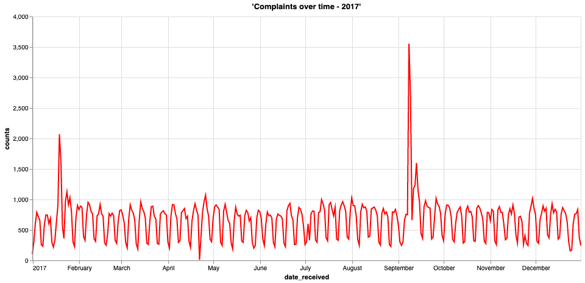

Analyse des séries chronologiques – Analyse des plaintes des consommateurs au fil du temps
------------------------------------------------------------------------------------------

### Avant de commencer

Ouvrez l'éditeur pour poursuivre ce cas d'utilisation. [LANCER L'ÉDITEUR](#data=%7B%22navigateTo%22:%22editor%22%7D)

### Introduction

Dans cet exemple, nous allons analyser le nombre de plaintes au fil du temps reçues par le Bureau de protection financière des consommateurs (CFPB, Consumer Financial Protection Bureau).

Comment pouvons-nous utiliser Vantage pour extraire des informations et faire parler concrètement un ensemble de données ? Dans ce cas d'utilisation, vous verrez à quel point il est puissant et simple d'extraire des réponses d'un ensemble de données public disponible par le biais de [Data.gov](http://data.gov). Nous utilisons SQL et un outil de visualisation pour analyser le nombre de plaintes au fil du temps afin de répondre aux questions suivantes :

*Quelles sont les tendances des plaintes au fil du temps ? Comment pouvons-nous interpréter les valeurs aberrantes dans l'ensemble de données ?*

En répondant à des questions comme celles ci-dessus, nous acquérons une compréhension approfondie de l'ensemble de données et pouvons expliquer en langage clair comment le nombre de plaintes évolue au fil du temps. Dans la section Explorer, nous ciblons l'analyse du nombre de plaintes au fil du temps ainsi que l'identification des tendances et des valeurs aberrantes dans la série chronologique pour répondre aux questions ci-dessus.

### Expérience

La section Expérience dure environ 5 minutes.

### Configuration

Sélectionnez **Charger les actifs** pour créer les tables et charger les données requises dans votre compte (instance de base de données Teradata) pour ce cas d'utilisation. [Charger les actifs](#data=%7B%22id%22:%22FinancialProtection%22%7D)

### Procédure pas à pas

#### Étape 1 : Interrogation des données

Commencez par compter le nombre de lignes dans la table.

``` sourceCode
select count(*) from fp_consumer_complaints;
```

Elle contient un peu moins de 1,3 million de lignes. Il n'est pas difficile d'analyser de grands ensembles de données à l'aide de Vantage. Jetons un œil à un échantillon de données.

``` sourceCode
select TOP 100 * from fp_consumer_complaints;
```

#### Étape 2 : Visualisation des données

À partir de la requête ci-dessus, nous remarquons que cet ensemble de données contient beaucoup d'informations. Pour en tirer des enseignements, nous devons commencer à regrouper les données.

La première colonne est **date\_received**. Il s'agit de la date à laquelle les plaintes ont été reçues, ce qui signifie que nous pouvons examiner un graphique de série chronologique des données. Commençons par regrouper les décomptes de **complaint\_id** au fil du temps, en utilisant **date\_received** comme axe temporel.

``` sourceCode
select date_received, count(complaint_id) as counts
from fp_consumer_complaints
where date_received BETWEEN DATE '2017-03-01'
AND DATE '2019-03-01'
group by date_received;
```

C'est très bien, nous connaissons désormais le nombre de plaintes (**counts**) par période (**date\_received**), mais comment interpréter ces données ? Représentons cette série chronologique sur un graphique.


En visualisant les données ci-dessus, nous constatons que le nombre de plaintes varie beaucoup au fil du temps et qu'il semble également y avoir davantage de plaintes à mesure que le temps passe. On constate également des pics inhabituels en 2017. Apprenons-en plus sur nos données. Commençons par examiner la tendance générale.

Regroupons les données par mois et retraçons le graphique ci-dessus.

``` sourceCode
select extract(year from date_received) || extract(month from date_received) as month_date, count(complaint_id) as counts
from fp_consumer_complaints
group by month_date
order by month_date;
```


En observant les plaintes au fil des mois et des années, nous constatons une nette tendance à la hausse. Une hypothèse est qu'avec le temps, les gens deviennent plus conscients et font passer le message. Les médias peuvent également faire la promotion des canaux de plaintes au fil du temps. Grâce à ce graphique, nous constatons clairement que les pics que nous avons vus ci-dessus ont eu lieu en janvier 2017 et en septembre 2017. Approfondissons ces dates et tirons quelques enseignements de la prochaine étape.

#### Étape 3 : Extraction d'informations des données

Examinons de plus près les deux pics ci-dessus et voyons exactement où ils se produisent. Nous pouvons le faire en traçant un autre graphique de série chronologique, cette fois-ci uniquement en 2017.

``` sourceCode
select date_received, count(complaint_id) as counts
from fp_consumer_complaints
where year(date_received) = 2017
group by date_received
order by date_received;
```



En examinant les pics, nous constatons qu'ils se sont produits du 15 au 21 janvier et au cours de la première semaine de septembre. Pour trouver les dates réelles des pics, nous pouvons limiter la requête à au moins 1 500 plaintes par jour.

``` sourceCode
select date_received,
    month(date_received) as month_date,
    count(complaint_id) as counts
from fp_consumer_complaints
where year(date_received) = 2017 and month_date in (1, 9)
group by date_received
having counts >= 1500
order by month_date, counts desc;
```

Examinons quelques-uns des problèmes qui ont été signalés à ces dates.

``` sourceCode
select date_received, company, count(company) as counts
from fp_consumer_complaints
where date_received in (
    date '2017-01-19',
    date '2017-01-20',
    date '2017-09-08',
    date '2017-09-09',
    date '2017-09-13'
)
group by date_received, company
having counts > 500
order by date_received, counts desc;
```

Il est intéressant de constater que la grande majorité des plaintes concernaient deux entreprises : Navient Solutions et EQUIFAX. Ces deux entreprises semblent être étroitement liées au procès de Navient et aux failles d'Equifax qui se sont produits respectivement à ces dates. Récapitulons ce qui s'est passé :

> Procès de Navient : En janvier 2017, le Bureau américain de protection financière des consommateurs(CFPB) et les procureurs généraux de l'Illinois et de Washington ont intenté un procès contre Navient Solutions. Navient est un important prestataire de services de prêts étudiants privés et fédéraux. Selon le CFPB, au moins depuis janvier 2010, « Navient a détourné les paiements, a orienté les emprunteurs en difficulté vers de multiples délais de grâce au lieu de plans de remboursement en fonction du revenu et a fourni des informations peu claires sur la manière de se réinscrire à des plans de remboursement basés sur les revenus et d'obtenir une décharge de cosignataire »
>
> Faille d'Equifax : Le 7 septembre 2017, Equifax a annoncé qu'une faille de cybersécurité, l'une des plus importantes de l'histoire, s'était produite entre la mi-mai et juillet 2017. Certaines des informations personnelles consultées comprenaient des noms, des numéros de sécurité sociale, des dates de naissance, des adresses et des numéros de permis de conduire.

Examinons maintenant les principaux problèmes rencontrés par Navient Solutions et Equifax au cours de ces périodes pour confirmer notre hypothèse.

``` sourceCode
-- analyze top issues reported agains Navient Soultions on 2017-01-19 and 2017-01-20
select company, product, issue, count(issue) as counts
from fp_consumer_complaints
where date_received in (
    date '2017-01-19',
    date '2017-01-20') and
    company like 'Navient Solutions%'
group by company, product, issue
order by counts desc;
```

Nous constatons que les deux principaux problèmes représentent la majorité des plaintes contre Navient Solutions. De plus, en examinant les colonnes relatives aux produits et aux problèmes, nous pouvons en déduire qu'ils sont effectivement liés au procès concernant les prêts étudiants. Effectuons maintenant la même analyse pour les problèmes d'Equifax.

``` sourceCode
-- analyze top issues reported agains Navient Soultions on 2017-01-19 and 2017-01-20
select
    company,
    product,
    issue,
    count(issue) as counts
from fp_consumer_complaints
where date_received in (
    date '2017-09-08',
    date '2017-09-09',
    date '2017-09-13') and
        company like 'EQUIFAX%'
group by company, product, issue
order by counts desc;
```

Ici, nous pouvons également confirmer notre hypothèse. Les principaux problèmes concernent l'utilisation abusive du rapport de solvabilité, les alertes de fraude, le vol d'identité, etc. Cela semble vraiment lié à la faille d'Equifax qui s'est produite à peu près à la même période.

Ensemble de données
-------------------

------------------------------------------------------------------------

La Base de données des plaintes des consommateurs contient des données sur les plaintes reçues par le Bureau de protection financière des consommateurs (CFPB) concernant les produits et services financiers, notamment les comptes bancaires, les cartes de crédit, les rapports de solvabilité, le recouvrement de créances, les virements d'argent, les hypothèques, les prêts étudiants et d'autres types de crédit à la consommation. L'ensemble de données est actualisé quotidiennement et contient des informations sur le fournisseur, la plainte, la date, le code postal et bien plus encore. Vous trouverez plus d'informations sur l'ensemble de données dans la section Consommateur du site Web [Data.gov](data.gov).

L'ensemble de données **fp\_consumer\_complaints** comporte 1 273 782 lignes, chacune représentant une plainte unique d'un consommateur, et 18 colonnes, représentant les fonctionnalités suivantes :

-   `date_received` : date à laquelle le CFPB a reçu la plainte
-   `product` : type de produit identifié par le consommateur dans la plainte
-   `sub_product` : type de sous-produit identifié par le consommateur dans la plainte
-   `issue` : problème identifié par le consommateur dans la plainte
-   `sub_issue` : sous-problème identifié par le consommateur dans la plainte
-   `consumer_complaint_narrative` : description des « faits survenus » soumise par le consommateur suite à la plainte
-   `company_public_response` : réponse facultative et publique de l'entreprise à la plainte d'un consommateur
-   `company` : la plainte concerne cette entreprise
-   `state` : état de l'adresse postale fourni par le consommateur
-   `zip_code` : code postal de correspondance fourni par le consommateur
-   `tags` : données facilitant la recherche et le tri des plaintes déposées par des consommateurs ou au nom de ceux-ci
-   `consumer_consent_provided` : identifie si l'option du consommateur consiste à publier le récit de sa plainte
-   `submitted_via` : mode de soumission de la plainte au CFPB
-   `date_sent_to_company` : date à laquelle le CFBP a envoyé la plainte à l'entreprise
-   `company_response_to_consumer` : indique comment l'entreprise a répondu
-   `timely_response` : indique si l'entreprise a donné une réponse rapide
-   `consumer_disputed` : indique si l'entreprise a contesté la réponse de l'autre entreprise
-   `complaint_id` : numéro d'identification unique pour une plainte

Explorer
--------

Grâce à cet exemple, nous avons pu constater la puissance et la simplicité de l'exécution de requêtes dans Vantage et la manière dont elle peut être exploitée pour extraire des informations des données afin de faire parler concrètement un ensemble de données. Nous espérons que vous avez remarqué à quel point il est facile d'utiliser Vantage pour écrire vos propres requêtes SQL.

Vous pouvez continuer à explorer Vantage pour extraire davantage d'informations et trouver des réponses à d'autres questions en utilisant l'ensemble de données préchargé. Voici quelques suggestions :

-   Quels sont les types de plaintes les plus courants ? En regroupant la catégorie **produit**, nous pouvons arriver à cette réponse. Comment cela évolue-t-il au fil du temps ?
-   Comment les clients déposent-ils leurs plaintes ? La colonne **submitted\_via** peut également être regroupée pour répondre à cette question.
-   Quelle est la proportion de plaintes clients contestées ? En agrégeant les décomptes de **customer\_disputed**, nous pouvons répondre à cette question.
-   Les données présentent-elles une certaine saisonnalité ? Quelle est la raison de cette saisonnalité ? Si nous soustrayons la tendance de la série, nous pouvons analyser la saisonnalité de l'ensemble de données. La plupart des plaintes sont-elles déposées pendant la semaine ou le week-end ?
