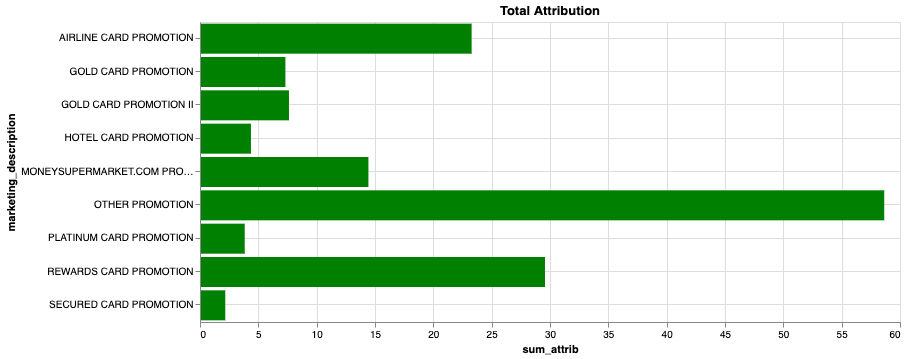
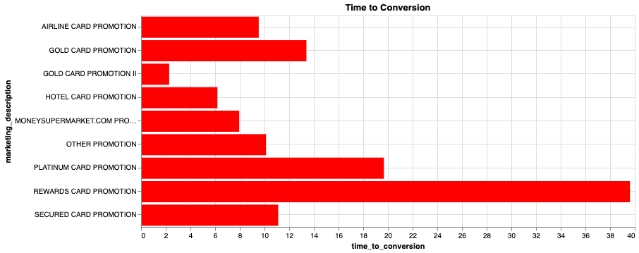
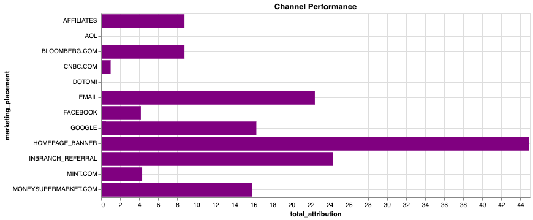

金融サービスのカスタマー ジャーニー
-----------------------------------

### 始める前に

エディタを開いてこのユース ケースを進めます。[エディタを起動する](#data=%7B%22navigateTo%22:%22editor%22%7D)

### はじめに

このユース ケースでは、Vantageを使用してカスタマー ジャーニーのさまざまな側面を分析するための各種の分析手法を示しています。具体的には、アトリビューション機能とnPath機能を使用します。

今回取り上げるシナリオの概要を以下に示します。

顧客とリテール銀行との重要なやり取りに注目してみます。Vantageを使用して、カスタマー ジャーニーのさまざまなステップで新たな洞察を発見する方法をご紹介します。

最初の **customer acquisition** では、以下を行う方法を探ります。- 新規顧客を見つける - マーケティングのアトリビューションを評価する - どうすればROIを高めてマーケティングの効果を最大化し、コンバージョンにかかる時間を短縮できるか

次に、**customer adoption** について考察します。- 顧客が新たに資産管理口座のような高度な商品に導かれるのは、どのようなきっかけからでしょうか?

顧客は、オンラインとオフライン両方のさまざまな方法で銀行とやり取りします。データ ソースは、銀行の窓口での行員とのやり取りや、オンライン バンキング、電子メール、コール センターのログなど多岐にわたります。全体像を把握するには、それらの **all** に着目する必要があります。

Vantageは、データソース集約がとても得意です。さまざまなクラウド オブジェクト ストアへの接続とともに、HadoopやOracleなどに直接接続するQueryGridコネクタも備えています。これらすべてのチャネルから集約されたデータセットを使用します。統合と集約のステップについては他のデモで解説し、ここでは対象外なので扱いません。

ここで得られる洞察はオンライン/オフライン両方の各種のチャネルに由来していることについて、後ほど取り上げます。

経験
----

ユース ケース全体を実施する所要時間は約10分です。

### セットアップ

**アセットをロード** を選択してテーブルを作成し、このユース ケースに必要なデータを自分のアカウント(Teradataデータベース インスタンス)にロードします。[アセットをロード](#data=%7B%22id%22:%22FSCustomerJourney%22%7D)

### 顧客の開拓

デモで扱うジャーニーを、ここから始めます。クレジット カード口座の開設に焦点をあてます。顧客はどこから訪れるのか、またどうすればマーケティングの投資収益率(ROI)を最大化できるかを把握したいと思います。Vantageの高機能なマーケティング アトリビューション機能を利用して、さまざまなチャネルのデータを見ていきます。

これにより、販促とチャネル(オンライン/オフライン)のマーケティングの効果を特定の対象に絞ることができます。どの販促活動が最も効果的でしょうか。この情報を使用して、マーケティング活動の支出や実施場所を最適化できます。

いくつかのテーブルを作成し、多数のパラメータをプログラマティックにアトリビューション分析機能に送付できるようにします。

``` sourceCode
--DATABASE <database_name>;

CREATE TABLE FSCJ_conversion_events
   (conversion_event   VARCHAR(55))
NO PRIMARY INDEX;
```

口座の予約がオンラインとオフラインでいつ行われるのかを突き止めて、それを成功の基準として利用したいと思います。

``` sourceCode
INSERT INTO FSCJ_conversion_events VALUES('ACCOUNT_BOOKED_ONLINE');
INSERT INTO FSCJ_conversion_events VALUES('ACCOUNT_BOOKED_OFFLINE');
```

Vantageを活用することで、どのようなアトリビューション モデルを適用すればよいかを特定できます。このケースでは、なるべくシンプルにするために基本的な「UNIFORM」戦略を選びます。

``` sourceCode
CREATE TABLE FSCJ_attribution_model
   (id    INTEGER,
    model VARCHAR(100))
NO PRIMARY INDEX;
```

``` sourceCode
INSERT INTO FSCJ_attribution_model VALUES(0, 'SIMPLE');
INSERT INTO FSCJ_attribution_model VALUES(1, 'UNIFORM:NA');
```

これで、データセットでアトリビューション機能を呼び出す準備が整いました。データセットには、あらゆる種類のクロス チャネルでの顧客のやり取りが含まれており、それらを分析できます。

``` sourceCode
CREATE TABLE FSCJ_marketing_attribution AS (
    SELECT * FROM Attribution (
                ON (
          SELECT
                customer_identifier, interaction_timestamp, interaction_type, customer_days_active, customer_type,
                marketing_placement, marketing_description, marketing_category,
                interaction_type || product_category AS interaction_product
            FROM fscj_ich_banking
            WHERE
                interaction_type IN ('ACCOUNT_BOOKED_OFFLINE','ACCOUNT_BOOKED_ONLINE','CLICK','REFERRAL','BROWSE')
                AND product_category <> '-1'
        ) 
        PARTITION BY customer_identifier
        ORDER BY interaction_timestamp
        ON FSCJ_conversion_events AS ConversionEventTable DIMENSION
        ON FSCJ_attribution_model AS FirstModel DIMENSION
        USING
        EventColumn ('interaction_type')
        TimestampColumn ('interaction_timestamp')
        WindowSize('rows:10')
    ) as attrib)
    WITH DATA
```

マーケティング アトリビューションは、クレジット カード口座の開設につながるイベントを特定し、それらのイベントに値を割り当てることを目的としています。データにおける具体的なコンバージョン イベントは「ACCOUNT\_BOOKED\_ONLINE」、「ACCOUNT\_BOOKED\_OFFLINE」です。これにより、顧客の開拓を後押しする最も影響力のあるイベントとチャネルを計算します。Vantageのアトリビューション機能は、各種の標準アトリビューション モデルをサポートします。Vantageを使用することで、アトリビューション モデル/パラメータに対する変更が社内の分析にどのように影響するかをすばやく確認できます。

次に、結果からサマリ統計を取得します。

``` sourceCode
SELECT marketing_description, AVG(attribution) AS avg_attrib, SUM(attribution) AS sum_attrib, AVG(-time_to_conversion)/3600 AS time_to_conversion
FROM FSCJ_marketing_attribution 
WHERE marketing_description NOT IN ('\N', '-1')
GROUP BY marketing_description;
```






最初に視覚化されるグラフは、これまでに実施したさまざまな販促を中心にしています。グラフのバーが長いほど、顧客の口座開設に向けた販促の影響が大きくなります。

2番目のグラフは、販促がもたらした合計アトリビューション スコアを示しています。成約の後押しに最も貢献した要素のグラフが、最も長くなります。

3番目のグラフはコンバージョンが実現されるまでの時間を示しており、ユーザーが契約に進むまでの販促の平均所要時間がわかります。時間が短いほどグラフが短く、相手がより迅速に行動に移したことを示します。Gold Card Promotion IIが総合的に最も優秀で、次にHotel Card Promotion、MoneySupermarket.com Promotionが続いていることがわかります。

### チャネル分析

販促および広告ネットワークにはさまざまなものがあります。次に、多岐にわたるチャネルでの各種の販促により得られるトラクションについて見ていきます。

``` sourceCode
SELECT marketing_category, marketing_placement, SUM(attribution) AS total_attribution 
FROM FSCJ_marketing_attribution 
WHERE marketing_description NOT IN ('\N', '-1')
GROUP BY 1, 2;
```



次に視覚化されるグラフは、マーケティング活動を展開した各種のチャネルを中心にしています。グラフのバーの長さは、そのチャネルに対する総合的なアトリビューションを示しています。色は最初のビューで見た販促に対応しており、どの販促がどのチャネルで実施されたか、およびそれぞれの業績がわかります。データの結果セットでは、ウェブの他に電子メール、支店内(オフライン)があることを確認できます。

デジタルのチャネルについては、総合的にホームページの広告が最も優秀で、次に電子メール、Googleサーチが続くことがわかります。

BI (ビジネス インテリジェンス)ツールを使用すると、新たなレベルの分析が可能になります。


ここでは、多岐にわたるチャネルでの販促とその実績が示されます。MoneySupermarketとGold Card Promotion IIの販促が最も効果的だったという、興味深い洞察を確認できます。Gold Card IIと最初のGold Card Promotionを比べるのも面白いでしょう。その下の各種チャネルに目を向けると、最初のGold Card販促は電子メールのみで実施され、一方Gold Card Promotion IIは複数のチャネルで実施されており、同じ商品に対してより効果的だったことがわかります。

このダッシュボードとVantageの高度な機能を活用することで、さまざまな販促を簡単に比較して、MoneySupermarket.comで実施した特別な販促がとりわけ効果的だったことを確認できます。この販促は特定のチャネルでのみ実施しており、コンバージョンまでの時間が短く平均アトリビューションでも優れた実績を上げています。

その他にも目を向けましょう...Rewards Cardの販促は各チャネルで高い成果を得ていますが、特に支店内での紹介が効果的でした。Airline Card販促は、チャネルの中でもホームページとGoogleでより高い実績を上げています。

アダプションへのパス
--------------------

次に、顧客が資産管理のような高度な口座をどのように開設するかについて見ていきます。多くのリテール銀行は、資産管理が重要な収益の柱になると認識しており、この分野でビジネスを構築しようとしています。

Vantageの強力なnPath分析機能を活用することで、SQLではきわめて難しいパターン/時系列の分析を実行できます。顧客が資産管理口座を開設するとき一般的に辿るパスを調べてみましょう。また、資産管理口座の顧客が保有する他の口座との関連性についても調べます。

以下のコードには、いくつかのキー ポイントがあります。1.インタラクションと商品カテゴリを結び付けて固有のイベントを作成します。 2.資産管理アプリケーションの開始/完了は、当然ながら誰もが実行するので無視します。このケースではノイズを減らしたいと思います。さらなる分析は、未完了のアプリケーションまたは他のシナリオで後からでも実施できます。3.**‘PATTERN’** では、資産管理口座の開設が後に続く4つのイベントを検索します(ACCOUNT\_BOOKED)。4.**‘SYMBOLS’** では、資産管理口座の開設は'EVENT'、当該の口座の開設は'ADOPTION'となる以外は何でも使用できます。

``` sourceCode
SELECT * FROM nPath (
        ON (
        SELECT customer_identifier, interaction_timestamp, interaction_type, product_category, interaction_type || '_' || product_category AS event, 
                marketing_category, marketing_description, marketing_placement, sales_channel, 
                conversion_sales, conversion_cost, conversion_margin
            FROM fscj_ich_banking
            WHERE
                product_category <> '-1'
                AND interaction_type || '_' || product_category <> 'STARTS_APPLICATION_WEALTH MANAGEMENT'
                AND interaction_type || '_' || product_category <> 'COMPLETE_APPLICATION_WEALTH MANAGEMENT'
        )
        PARTITION BY customer_identifier
        ORDER BY interaction_timestamp
        USING
        MODE (NONOVERLAPPING)
        -- Limit to a depth of 4
        PATTERN ('(EVENT){4}.ADOPTION')
        SYMBOLS (
            event NOT LIKE 'ACCOUNT_BOOKED%_WEALTH MANAGEMENT' AS EVENT,
            event LIKE 'ACCOUNT_BOOKED%' AND product_category = 'WEALTH MANAGEMENT' AS ADOPTION
        )
        RESULT (
            ACCUMULATE( event OF ANY(EVENT,ADOPTION) )  AS interaction_type_list,
            COUNT( event OF ANY(EVENT,ADOPTION) )       AS click_depth,

            FIRST( customer_identifier of ADOPTION )  AS customer_identifier,
            FIRST( product_category OF ADOPTION )     AS product_category
        )
    ) a;
```

この視覚化では、ユーザーが資産管理口座の開設時に辿る最も一般的なパスについて、多くの洞察を得られます。


さらに、最もよく使われるパスに絞り込むことができます。


視覚化についての説明に続いて、各ケースの主な原動力について見ていきます。

まず、オンラインでの資産管理口座の開設を後押しする要因から見てみます。銀行が自行のウェブサイトで表示している「比較」ツールが、口座開設への主なステップであることがわかります。これにより資産管理商品を他行と比較できますが、それは説得力のある要因であることがわかります。商品を閲覧した顧客は比較ツールを使用して、最終的に予約に至ります。

オンラインでの口座成約を後押しする他の要因として、自動貯蓄積み立てプランを開設する利用者が存在します。このような貯蓄意識の高い利用者が、資産管理口座を開こうとする傾向があります。また、通常の商品閲覧やCDの開設が、別のパスにもなっているようです。

オフラインについても調べてみると、後押しする別の要因があります。オンラインとオフラインの両方で、CDや証券口座など他のタイプの口座も開設している利用者がかなり多いようです。資産管理口座のオフラインでの予約につながる主なパスは、支店内での紹介に由来することがわかります。支店を訪れて別タイプの口座を開設する人が、資産管理口座の開設も紹介されるのです。

### クリーンアップ

``` sourceCode
DROP TABLE FSCJ_conversion_events;
```

``` sourceCode
DROP TABLE FSCJ_attribution_model;
```

``` sourceCode
DROP TABLE FSCJ_marketing_attribution;
```

### データセット

このユース ケース、FSCustomerJourneyのデータは、`retail_sample_data` データベースに格納されています。

#### 統合型問い合わせ履歴

以下にこのユース ケースで使用するメインのテーブルを示します。さまざまなソース システムやチャネルからのデータがあらかじめ結合され、1つの大きなテーブルにまとめられています。これはすべての顧客とのやり取りを表し、顧客システムにおいて、各種のソース テーブルの最も重要なビューと見なすこともできます。

`fscj_ich_banking`

-   `customer_skey`: 顧客キー
-   `customer_identifier`: 固有の顧客識別子
-   `customer_cookie`: 顧客のデバイスに配置されるCookie
-   `customer_online_id`: ブーリアン - 顧客がオンライン口座を保有しているか
-   `customer_offline_id`: 顧客の口座番号
-   `customer_type`: これは高価値の顧客か、それとも単にウェブサイトを閲覧している訪問者か?
-   `customer_days_active`: 顧客がアクティブな時間はどのくらいか
-   `interaction_session_number`: セッション識別子
-   `interaction_timestamp`: このイベントのタイムスタンプ
-   `interaction_source`: このイベント発生元のチャネル(オンライン/オフライン、支店内など)
-   `interaction_type`: イベントのタイプ
-   `sales_channel`: 販売イベントがあったチャネル
-   `conversion_id`: 販売コンバージョン識別子
-   `product_category`: イベントが関連する商品のタイプ(当座預金、普通預金、CDなど)
-   `product_type`: 未使用
-   `conversion_sales`: 未使用
-   `conversion_cost`: 未使用
-   `conversion_margin`: 未使用
-   `conversion_units`: 未使用
-   `marketing_code`: マーケティング識別子
-   `marketing_category`: マーケティング チャネル(支店内、ウェブサイト、電子メールなど)
-   `marketing_description`: マーケティング キャンペーン名
-   `marketing_placement`: 特定のマーケティング経路(Google、Bloomberg.comなど)
-   `mobile_flag`: ブーリアンがモバイル デバイス上にあった
-   `updt`: 未使用
