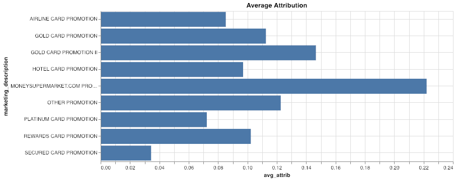
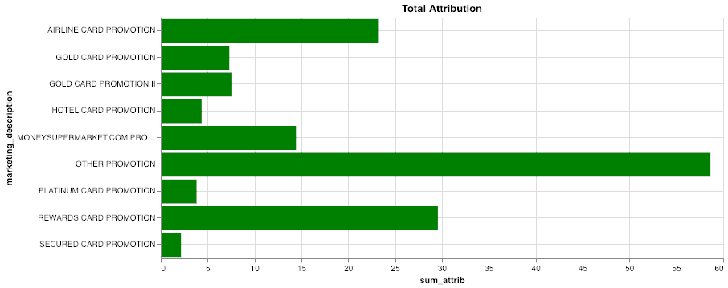
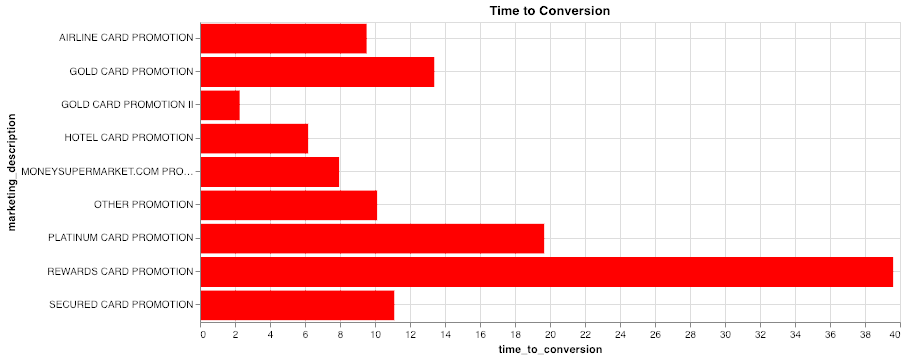
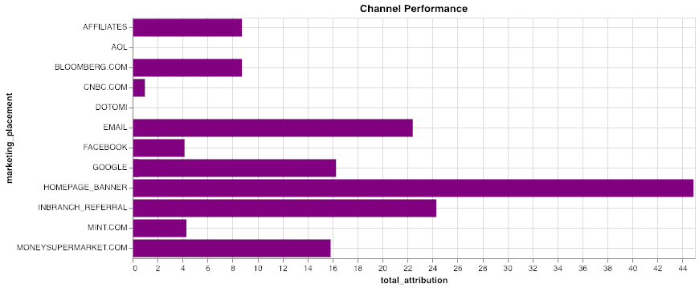
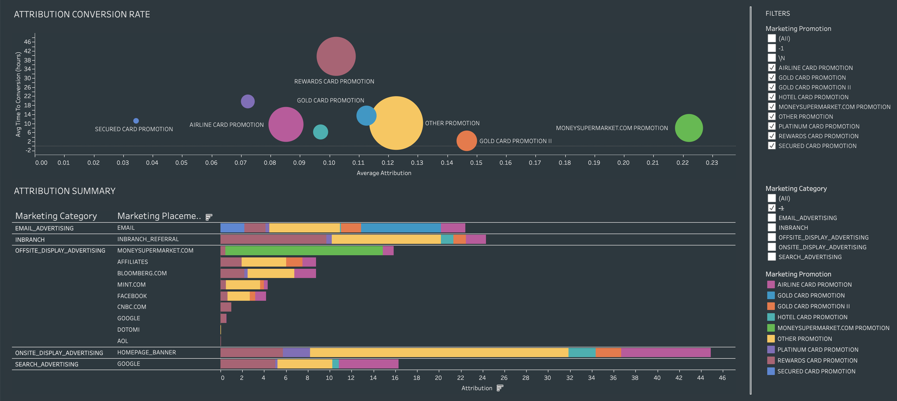

Financial services customer journey
-----------------------------------

### Before You Begin

Open Editor to proceed with this use case. [LAUNCH EDITOR](#data=%7B%22navigateTo%22:%22editor%22%7D)

### Introduction

In this use case, we’ll show several techniques to analyze aspects of a customer journey using Teradata VantageCloud Lake. Specifically, we’ll use the Attribution and nPath functions.

Here’s the scenario we’ll cover: We’ll review the important interactions customers have with a retail bank to show how we can use VantageCloud Lake to discover new insights across various steps in a customer journey.

Starting with **customer acquisition**, we’ll discover how to: - Find new customers - Measure marketing attribution - Increase return on investment (ROI) and maximize marketing effectiveness - Minimize the time to conversion

Next, we’ll **review customer adoption:** What leads customers to additional high-end products, such as wealth management accounts?

Customers interact with the bank in many ways, both online and offline. There are many different data sources, such as in-branch interactions with tellers, online banking, email, and call center logs. It is necessary to look at all of them to see the full picture.

VantageCloud Lake provides best-in-class capabilities for combining and aggregating data at any scale. It provides performance-optimized connectivity to open object stores and third-party database systems via patented QueryGrid technology to create a single, aggregated, and optimized query fabric, which encompasses data from a myriad of systems, clouds, and physical locations. Other demos cover the integration and aggregation steps, but this is out of scope in our case.

We’ll see later in this demonstration that this multichannel data is key to attaining the most accurate and actionable insights.

Experience
----------

The entire use case takes about 10 minutes to run.

### Setup

Select **Load Assets** to create the tables and load the data required into your account (Teradata database instance) for this use case. [Load Assets](#data=%7B%22id%22:%22FSCustomerJourney%22%7D)

### Customer acquisition

The customer acquisition channel is the first step in our analysis. We’ll focus on analyzing the efficacy of various marketing programs on customers opening a new credit card account. We want to understand what channel our customers are coming from and how to maximize marketing ROI. We’ll use the powerful marketing attribution function in VantageCloud Lake to look at the multichannel data.

This will allow us to quickly quantify marketing effectiveness of both our promotions and channels (online and offline). Understanding which promotions are most effective will allow us to optimize marketing spend and promotion placement.

To efficiently analyze many variable parameters using the attribution function, we’ll create various dimension tables:

``` sourceCode
--DATABASE <database_name>;

CREATE TABLE FSCJ_conversion_events
   (conversion_event   VARCHAR(55))
NO PRIMARY INDEX;
```

We want to determine when people have booked accounts both online and offline and use that as our success criteria:

``` sourceCode
INSERT INTO FSCJ_conversion_events VALUES('ACCOUNT_BOOKED_ONLINE');
INSERT INTO FSCJ_conversion_events VALUES('ACCOUNT_BOOKED_OFFLINE');
```

VantageCloud Lake allows us to specify which type of attribution model to apply. For simplicity, we’ll choose a basic UNIFORM model. UNIFORM models apply an equal weight to each precedent step prior to the desired outcome.

``` sourceCode
CREATE TABLE FSCJ_attribution_model
   (id    INTEGER,
    model VARCHAR(100))
NO PRIMARY INDEX;
```

``` sourceCode
INSERT INTO FSCJ_attribution_model VALUES(0, 'SIMPLE');
INSERT INTO FSCJ_attribution_model VALUES(1, 'UNIFORM:NA');
```

Now we’re ready to invoke the attribution function on our dataset. The dataset contains many types of cross-channel customer interactions we can analyze. The attribution function will use the aggregated event data as input, as well as the two -dimension tables we created above. Additional function arguments help to define the maximum number of events to process, as well as information on time- ordering and event identification columns.

``` sourceCode
CREATE TABLE FSCJ_marketing_attribution AS (
    SELECT * FROM Attribution (
                ON (
          SELECT
                customer_identifier, interaction_timestamp, interaction_type, customer_days_active, customer_type,
                marketing_placement, marketing_description, marketing_category,
                interaction_type || product_category AS interaction_product
            FROM fscj_ich_banking
            WHERE
                interaction_type IN ('ACCOUNT_BOOKED_OFFLINE','ACCOUNT_BOOKED_ONLINE','CLICK','REFERRAL','BROWSE')
                AND product_category <> '-1'
        ) 
        PARTITION BY customer_identifier
        ORDER BY interaction_timestamp
        ON FSCJ_conversion_events AS ConversionEventTable DIMENSION
        ON FSCJ_attribution_model AS FirstModel DIMENSION
        USING
        EventColumn ('interaction_type')
        TimestampColumn ('interaction_timestamp')
        WindowSize('rows:10')
    ) as attrib)
    WITH DATA
```

This attribution analysis aims to identify the events leading to the opening of a credit card account and assign value to them. The specific conversion events in the data are ACCOUNT\_BOOKED\_ONLINE and ACCOUNT\_BOOKED\_OFFLINE, thus calculating the most influential events and channels driving customer acquisition. The attribution function in VantageCloud Lake supports a variety of standard attribution models. Using VantageCloud Lake, we can quickly see how changes to the attribution model/parameters will affect our analysis.

Now, let’s get some summary statistics from the results:

``` sourceCode
SELECT marketing_description, AVG(attribution) AS avg_attrib, SUM(attribution) AS sum_attrib, AVG(-time_to_conversion)/3600 AS time_to_conversion
FROM FSCJ_marketing_attribution 
WHERE marketing_description NOT IN ('\N', '-1')
GROUP BY marketing_description;
```







The first visualization illustrates the average attribution score for each promotion. The larger the bar, the more influence the promotion had on a customer opening an account.

The second chart shows the total attribution score for each promotion. The most impactful promotion overall in terms of total conversions will be represented by the largest bars.

The third chart shows the average time to customer conversion in hours for each promotion. The shorter the time—lower on the chart—the faster people acted. We can see that “Gold Card Promotion II” provided the shortest time to conversion, followed by the “Hotel Card Promotion” and “MoneySupermarket.com Promotion.”

### Channel analysis

We have different promotions and advertising networks, so let’s look at the traction we’re getting with the various promotions across different channels:

``` sourceCode
SELECT marketing_category, marketing_placement, SUM(attribution) AS total_attribution 
FROM FSCJ_marketing_attribution 
WHERE marketing_description NOT IN ('\N', '-1')
GROUP BY 1, 2;
```



The visualization below illustrates the total attribution based on each channel where the promotions were run. The overall length of the bar shows the total attribution to that channel. The colors correspond to the promotions that we looked at in the top view, so we can see which promotions were on which channels and the performance of each. In the data result set, you can see that there is email, in branch (offline), and web.

For the digital channels, we can see that the homepage ads did best, followed by email and Google searches.

Using a business intelligence (BI) tool, we can create this type of analysis based on the output of the attribution function:



This visualization gives us deeper insights into our marketing promotions and their placements across various channels. For example, we can see that “MoneySupermarket.com Promotion” and “Gold Card Promotion II” were our most effective promotions. We can see that “Gold Card Promotion” was only run over email, while “Gold Card Promotion II” was run on multiple channels and was more effective.

Using this dashboard and the power of VantageCloud Lake, you can easily compare the different promotions and see that the special “MoneySupermarket.com Promotion” was particularly effective. This was only run on that particular channel and had both a quick time to conversion and a strong average attribution.

We can see that “Rewards Card Promotion” did well across channels but was particularly effective through in-branch referrals. “Airline Card Promotion” did best on the homepage and Google.

Path to adoption
----------------

Next, we want to see how customers are opening higher-end accounts, such as wealth management. Many retail banks have found wealth management to be a key profit center, so they’re looking to build their business in this area.

We can use the powerful nPath analytic function in VantageCloud Lake to perform combined pattern and time-ordered analysis that is very hard to do in SQL. In this use case, we want to see the common paths that customers take when they go to open a wealth management account. We’ll also look at the affiliation between the other accounts that wealth management customers hold.

The nPath function takes several key inputs to define how it will construct the time-ordered path for each user. In the code here, you can see a few key elements. First, we clean up the input data to make analysis easier. Next, we define the patterns to match on to assemble the path: 1. In the input data, we are concatenating the interaction and the product category to make unique events. 2. Also in the input data, we’re filtering out the starting/completing of the wealth management application. Everyone does that by definition and, in this case, we want to reduce the noise. Further analysis could be done on incomplete applications or other scenarios. 3. In the **‘PATTERN’** element, we’re using syntax to search for four events followed by opening (ACCOUNT\_BOOKED) a wealth management account.  
4. The two **‘SYMBOLS’** are defined as any event except opening a wealth management account as EVENT and opening said account as ADOPTION. 5. The **‘RESULT’** clause directs the function on how to display results. In this case, we’re creating a long string of events representing the path, as well as other information, like the number of events, customer ID, and product category.

``` sourceCode
SELECT * FROM nPath (
        ON (
        SELECT customer_identifier, interaction_timestamp, interaction_type, product_category, interaction_type || '_' || product_category AS event, 
                marketing_category, marketing_description, marketing_placement, sales_channel, 
                conversion_sales, conversion_cost, conversion_margin
            FROM fscj_ich_banking
            WHERE
                product_category <> '-1'
                AND interaction_type || '_' || product_category <> 'STARTS_APPLICATION_WEALTH MANAGEMENT'
                AND interaction_type || '_' || product_category <> 'COMPLETE_APPLICATION_WEALTH MANAGEMENT'
        )
        PARTITION BY customer_identifier
        ORDER BY interaction_timestamp
        USING
        MODE (NONOVERLAPPING)
        -- Limit to a depth of 4
        PATTERN ('(EVENT){4}.ADOPTION')
        SYMBOLS (
            event NOT LIKE 'ACCOUNT_BOOKED%_WEALTH MANAGEMENT' AS EVENT,
            event LIKE 'ACCOUNT_BOOKED%' AND product_category = 'WEALTH MANAGEMENT' AS ADOPTION
        )
        RESULT (
            ACCUMULATE( event OF ANY(EVENT,ADOPTION) )  AS interaction_type_list,
            COUNT( event OF ANY(EVENT,ADOPTION) )       AS click_depth,

            FIRST( customer_identifier of ADOPTION )  AS customer_identifier,
            FIRST( product_category OF ADOPTION )     AS product_category
        )
    ) a;
```

Using VantageCloud Lake Console Visualizations or another BI tool, we can create a specialized chart called a Sankey, which provides insight into the most common paths that users are taking when opening wealth management accounts:


We can filter it down to the most popular paths:


Now that we have a better view of what’s happening, let’s review the main drivers in each case.

Start by looking at the drivers of wealth management accounts online. We can see that the comparison tool the bank has on its website is a main step in opening an account. This allows customers to compare its wealth management offerings to those of competitors. It’s proven to be compelling: Customers are browsing the offerings, then using the compare tool and ultimately booking.

The other main drivers of online account signups are people signing up for an automatic savings plan. Savings-minded people tend to open wealth management accounts. Also, generally browsing the offerings and opening a certificate of deposit (CD) appear to be secondary paths as well.

We can see that offline has different drivers—predominately people opening other types of accounts, as well as CDs and brokerage accounts—both online and offline. In-branch referrals are the main paths to booking a wealth management account offline. People visit a branch and open another type of account, and they are referred to opening a wealth management account.

### Clean up

``` sourceCode
DROP TABLE FSCJ_conversion_events;
```

``` sourceCode
DROP TABLE FSCJ_attribution_model;
```

``` sourceCode
DROP TABLE FSCJ_marketing_attribution;
```

### Dataset

The data for this use case, FSCustomerJourney, is stored in the `retail_sample_data` database.

#### Integrated contact history

This is the main table we use in this use case. It is data from various source systems and channels already combined and put into one big table. This is all of the customer interactions, in a customer system this might be a view on top of various source tables.

`fscj_ich_banking`

-   `customer_skey`: customer key
-   `customer_identifier`: unique customer identifier
-   `customer_cookie`: cookie placed on customers device
-   `customer_online_id`: boolean - does the customer have an online account
-   `customer_offline_id`: customer account number
-   `customer_type`: is this a high value customer or just a vistor browsing the website?
-   `customer_days_active`: how long has the customer been active
-   `interaction_session_number`: session identifier
-   `interaction_timestamp`: timestamp for this event
-   `interaction_source`: channel this event is from (online / offline, in branch etc.)
-   `interaction_type`: type of event
-   `sales_channel`: channel a sales event was in
-   `conversion_id`: sales conversion identifier
-   `product_category`: what type of product the event concerned (checking, savings, cd etc..)
-   `product_type`: unused
-   `conversion_sales`: unused
-   `conversion_cost`: unused
-   `conversion_margin`: unused
-   `conversion_units`: unused
-   `marketing_code`: marketing identifier
-   `marketing_category`: marketing channel (inbranch, website, email etc..)
-   `marketing_description`: marketing campaign name
-   `marketing_placement`: specific marketing outlet (Google, Bloomberg.com etc..)
-   `mobile_flag`: boolean was on a mobile device
-   `updt`: unused
