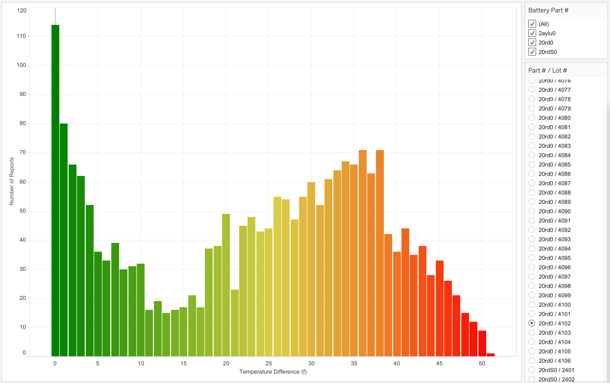

製造上の欠陥の分析
------------------

### 始める前に

エディタを開いてこのユース ケースを進めます。[エディタを起動する](#data=%7B%22navigateTo%22:%22editor%22%7D)

### はじめに

ご自身が大手自動車メーカーのアナリストだとします。Teradata Vantageで通常の財務報告書に目を通しているとき、保証修理の増加という重大な事業上の問題が見つかりました。


その問題の主な原因は、バッテリー パック交換にあるようです。EV (電気自動車)メーカーにとって、バッテリー パックは自社製の自動車に使われる最も高価で重要な部品の1つです。Vantageと製造プロセスで取得する構造化データおよび半構造化データを活用することで、この問題を切り分けて対処することができます。

### 経験

「体験」セクションの実施所要時間は約15分です。

### セットアップ

**アセットをロード** を選択してテーブルを作成し、このユース ケースに必要なデータを自分のアカウント(Teradataデータベース インスタンス)にロードします。[アセットをロード](#data=%7B%22id%22:%22EVCarBattery%22%7D)

### ウォークスルー

------------------------------------------------------------------------

#### ステップ1:根本原因の絞り込み

予備的な分析はすでに実施済みで、保証対象のバッテリー交換が必要となった車両の全VIN (車両識別番号)の報告にも目を通しています。

``` sourceCode
SELECT d.company, count(*)
FROM ev_dealers d, ev_badbatts bb,
ev_vehicles v
WHERE bb.vin = v.vin
AND v.dealer_id = d.id
GROUP BY d.company order by 2 desc
```

次に、バッテリーを搭載している各種の自動車モデルを見ていきましょう。自社の製品ラインでは、いくつかの異種モデルに同じバッテリー部品のセットを使用しています。

``` sourceCode
SELECT v.model, count(*)
FROM ev_vehicles v, ev_badbatts bb
WHERE bb.vin = v.vin
GROUP BY v.model order by 2 desc
```

ここには目立った問題はないようなので、さらに見ていきます...

次に自動車が組み立てられる工場を見てみましょう。

``` sourceCode
SELECT mfg.company, count(*)
FROM ev_mfg_plants mfg, ev_badbatts bb,
ev_vehicles v
WHERE bb.vin = v.vin
AND v.mfg_plant_id = mfg.id
GROUP BY mfg.company order by 2 desc
```

不具合をともなう非常に多くの自動車が、すべて同じ組み立て工場から来ていました。

不良バッテリーを搭載した自動車にどのバッテリー セルが組み込まれているかを調べます。

``` sourceCode
SELECT DISTINCT bom.part_no, p.description, count(*)
FROM ev_bom bom, ev_badbatts bb, ev_parts p
WHERE bb.vin = bom.vin
AND bom.part_no = p.part_no
AND p.description LIKE 'Battery Cell%'
GROUP BY bom.part_no, p.description
```

確かに、part\_no ‘20rd0’に問題があるようです。

社内の統合データ ウェアハウスには、詳細な製造データが格納されています。これらのバッテリー セルでロット番号との相関性があるかどうか確めます。

``` sourceCode
SELECT bom.part_no, bom.lot_no, p.description, count(*)
FROM ev_bom bom, ev_badbatts bb, ev_parts p
WHERE bb.vin = bom.vin
AND p.part_no = bom.part_no
AND p.description LIKE 'Battery Cell%'
GROUP BY bom.part_no, bom.lot_no, p.description
ORDER BY count(*) DESC
```

なるほど、part\_no ‘20rd0’の根底にある問題点がわかりました。不具合の大部分はバッテリー ロット「4012」によるもので(ジャクソン工場に納入されたことが判明)、保証修理を増加させた膨大な数の不良バッテリーがあります。これらの洞察が、社内で好評なBI (ビジネス インテリジェンス)ツールのダッシュボード上で非常にわかりやすく示されています。BIツールは直接Vantageに接続しており、インタラクティブな反復的分析が可能になります。


自社の最新型コネクテッドEV自動車からは、詳細なセンサー データも得られます。問題のバッテリー ロットについて温度センサーのデータも確認できます。



それを平均的なバッテリー ロットと比較します。


バッテリー パックのモデル/ロット番号に応じて、バッテリー パックで高温/過熱が発生しているのが明確にわかります。これで保証修理コスト増加の根底にある原因がわかりましたが、さらに問題を深掘りして、自動車の組み立て/試験の実施時点に戻り、将来この問題が再発するのを防ぎたいと思います。

以下の文を使用して、空の信頼証明を含む認証オブジェクトを作成できます。

``` sourceCode
CREATE AUTHORIZATION MyAuth
USER ''
PASSWORD '';
```

#### ステップ2:他にもデータが必要 - 社内のデータ レイクからテスト結果にアクセス

さらにこの分析を進めて、お客様に提供する自動車に不良バッテリーが搭載される前にそれらを検出する方法を把握したいと思います。これにより、高額な保証修理サイクルや将来的に顧客満足度が低下するのを避けることができます。自動車の製造時には、車両を構成する各種のパーツやサブシステムの詳細なテスト レポートを保存しています。これらの膨大な半構造化データは、オブジェクト ストアに格納されているデータ レイクに直接ロードされます。

Teradata Vantageを使用することで、このデータをネイティブに取り込み分析に応用できます。

Amazon S3でJSON形式のデータにアクセスするために、外部テーブルを作成します。

``` sourceCode
CREATE FOREIGN TABLE test_reports , FALLBACK ,
     EXTERNAL SECURITY MyAuth
(
    Location VARCHAR(2048) CHARACTER SET UNICODE CASESPECIFIC,
    payload JSON(16776192) INLINE LENGTH 64000 CHARACTER SET LATIN)
USING (
    Location ('/s3/s3.amazonaws.com/trial-datasets/EVCarBattery/')
), NO PRIMARY INDEX;
```

``` sourceCode
SELECT TOP 10 *
FROM test_reports
```

外部テーブルの最上部にユーザー フレンドリーなビューを配置し、ファイルを裁断してテスト レポート データへのアクセスをより簡単にします。

``` sourceCode
REPLACE VIEW test_reports_v AS
(SELECT vin, part_no, lot_no, CAST(test_report AS JSON) test_report
FROM TD_JSONSHRED(
    ON (
                SELECT payload.vin as vin, payload
                FROM test_reports)
            USING
            ROWEXPR('parts')
            COLEXPR('part_no', 'lot_no', 'test_report') 
            RETURNTYPES('VARCHAR(17)', 'VARCHAR(1000)', 'VARCHAR(10000)')
        ) AS d1 (vin, part_no, lot_no, test_report)
    )
```

``` sourceCode
SELECT TOP 10 *
FROM test_reports_v
```

#### ステップ3:VantageでJSON形式の製造試験データにネイティブにアクセスし結合

ここまで順調のようです。次にテスト レポートの内容がどのようなものか見ていきます。さまざまなパーツには各種のデータがあり、試験時にそのデータがレポートされます。最も単純なパーツのテスト結果はこのようなものです。

``` sourceCode
SELECT TOP 1 test_report
FROM test_reports_v
WHERE part_no = '11400zn'
```

対照的に、バッテリーのテスト レポートにはバッテリーの組み立て後車両に搭載される前の性能に関する詳細なデータが含まれています。

``` sourceCode
SELECT TOP 1 test_report
FROM test_reports_v
WHERE part_no = '20rdS0'
```

バッテリーについて、定格容量と実測容量を部品/ロット番号とともに比較したいと思います。簡潔なドット表記法を使用してJSONデータを簡単に掘り下げ、必要なテスト結果にアクセスできます。

``` sourceCode
SELECT TOP 10 tr.part_no, p.description, tr.lot_no, 
tr.test_report."Rated Capacity" AS rated_capacity,
tr.test_report."Static Capacity Test"."Measured Average Capacity" AS measured_capacity
FROM ev_parts p, test_reports_v tr
WHERE  p.part_no = tr.part_no
AND p.description LIKE 'Battery Cell%'
```

これをBIツールで視覚化すると、これらのバッテリーが実際には仕様の範囲内にあることがわかりますが、レンジは他のバッテリー ロットよりもはるかに低いです。この洞察により、許容基準を厳格化するとともに今回のようなプロアクティブな分析を実施して、完成車両がお客様に届けられる前に潜在的な品質上の問題を特定できます。このような作業によって製品品質を高め、問題を再発させないようにできます。


統合データとデータ レイクの両方の分析にTeradata Vantageを活用することで、実質的にあらゆる事業上の問題の根底にある原因をすばやく簡単に突き止めることができます。

#### ステップ4:クリーンアップ

独自のデータベース スキーマで作成したオブジェクトを削除します。

``` sourceCode
DROP TABLE test_reports;
```

``` sourceCode
DROP VIEW test_reports_v;
```

データセット
------------

------------------------------------------------------------------------

**bom** - BOM (部品表) - 個々の車両を構成するあらゆる主要パーツが含まれています。

-   `id`: 固有の識別子
-   `vin`: 車両識別番号
-   `part_no`: 部品番号
-   `vendor_id`: 部品を作成したベンダー(未使用)
-   `lot_no`: ベンダーによるロット番号
-   `quantity`: この部品が車両に使われている数

**dealers** - 車両の販売流通業者:

-   `id`: 固有の識別子
-   `Company`: 社名
-   `StreetAddress`: ストリート アドレス
-   `City`: 都市
-   `State`: 州
-   `ZipCode`: 郵便番号
-   `Country`: 国
-   `EmailAddress`: メインの電子メール アドレス
-   `TelephoneNumber`: 電話番号
-   `DomainName`:企業ウェブサイトのURL
-   `Latitude`: 緯度(位置)
-   `Longitude`: 経度(位置)

**mfg\_plants** - 製造工場:

-   `id`: 固有の識別子
-   `Company`: 工場名
-   `StreetAddress`: ストリート アドレス
-   `City`: 都市
-   `State`: 州
-   `ZipCode`: 郵便番号
-   `Country`: 国
-   `EmailAddress`: メインの電子メール アドレス
-   `TelephoneNumber`: 電話番号
-   `DomainName`:工場ウェブサイトのURL
-   `Latitude`: 緯度(位置)
-   `Longitude`: 経度(位置)

**parts** - 全車両向け部品のマスター リスト:

-   `part_no`: 固有の部品番号
-   `description`: 部品の説明

**vehicles** - 製造済み製造中の車両:

-   `vin`: 固有の識別子
-   `yr`: 年式
-   `model`: 車両型式
-   `customer_id`: 顧客/購入者
-   `dealer_id`: 車両を販売/納入したディーラー
-   `mfg_plant_id`: 車両を組み立てた工場
