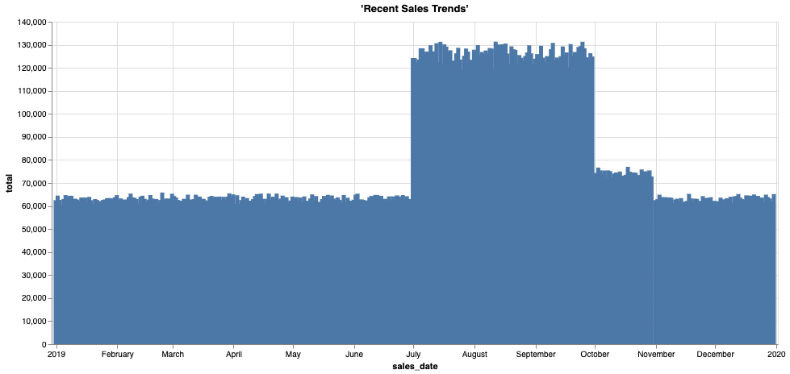

## ディープ ヒストリー - 履歴コールド データをオブジェクト ストアにオフロードする

### 始める前に

エディタを開いてこのユース ケースを進めます。
[エディタを起動する](#data={"navigateTo":"editor"})

### はじめに

ますます厳しくなる規制により、企業は規制遵守のためにデータをオンラインで長年にわたってアクセス可能にしておかなければなりません。最も頻繁にアクセスされるデータは最新または現行のデータですが、古い情報が有用でない、または関連性がないというわけではありません。長年にわたって蓄積された過去データは、長期的なトレンドや周期的なパターンなど、ビジネスに関する豊かな視点をもたらしてくれます。

Teradata Vantageは、世界最大かつ最も要求の厳しい企業に対し、データ分析において比類のない並行性とパフォーマンスを提供します。古い情報に対する分析や並行性のニーズは通常、データが古くなるにつれて大幅に減少します。時間の経過とともに、現在の「ホット」なデータよりも蓄積される過去データの方がはるかに多くなるため、パフォーマンスや価格特性の異なる場所に保存するというのは理にかなっています。例えば、Amazon S3やAzure Blobストレージなどのオブジェクト ストアです。

過去データと現在のデータを別々のシステムに保存すると、情報を一緒に分析することによってのみ可能な独自のインサイトを得ることが難しくなります。しかし、これからは違います。Teradata Vantageを使用することで、基本的なデータ構造やクエリーを変更することなく、データ ウェアハウスとオブジェクト ストレージにまたがるすべての履歴情報と最新情報をシームレスに結合できるようになりました。これによって、従来は対応できなかった疑問にもコスト効率よく答えられるようになり、意思決定者は将来に向けてより良い計画を立てられるようになります。

### 経験

「体験」セクションの実施所要時間は約10分です。

### セットアップ

**アセットをロード** を選択してテーブルを作成し、このユース ケースに必要なデータを自分のアカウント(Teradataデータベース インスタンス)にロードします。
[アセットをロード](#data={"id":"SalesOffload"})

### ウォークスルー

#### ステップ1:データのクエリー

これが現在の売上データです。いくつかのサンプル行を取得してみましょう。この例では、顧客、店舗、バスケット、割引情報があります。


```sql
SELECT TOP 10 * 
FROM so_sales_fact
```


```sql
SELECT sales_date, sum(sales_quantity) as total 
FROM so_sales_fact
GROUP BY sales_date
ORDER BY sales_date ASC
```




```sql
SELECT MIN(sales_date) AS min_date, MAX(sales_date) AS max_date FROM so_sales_fact
```

データ ウェアハウス (2019年データ) にはいくつの記録があるでしょうか？


```sql
SELECT COUNT(*)
FROM so_sales_fact
```

#### ステップ2:オフロードされた過去データの探索

ご覧のとおり、当社のデータ ウェアハウスには1年分の売上データしかありません。これはその期間のデータに対するクエリーが圧倒的に多いためですが、コンプライアンス上の理由から、多くの企業では最大10年分の過去データを保存する必要があります。古いデータは月単位でVantageからエクスポートされ、Amazon S3にロードされて長期保存されます。Teradata Vantageを使用することで、このオフロードされたデータにシームレスにアクセスして他のデータと結合し、長期的なトレンドに関するインサイトを得たり、監査リクエストに簡単に対応したりすることができます。これには、本来であれば書き直す必要のある既存のクエリーやレポートの利用も含まれます。

オフロードされた売上データが保存されているバケットはわかっているので、そこにあるデータを少し見てみましょう。ファイルのリストとそのサイズは、READ_NOS関数を使って取得することができます。


```sql
SELECT location(char(255)), ObjectLength 
FROM (
 LOCATION='/s3/s3.amazonaws.com/trial-datasets/SalesOffload'
 AUTHORIZATION='{"ACCESS_ID":"","ACCESS_KEY":""}'
 RETURNTYPE='NOSREAD_KEYS'
) as d 
ORDER BY 1
```

全部でいくつのファイルとディレクトリがあるでしょうか？


```sql
SELECT COUNT(location(char(255))) as NumFiles
FROM (
 LOCATION='/s3/s3.amazonaws.com/trial-datasets/SalesOffload'
 AUTHORIZATION='{"ACCESS_ID":"","ACCESS_KEY":""}'
 RETURNTYPE='NOSREAD_KEYS'
) as d 
ORDER BY 1
```

ファイルのフォーマットをよりよく理解するために、ファイルの1つを見てみましょう。


```sql
SELECT * FROM (
      LOCATION='/s3/s3.amazonaws.com/trial-datasets/SalesOffload/2010/1/object_33_0_1.parquet'
      AUTHORIZATION='{"ACCESS_ID":"","ACCESS_KEY":""}'
      RETURNTYPE='NOSREAD_PARQUET_SCHEMA'
      )
AS d
```

#### ステップ3:シンプルな抽象化レイヤーを作成してアクセスしやすくする

以下の文を使用して、信頼証明を外部オブジェクト ストアに含める認証オブジェクトを作成できます。


```sql
CREATE AUTHORIZATION MyAuth
USER ''
PASSWORD '';
```

Vantageに外部テーブルとビューを作成し、ビジネス アナリストやその他のユーザーがオフロードされた過去データに簡単にアクセスできるようにします。


```sql
CREATE FOREIGN TABLE sales_fact_offload
, EXTERNAL SECURITY MyAuth 
USING
       (
LOCATION  ('/s3/s3.amazonaws.com/trial-datasets/SalesOffload')
STOREDAS  ('PARQUET')
       )
NO PRIMARY INDEX
PARTITION BY COLUMN;
```

オフロードされたファイルにある行の一部を見てみましょう。


```sql
SELECT TOP 10 *
FROM sales_fact_offload;
```

どのくらいのデータがありますか？


```sql
SELECT COUNT(*)
FROM sales_fact_offload;
```

あともう少しです！データをネイティブ テーブルのように表示させます。ビューを上に置いて、カラムごとに分割しましょう。


```sql
REPLACE VIEW sales_fact_offload_v as (  
SELECT 
    sales_date,
    customer_id,
    store_id,
    basket_id,
    product_id,
    sales_quantity,
    discount_amount
FROM sales_fact_offload);
```

これでTeradata Vantageの他のテーブルと同じようにデータをクエリーできるようになりましたが、データはクエリー実行時にオブジェクト ストアから直接取得されます。既存のSQLスキルとワークフローを使用して、オブジェクト ストアベースのデータセットとTeradataリレーショナル テーブルの構造化データセットの相関をサポートすることで、シームレスな分析体験が実現します。


```sql
SELECT TOP 10 *
FROM sales_fact_offload_v;
```

いい感じですね！これでユーザーは、オブジェクト ストアにあるすべての過去データにアクセスできるようになりました。

標準的なデータベース ビューで行えることを、外部テーブル上のビューですべて行うことができます。これには、基礎となるテーブル カラムのサブセットのみを返すことや、ビューにWHERE句を追加してビューで使用できる行を制限することも含まれます。

たいていの場合、一度に見たいのはその膨大なデータの一部のみであるため、年ごとや月ごとに保存されています。外部テーブルを再定義して、データを読み込む際に事前フィルタリングできるようにしましょう。

#### ステップ4:外部テーブルとビューを最適化してアクセスを効率化する

S3には大量のデータがあります。外部テーブルを最適化して、オブジェクト ストアのクエリー時に読み込むデータを最小限に抑えましょう。オブジェクト ストアのバケットとパス構造を設計することは、オブジェクト ストアを作成する上で重要な最初のステップです。ビジネス ニーズの知識、データへのアクセスで予想されるパターン、データに対する理解、トレードオフに対する感性が必要です。私たちのケースでは、おおよその日付がわかっていることが多いので、それを有効に活用することになります。


```sql
DROP TABLE sales_fact_offload;
CREATE FOREIGN TABLE sales_fact_offload
, EXTERNAL SECURITY MyAuth 
USING
       (
LOCATION  ('/s3/s3.amazonaws.com/trial-datasets/SalesOffload')
PATHPATTERN ('$dir1/$year/$month')
STOREDAS  ('PARQUET')
       )
NO PRIMARY INDEX
PARTITION BY COLUMN;
```

<b>PATHPATTERN</b> 句を含むように外部テーブルを再定義しました。これで、過去データを日付ごとに見る場合に、必要なファイルだけを読み込むことができます。

では、このパス フィルタリングを可能にするユーザーフレンドリーなビューを再作成してみましょう。


```sql
REPLACE VIEW sales_fact_offload_v as (  
SELECT 
    CAST($path.$year AS CHAR(4)) sales_year,
    CAST($path.$month AS CHAR(2)) sales_month,
    sales_date,
    customer_id,
    store_id,
    basket_id,
    product_id,
    sales_quantity,
    discount_amount
FROM sales_fact_offload);
```


```sql
SELECT TOP 10 *
FROM sales_fact_offload_v
WHERE sales_year = '2010'
AND sales_month = '9';
```

これは、少なくとも月単位で日付がわかっているユース ケースに最適です。例えば、ある顧客がかなり何年も前に何を買ったかを確認する必要があるとします。あるいは、過去の店舗売上についてレポートしたいとします。ビジネス アナリストは、IT部門の介入を受けたり、バックアップやアクセスしにくい他のデータ サイロに頼ったりすることなく、このクエリーを簡単に行えます。

2012年8月の6号店の売上を見てみましょう。


```sql
SELECT store_id, SUM(sales_quantity)
FROM sales_fact_offload_v
WHERE store_id = 6
AND sales_year = '2012'
AND sales_month = '8'
GROUP BY 1;
```

全体像を把握するために、過去データと現在のデータを結合しましょう。


```sql
REPLACE VIEW sales_fact_all as (
SELECT sales_date,
    customer_id,
    store_id,
    basket_id,
    product_id,
    sales_quantity,
    discount_amount
    FROM so_sales_fact
    UNION ALL
SELECT 
    sales_date,
    customer_id,
    store_id,
    basket_id,
    product_id,
    sales_quantity,
    discount_amount
FROM sales_fact_offload_v);
```

最後に、経年売上レポートを再実行します。コードは上のものと変わりませんが、直近の年だけでなく、すべての売上データを分析できるようになりました。


```sql
SELECT sales_date, sum(sales_quantity) as total 
FROM sales_fact_all
GROUP BY sales_date
ORDER BY sales_date ASC;
```


さて、2019年はより広い意味で異常な年であったことがわかりました。何が起こったのか、さらに掘り下げてみる必要があります。しかし、Teradata Vantageのおかげで、あまりクエリーされないよりコールドなデータをオブジェクト ストレージにオフロードして安全に保存し、すべてのデータをコスト効率よく分析することができます。

#### ステップ5:クリーンアップ

独自のデータベース スキーマで作成したオブジェクトを削除します。


```sql
DROP VIEW sales_fact_all;
```


```sql
DROP VIEW sales_fact_offload_v;
```


```sql
DROP TABLE sales_fact_offload;
```

データセット
------------

------------------------------------------------------------------------

<b>sales_fact</b> データセットには約4,300万行のサンプル売上データがあります。

-   `sales_date`: 注文が処理された日付
-   `customer_id`: 顧客識別子
-   `store_id`: 受注店舗識別子
-   `basket_id`: グループ番号または注文番号
-   `product_id`: 商品の識別子
-   `sales_quantity`: 販売された商品の数量
-   `discount_amount`: このライン アイテムで行われた割引
