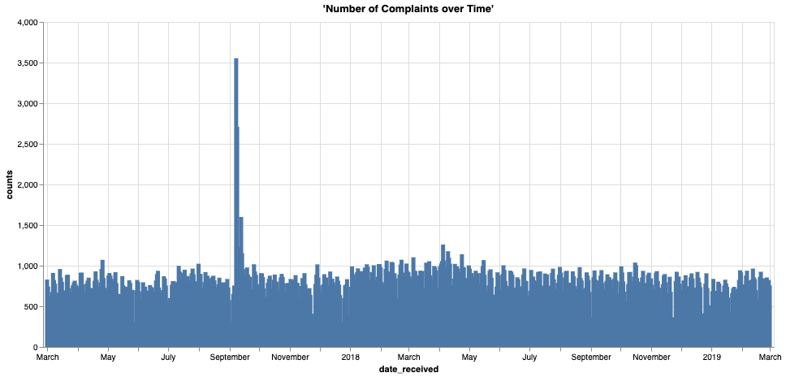
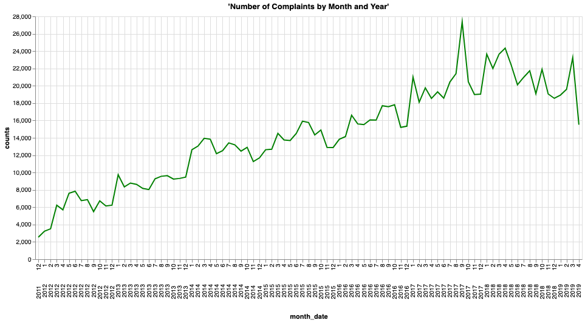

## 時系列分析 - 消費者の苦情を経時的に分析

### 始める前に

エディタを開いてこのユース ケースを進めます。
[エディタを起動する](#data={"navigateTo":"editor"})

### はじめに

この例では、米消費者金融保護局 (CFPB) に寄せられた苦情の件数を経時的に分析します。

Vantageを使ってどのようにインサイトを抽出し、データセットに隠されたストーリーを語れるでしょうか。このユース ケースでは、<a href="http://data.gov">Data.gov</a> を通じて利用可能な公開データセットから回答を抽出する機能がいかに強力なもので、簡単に実行できるかをご覧いただきます。SQLと視覚化ツールを使用して、経時的な苦情件数を分析し、次のような疑問に対する答えを示します。

<i>苦情の経時的傾向はどのようなものかデータセットの異常値をどのように解釈できるか</i>

上記のような疑問に対する答えを得ることで、データセットに対する理解が深まり、苦情の件数が時間とともにどのように推移していくかをわかりやすく説明することができます。「Explore(探索)」セクションでは、経時的な苦情件数の分析と、時系列における傾向および異常値の特定に焦点を当て、上記の疑問に対する答えを導き出します。

### 経験

「体験」セクションの実施所要時間は約5分です。

### セットアップ

**アセットをロード** を選択してテーブルを作成し、このユース ケースに必要なデータを自分のアカウント(Teradataデータベース インスタンス)にロードします。
[アセットをロード](#data={"id":"FinancialProtection"})

### ウォークスルー

#### ステップ1:データのクエリー

最初に、テーブルの行数を数えます。


```sql
select count(*) from fp_consumer_complaints;
```

130万行弱あります。Vantageを使用するので、大規模なデータセットの分析も問題ありません。データのサンプルを見てみましょう。


```sql
select TOP 100 * from fp_consumer_complaints;
```

#### ステップ2:データの視覚化

上記のクエリーから、このデータセットには多くの情報が含まれていることがわかります。何らかのインサイトを得るにあたり、まずデータをグループ化する必要があります。

最初のカラムは <b>date_received</b> です。これは苦情が寄せられた日付で、データの時系列プロットを確認できることを意味します。<b>complaint_id</b> を時間軸として、<b>date_received</b> の件数を経時的にグループ化することから始めましょう。


```sql
select date_received, count(complaint_id) as counts
from fp_consumer_complaints
where date_received BETWEEN DATE '2017-03-01'
AND DATE '2019-03-01'
group by date_received;
```

さて、これで時間 (<b>counts</b>) ごとの苦情件数 (<b>date_received</b>) がわかるようになりましたが、このデータをどのように活用すればいいでしょうか。この時系列をグラフにプロットしてみましょう。



上のデータを視覚化することで、苦情件数が時間によって大きく変化していること、また時間が経過するにつれて苦情件数が増加している様子が見て取れます。また、2017年には異常なスパイクも見られます。データについてもっと理解しましょう。まず、一般的な傾向を見てみます。

データを月ごとにグループ化し、上のグラフを再プロットしてみましょう。


```sql
select extract(year from date_received) || extract(month from date_received) as month_date, count(complaint_id) as counts
from fp_consumer_complaints
group by month_date
order by month_date;
```



数カ月、数年にわたる苦情を見ると、明らかに増加傾向にあることがわかります。仮説のひとつとして、時間が経つにつれて人々の意識が高まり、噂が広まるというものが挙げられます。また、時間の経過とともに、メディアが苦情チャネルを広める場合もあります。このグラフを通して、上記で見たスパイクが2017年1月と2017年9月に起こったことがはっきりとわかります。これらの日付をさらに深く掘り下げて、次のステップへのインサイトを引き出してみましょう。

#### ステップ3:データからインサイトを抽出する

上記の2つのスパイクを絞り込み、それらが正確にどこで起こっているかを見てみましょう。これを行うには、別の時系列プロットを作成します。今回は2017年の分のみを作成します。


```sql
select date_received, count(complaint_id) as counts
from fp_consumer_complaints
where year(date_received) = 2017
group by date_received
order by date_received;
```


ピークを見ると、1月15日から21日と、9月の第1週に発生していることがわかります。ピークの実際の日付を特定するには、1日あたり1,500件の苦情をピックアップするようにクエリーを制限します。


```sql
select date_received,
    month(date_received) as month_date,
    count(complaint_id) as counts
from fp_consumer_complaints
where year(date_received) = 2017 and month_date in (1, 9)
group by date_received
having counts >= 1500
order by month_date, counts desc;
```

これらの期間に報告された問題のいくつかを見てみましょう。


```sql
select date_received, company, count(company) as counts
from fp_consumer_complaints
where date_received in (
    date '2017-01-19',
    date '2017-01-20',
    date '2017-09-08',
    date '2017-09-09',
    date '2017-09-13'
)
group by date_received, company
having counts > 500
order by date_received, counts desc;
```

興味深いことに、苦情の多くが2社に向けられたものであることがわかります。Navient SolutionsとEquifaxの2社です。これらはそれぞれ、その時期の前後に起きたNavientの訴訟とEquifaxの情報漏洩事件と高い相関関係があるようです。何が起こったかを振り返ってみましょう。

<p>
<blockquote><i>Navient訴訟:2017年1月、米国の消費者金融保護局 (CFPB) と、イリノイ州およびワシントン州の検事総長は、Navient Solutionsを提訴しました。Navientは民間および連邦学生ローンの大手サービサーです。CFPBによると、少なくとも2010年1月以降、「Navientは、返済額の配分を誤り、苦境にある借り手を、収入に応じた返済計画ではなく、何度も返済猶予に誘導し、収入に応じた返済計画に再登録する方法や、連帯保証人の免除を受ける資格を得る方法について、不明確な情報を提供してきた」ということです。

Equifax侵害:2017年9月7日、Equifaxは、2017年5月中旬から7月にかけて、史上最大級のサイバーセキュリティ侵害が発生したと発表しました。アクセスされた個人情報には、氏名、社会保障番号、生年月日、住所、運転免許証番号などが含まれていました。</i></blockquote>
</p>

仮説を裏付けるために、これらの期間におけるNavient SolutionsとEquifaxの最大の問題点を見てみましょう。


```sql
-- analyze top issues reported agains Navient Soultions on 2017-01-19 and 2017-01-20
select company, product, issue, count(issue) as counts
from fp_consumer_complaints
where date_received in (
    date '2017-01-19',
    date '2017-01-20') and
    company like 'Navient Solutions%'
group by company, product, issue
order by counts desc;
```

Navient Solutionsに対する苦情件数の大半を占めているのは、上位2つの問題であることがわかります。さらに、プロダクトと問題のカラムを見れば、それらが学生ローンに関する訴訟と確かに関連していることが推測できます。次に、Equifaxの問題についても同じ分析をしてみましょう。


```sql
-- analyze top issues reported agains Navient Soultions on 2017-01-19 and 2017-01-20
select
    company,
    product,
    issue,
    count(issue) as counts
from fp_consumer_complaints
where date_received in (
    date '2017-09-08',
    date '2017-09-09',
    date '2017-09-13') and
        company like 'EQUIFAX%'
group by company, product, issue
order by counts desc;
```

この場合も仮説を裏付けることができます。上位の問題は、信用報告書の不適切な使用、詐欺警告、個人情報の盗難などに関するものです。同時期に起きたEquifaxの情報漏洩事件と確かに関連があると考えられます。

## データセット
***

消費者苦情データベースには、銀行口座、クレジット カード、信用調査、債権回収、送金、住宅ローン、学生ローン、その他の消費者信用を含むがこれらに限定されない金融プロダクトやサービスに関して米消費者金融保護局 (CFPB) に寄せられた苦情データが保存されています。データセットは毎日更新され、プロバイダ、苦情内容、日付、郵便番号などの情報が含まれています。データセットの詳細については、<a href="data.gov">Data.gov</a> ウェブサイトの「Consumer(消費者)」セクションをご覧ください。

<b>fp_consumer_complaints</b> データセットの行数は1,273,782行で、それぞれが一意の消費者苦情を表しており、カラム数は18で、次の特性を表しています。

-   `date_received`: CFPBが苦情を受理した日付
-   `product`: 苦情において消費者が特定したプロダクトのタイプ
-   `sub_product`: 苦情において消費者が特定したサブプロダクトのタイプ
-   `issue`: 苦情において消費者が特定した問題
-   `sub_issue`: 苦情において消費者が特定した副次的問題
-   `consumer_complaint_narrative`: 苦情において消費者が提出した「何が起こったか」の説明
-   `company_public_response`: 消費者の苦情に対する企業の一般向け任意回答
-   `company`: 苦情がこの企業に関するものである
-   `state`: 消費者が提供した郵送先住所の州
-   `zip_code`: 消費者が提供した郵送先の郵便番号
-   `tags`: 消費者によって、または消費者の代わりに提出された苦情の簡単な検索と並べ替えをサポートするデータ
-   `consumer_consent_provided`: 消費者が苦情の説明を公にすることを選択したかどうかの識別
-   `submitted_via`: 苦情がCFPBに提出された方法
-   `date_sent_to_company`: CFBPが企業に苦情を送付した日付
-   `company_response_to_consumer`: 企業がどのように回答したか
-   `timely_response`: 企業が適時に回答したかどうか
-   `consumer_disputed`: 企業の回答に対する消費者の異議の有無
-   `complaint_id`: 苦情の固有識別番号

## 探索

この例を通じて、Vantageでクエリーを実行することがいかに強力で簡単であるか、そして、どう活用すればデータからインサイトを抽出してデータセットの背後にあるストーリーを語ることができるのかを確認できました。Vantageを使えば独自のSQLクエリーを簡単に作成できることをお分かりいただけたかと思います。

Vantageを引き続き探索し、あらかじめロードされたデータセットを使用することで、より多くのインサイトを抽出し、他の疑問に対する答えを見つけることができます。ここにいくつか提案します。

-   苦情のタイプで最も多いのは何か <b>product</b> カテゴリをグループ化すれば、この答えにたどり着けます。これは時間の経過とともにどう変化するか
-   顧客はどのように苦情を提出しているのか <b>submitted_via</b> のカラムもグループ化すれば、この疑問の答えを導き出すことができます。
-   顧客苦情の何割が争議になっているか <b>customer_disputed</b> のカウントを集計すれば、この疑問の答えを得られます。
-   データに季節性があるかどうか季節性の理由は何か系列から傾向を差し引けば、データセットの季節性を分析できます。多くの苦情が寄せられるのは平日か、それとも週末か
