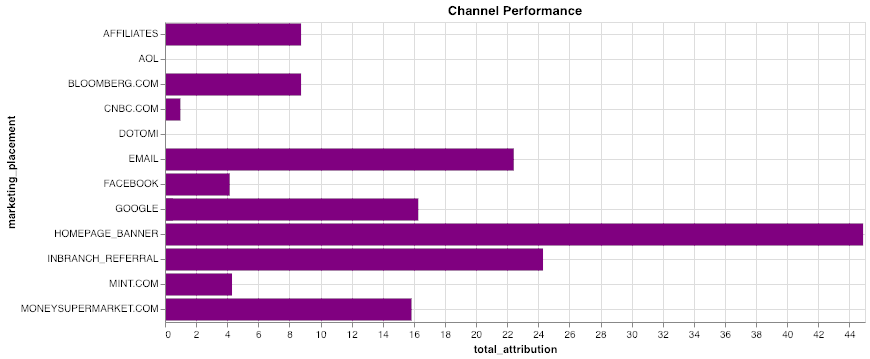

金融サービスのカスタマー ジャーニー
-----------------------------------

### 始める前に

エディタを開いてこのユース ケースを進めます。[エディタを起動する](#data=%7B%22navigateTo%22:%22editor%22%7D)

### はじめに

このユース ケースでは、Teradata VantageCloud Lakeを使用してカスタマー ジャーニーの側面を分析するいくつかの手法を紹介します。具体的には、Attribution関数とnPath関数を使用します。

ここで取り上げるシナリオは次のとおりです。顧客と小売銀行との重要なやり取りを確認し VantageCloud Lakeを使用して、顧客ジャーニーのさまざまなステップで新しいインサイトを発見する方法を示します。

**顧客獲得**から始めて、次の方法を学びます。 - 新規顧客を見つける - マーケティング アトリビューションを測定する - 投資収益率(ROI)を高め、マーケティング効果を最大化する - コンバージョンまでの時間を最小限に抑える

次に、**顧客の採用状況を確認する。**顧客が資産管理口座などの追加の高級製品を購入する理由は何でしょうか?

顧客は、オンラインとオフラインの両方で、さまざまな方法で銀行とやり取りします。支店内の窓口担当者とのやり取り、オンライン バンキング、電子メール、コール センターのログなど、さまざまなデータ ソースがあります。全体像を把握するには、これらすべてを確認する必要があります。

VantageCloud Lakeは、あらゆる規模のデータを組み合わせて集約するクラス最高の機能を提供します。特許取得済みのQueryGridテクノロジーを介して、オープン オブジェクト ストアやサードパーティのデータベース システムへのパフォーマンスが最適化された接続を提供し、無数のシステム、クラウド、物理的な場所からのデータを網羅する単一の集約された最適化されたクエリー ファブリックを作成します。他のデモでは統合と集約の手順を取り上げていますが、これは今回のケースでは対象外です。

このデモの後半で、このマルチチャネル データが最も正確で実用的なインサイトを得るための鍵となることがわかります。

エクスペリエンス
----------------

ユース ケース全体を実施する所要時間は約10分です。

### セットアップ

**アセットをロード** を選択してテーブルを作成し、このユース ケースに必要なデータを自分のアカウント(Teradataデータベース インスタンス)にロードします。[アセットをロード](#data=%7B%22id%22:%22FSCustomerJourney%22%7D)

### 顧客の開拓

顧客獲得チャネルは、分析の最初のステップです。新しいクレジットカードアカウントを開設する顧客に対するさまざまなマーケティング プログラムの有効性を分析することに焦点を当てます。顧客がどのチャネルから来ているのか、マーケティングROIを最大化するにはどうすればよいのかを理解したいと考えています。VantageCloud Lakeの強力なマーケティング アトリビューション機能を使用して、マルチチャネル データを確認します。

これにより、プロモーションとチャネル（オンラインとオフライン）の両方のマーケティング効果を迅速に定量化できます。どのプロモーションが最も効果的かを理解することで、マーケティング費用とプロモーションの配置を最適化できます。

アトリビューション機能を使用して多くの変数パラメータを効率的に分析するために、さまざまなディメンション テーブルを作成します。

``` sourceCode
--DATABASE <database_name>;

CREATE TABLE FSCJ_conversion_events
   (conversion_event   VARCHAR(55))
NO PRIMARY INDEX;
```

私たちは、人々がオンラインとオフラインの両方でいつアカウントを予約したかを判断し、それを成功基準として使用したいと考えています。

``` sourceCode
INSERT INTO FSCJ_conversion_events VALUES('ACCOUNT_BOOKED_ONLINE');
INSERT INTO FSCJ_conversion_events VALUES('ACCOUNT_BOOKED_OFFLINE');
```

VantageCloud Lakeでは、適用するアトリビューションモデルの種類を指定できます。簡単のために、基本的なUNIFORMモデルを選択します。UNIFORMモデルは、望ましい結果に至る前の各前段階に等しい重みを適用します。

``` sourceCode
CREATE TABLE FSCJ_attribution_model
   (id    INTEGER,
    model VARCHAR(100))
NO PRIMARY INDEX;
```

``` sourceCode
INSERT INTO FSCJ_attribution_model VALUES(0, 'SIMPLE');
INSERT INTO FSCJ_attribution_model VALUES(1, 'UNIFORM:NA');
```

これで、データセットに対してアトリビューション関数を呼び出す準備が整いました。データセットには、分析可能な多くの種類のクロスチャネル顧客インタラクションが含まれています。アトリビューション関数は、集約されたイベントデータと、上記で作成した2つの次元テーブルを入力として使用します。追加の関数引数は、処理するイベントの最大数や、時間順序およびイベント識別列に関する情報を定義するのに役立ちます。

``` sourceCode
CREATE TABLE FSCJ_marketing_attribution AS (
    SELECT * FROM Attribution (
                ON (
          SELECT
                customer_identifier, interaction_timestamp, interaction_type, customer_days_active, customer_type,
                marketing_placement, marketing_description, marketing_category,
                interaction_type || product_category AS interaction_product
            FROM fscj_ich_banking
            WHERE
                interaction_type IN ('ACCOUNT_BOOKED_OFFLINE','ACCOUNT_BOOKED_ONLINE','CLICK','REFERRAL','BROWSE')
                AND product_category <> '-1'
        ) 
        PARTITION BY customer_identifier
        ORDER BY interaction_timestamp
        ON FSCJ_conversion_events AS ConversionEventTable DIMENSION
        ON FSCJ_attribution_model AS FirstModel DIMENSION
        USING
        EventColumn ('interaction_type')
        TimestampColumn ('interaction_timestamp')
        WindowSize('rows:10')
    ) as attrib)
    WITH DATA
```

このアトリビューション分析は、クレジットカード アカウント開設につながるイベントを識別、それらに値を割り当てることを目的としています。データ内の具体的なコンバージョン イベントはACCOUNT\_BOOKED\_ONLINEとACCOUNT\_BOOKED\_OFFLINEであり、顧客獲得を促進する最も影響力のあるイベントとチャネルを計算します。VantageCloud Lakeのアトリビューション機能は、さまざまな標準アトリビューション モデルをサポートしています。VantageCloud Lakeを使用すると、アトリビューション モデル/パラメーターの変更が分析にどのように影響するかをすぐに確認できます。

さて、結果からいくつかの要約統計を取得してみましょう。

``` sourceCode
SELECT marketing_description, AVG(attribution) AS avg_attrib, SUM(attribution) AS sum_attrib, AVG(-time_to_conversion)/3600 AS time_to_conversion
FROM FSCJ_marketing_attribution 
WHERE marketing_description NOT IN ('\N', '-1')
GROUP BY marketing_description;
```


最初の可視化は、各プロモーションの平均アトリビューション スコアを示しています。バーが大きいほど、プロモーションが顧客のアカウント開設に与えた影響が大きくなります。

2番目のグラフは、各プロモーションの合計アトリビューション スコアを示しています。合計コンバージョンの観点から全体的に最も影響力のあるプロモーションは、最大のバーによって表されます。

3番目のグラフは、各プロモーションの顧客コンバージョンまでの平均時間を時間単位で示しています。時間が短いほど (グラフの下の方)、人々の行動が速いことを意味します。「ゴールド カード プロモーション II」のコンバージョン時間が最も短く、次に「ホテル カード プロモーション」と「MoneySupermarket.comプロモーション」が続いていることがわかります。

### チャネル分析

当社にはさまざまなプロモーションと広告ネットワークがありますので、さまざまなチャネルでのさまざまなプロモーションで得られる牽引力を見てみましょう。

``` sourceCode
SELECT marketing_category, marketing_placement, SUM(attribution) AS total_attribution 
FROM FSCJ_marketing_attribution 
WHERE marketing_description NOT IN ('\N', '-1')
GROUP BY 1, 2;
```



以下の可視化は、プロモーションが実行された各チャネルに基づく総アトリビューションを示しています。バーの全体の長さは、そのチャネルへの総アトリビューションを示しています。色は上部のビューで確認したプロモーションに対応しているため、どのプロモーションがどのチャネルで実行されたか、およびそれぞれのパフォーマンスを確認できます。データ結果セットには、電子メール、ブランチ内(オフライン)、およびWebがあることがわかります。

デジタル チャネルでは、ホームページ広告が最も効果的であり、次いで電子メールとGoogle検索が続いていることがわかります。

ビジネス インテリジェンス(BI)ツールを使用して、アトリビューション関数の出力に基づいて次のタイプの分析を作成できます。


この可視化により、マーケティング プロモーションと、さまざまなチャネルでのその配置について、より深いインサイトが得られます。たとえば、「MoneySupermarket.com プロモーション」と「ゴールド カード プロモーション II」が最も効果的なプロモーションであったことがわかります。「ゴールド カード プロモーション」は電子メールのみで実行されましたが、「ゴールド カード プロモーション II」は複数のチャネルで実行され、より効果的であったことがわかります。

このダッシュボードとVantageCloud Lakeの機能を使用すると、さまざまなプロモーションを簡単に比較して、特別な「MoneySupermarket.com プロモーション」が特に効果的であったことを確認できます。これは特定のチャネルでのみ実行され、コンバージョンまでの時間が短く、平均アトリビューションも強力でした。

「リワード カード プロモーション」はすべてのチャネルで好成績を収めましたが、特に支店での紹介で効果があったことがわかります。「航空会社カード プロモーション」はホームページとGoogleで最も高い成績を収めました。

アダプションへのパス
--------------------

次に、顧客が資産管理などのハイエンド口座を開設している様子を見たいと思います。多くのリテール銀行は資産管理を重要な収益源と認識しており、この分野でビジネスを構築しようとしています。

VantageCloud Lakeの強力な nPath分析関数を使用すると、SQLでは非常に難しいパターンと時間順の組み合わせ分析を実行できます。このユース ケースでは、顧客が資産管理アカウントを開設する際にたどる一般的なパスを確認します。また、資産管理顧客が保持する他の口座との関連性も確認します。

nPath関数は、各ユーザーの時間順のパスを構築する方法を定義するために、いくつかの重要な入力を受け取ります。このコードには、いくつかの重要な要素があります。まず、分析を容易にするために入力データをクリーンアップします。次に、パスを組み立てるために一致するパターンを定義します。1. 入力データでは、インタラクションと製品カテゴリを連結して、一意のイベントを作成します。2. また、入力データでは、資産管理アプリケーションの開始/完了をフィルタ処理します。これは誰もが当然行う操作であり、この場合はノイズを削減する必要があります。不完全なアプリケーションやその他のシナリオでさらに分析を行うことができます。3. **‘PATTERN’** 要素では、構文を使用して、資産管理アカウントの開設 (ACCOUNT\_BOOKED) に続く4つのイベントを検索します。  
4. 2つの**‘SYMBOLS’**は、資産管理アカウントの開設をEVENTとして、そのアカウントの開設をADOPTIONとして除く任意のイベントとして定義されます。5. **‘RESULT’**句は、関数に結果の表示方法を指示します。この場合、パスを表す長いイベント文字列と、イベント数、顧客ID、製品カテゴリなどのその他の情報を作成しています。

``` sourceCode
SELECT * FROM nPath (
        ON (
        SELECT customer_identifier, interaction_timestamp, interaction_type, product_category, interaction_type || '_' || product_category AS event, 
                marketing_category, marketing_description, marketing_placement, sales_channel, 
                conversion_sales, conversion_cost, conversion_margin
            FROM fscj_ich_banking
            WHERE
                product_category <> '-1'
                AND interaction_type || '_' || product_category <> 'STARTS_APPLICATION_WEALTH MANAGEMENT'
                AND interaction_type || '_' || product_category <> 'COMPLETE_APPLICATION_WEALTH MANAGEMENT'
        )
        PARTITION BY customer_identifier
        ORDER BY interaction_timestamp
        USING
        MODE (NONOVERLAPPING)
        -- Limit to a depth of 4
        PATTERN ('(EVENT){4}.ADOPTION')
        SYMBOLS (
            event NOT LIKE 'ACCOUNT_BOOKED%_WEALTH MANAGEMENT' AS EVENT,
            event LIKE 'ACCOUNT_BOOKED%' AND product_category = 'WEALTH MANAGEMENT' AS ADOPTION
        )
        RESULT (
            ACCUMULATE( event OF ANY(EVENT,ADOPTION) )  AS interaction_type_list,
            COUNT( event OF ANY(EVENT,ADOPTION) )       AS click_depth,

            FIRST( customer_identifier of ADOPTION )  AS customer_identifier,
            FIRST( product_category OF ADOPTION )     AS product_category
        )
    ) a;
```

VantageCloud Lake Consoleのビジュアライゼーションや他のBIツールを使用して、Sankeyと呼ばれる特殊なチャートを作成できます。これにより、ユーザーが資産管理アカウントを開設する際に最も一般的な経路についてのインサイトを得ることができます。


さらに、最もよく使われるパスに絞り込むことができます。


何が起こっているかがよくわかったので、それぞれのケースの主な要因を確認してみましょう。

まず、オンラインの資産管理口座の推進要因を見てみましょう。銀行のウェブサイトにある比較ツールがアカウント開設の主なステップであることがわかります。これにより、顧客は銀行の資産管理サービスと競合他社のサービスを比較できます。これは魅力的であることが証明されています。顧客はサービスを閲覧し、比較ツールを使用して最終的に予約します。

オンラインアカウントの登録を促すもう1つの主な要因は、自動貯蓄プランに申し込む人々です。貯蓄志向の人々は資産管理口座を開設する傾向があります。また、一般的には、提供内容の閲覧や預金証書(CD)の開設も二次的な経路であるようです。

オフラインには、オンラインとオフラインの両方で、主に他の種類の口座やCD、証券口座を開設する人々など、さまざまな推進要因があることがわかります。支店での紹介は、オフラインで資産管理アカウントを予約する主な経路です。人々は支店を訪れて別の種類のアカウントを開設し、資産管理アカウントの開設を紹介されます。

### クリーンアップ

``` sourceCode
DROP TABLE FSCJ_conversion_events;
```

``` sourceCode
DROP TABLE FSCJ_attribution_model;
```

``` sourceCode
DROP TABLE FSCJ_marketing_attribution;
```

### データセット

このユース ケース、FSCustomerJourneyのデータは、`retail_sample_data` データベースに格納されています。

#### 統合型問い合わせ履歴

以下にこのユース ケースで使用するメインのテーブルを示します。さまざまなソース システムやチャネルからのデータがあらかじめ結合され、1つの大きなテーブルにまとめられています。これはすべての顧客とのやり取りを表し、顧客システムにおいて、各種のソース テーブルの最も重要なビューと見なすこともできます。

`fscj_ich_banking`

-   `customer_skey`: 顧客キー
-   `customer_identifier`: 固有の顧客識別子
-   `customer_cookie`: 顧客のデバイスに配置されるCookie
-   `customer_online_id`: ブーリアン - 顧客がオンライン口座を保有しているか
-   `customer_offline_id`: 顧客の口座番号
-   `customer_type`: これは高価値の顧客か、それとも単にウェブサイトを閲覧している訪問者か?
-   `customer_days_active`: 顧客がアクティブな時間はどのくらいか
-   `interaction_session_number`: セッション識別子
-   `interaction_timestamp`: このイベントのタイムスタンプ
-   `interaction_source`: このイベント発生元のチャネル(オンライン/オフライン、支店内など)
-   `interaction_type`: イベントのタイプ
-   `sales_channel`: 販売イベントがあったチャネル
-   `conversion_id`: 販売コンバージョン識別子
-   `product_category`: イベントが関連する商品のタイプ(当座預金、普通預金、CDなど)
-   `product_type`: 未使用
-   `conversion_sales`: 未使用
-   `conversion_cost`: 未使用
-   `conversion_margin`: 未使用
-   `conversion_units`: 未使用
-   `marketing_code`: マーケティング識別子
-   `marketing_category`: マーケティング チャネル(支店内、ウェブサイト、電子メールなど)
-   `marketing_description`: マーケティング キャンペーン名
-   `marketing_placement`: 特定のマーケティング経路(Google、Bloomberg.comなど)
-   `mobile_flag`: ブーリアンがモバイル デバイス上にあった
-   `updt`: 未使用
