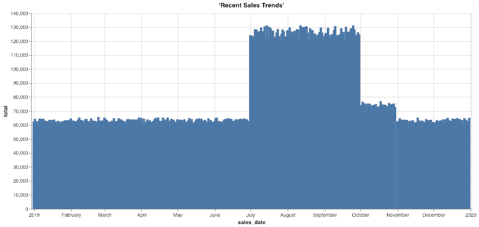

ディープ ヒストリー: オブジェクト ストアからのアーカイブ データへアクセスする
-----------------------------------------------------------------------------

### 始める前に

エディタを開いてこのユース ケースを進めます。[エディタを起動する](#data=%7B%22navigateTo%22:%22editor%22%7D)

### はじめに

ますます厳しくなる規制により、企業はデータをオンラインで保持し、何年にもわたって規制遵守のためにアクセス可能にする必要があります。最も頻繁にアクセスされるデータは最新または最も現在のデータですが、それは古い情報がビジネスや分析の使用例にとって役に立たない、または関連性がないという意味ではありません。何年にもわたって収集された履歴データは、長期的な傾向や周期的なパターンなど、ビジネスの豊かな視点を提供します。

Teradata VantageCloud Lakeは、世界最大かつ最も要求の厳しい企業がデータを分析するための比類のないスケーラビリティ、同時実行性、およびパフォーマンスを提供します。データが古くなるにつれて、古い情報の頻繁な分析の必要性は一般的に減少します。時間が経つにつれて、現在の「ホット」データよりも多くの履歴データが蓄積されるため、異なるパフォーマンスと価格特性を持つアーキテクチャに保存することが理にかなっています。例えば、Amazon S3やMicrosoft Azure Blob Storageのようなオブジェクトストアです。

一部のインサイトは、履歴データと現在のデータを一緒に分析することでのみ得られるため、これらを別々のシステムに保存することは多くの分析プラットフォームにとって課題となる可能性があります。逆に、Teradata VantageCloud Lakeは、ユーザーがツールやクエリを変更することなく、データウェアハウスとオブジェクトストレージ全体で履歴情報と現在の情報をシームレスに結合することができます。その結果、意思決定者は以前には答えられなかった質問に費用対効果の高い方法で答えることで、より良い計画を立てることができます。アナリストやデータサイエンティストは、深く包括的なデータセットにシームレスにアクセスできるため、より強力な高度な分析とAI/MLの成果を得ることができます。

### エクスペリエンス

「体験」セクションの実施所要時間は約10分です。

### セットアップ

**アセットをロード** を選択してテーブルを作成し、このユース ケースに必要なデータを自分のアカウント(Teradataデータベース インスタンス)にロードします。[アセットをロード](#data=%7B%22id%22:%22SalesOffload%22%7D)

### ウォークスルー

#### ステップ1:データのクエリー

これが現在の売上データです。いくつかのサンプル行を取得しましょう。この例では、顧客、店舗、バスケット、および割引情報が含まれています。

``` sourceCode
SELECT TOP 10 * 
FROM so_sales_fact
```

``` sourceCode
SELECT sales_date, sum(sales_quantity) as total 
FROM so_sales_fact
GROUP BY sales_date
ORDER BY sales_date ASC
```



どの期間のデータがありますか?

``` sourceCode
SELECT MIN(sales_date) AS min_date, MAX(sales_date) AS max_date FROM so_sales_fact
```

データ ウェアハウス (2019年データ) にはいくつの記録があるでしょうか？

``` sourceCode
SELECT COUNT(*)
FROM so_sales_fact
```

#### ステップ2:オフロードされた過去データの探索

この例では、データウェアハウスに1年分の売上データしかありません。これは最も頻繁にクエリされるデータだからです。コンプライアンスのために、多くの企業は最大10年分の履歴データを保持する必要があります。このシナリオでは、古いデータは毎月VantageCloud Lakeからエクスポートされ、長期保存のためにAmazon S3にロードされています。VantageCloud Lakeを使用すると、このオフロードされたデータにシームレスにアクセスし、他のデータと結合して長期的な傾向を確認し、監査要求などの分析ニーズを簡単に処理できます。これには、通常であれば書き直す必要がある既存のクエリやレポートの使用も含まれます。

私たちはすでに、オフロードされた販売データを含むバケットの場所を把握しているので、そのデータの一部を確認してみましょう。READ\_NOS関数を使用すると、ファイルの一覧とそのサイズを取得できます。FROM句のRETURNTYPE要素を使用すると、この関数にオブジェクトのメタデータ、スキーマ、または値そのものを返すよう指示できます。

このS3バケットは公開読み取り可能であることに注意してください。保護されたオブジェクトストアを使用している場合は、AUTHORIZATION要素を適切な認証情報を含むように変更するか、この情報を含む認可オブジェクトを使用することができます。

``` sourceCode
SELECT location(char(255)), ObjectLength 
FROM (
 LOCATION='/s3/s3.amazonaws.com/trial-datasets/SalesOffload'
 AUTHORIZATION='{"ACCESS_ID":"","ACCESS_KEY":""}'
 RETURNTYPE='NOSREAD_KEYS'
) as d 
ORDER BY 1
```

全部でいくつのファイルとディレクトリがあるでしょうか？

``` sourceCode
SELECT COUNT(location(char(255))) as NumFiles
FROM (
 LOCATION='/s3/s3.amazonaws.com/trial-datasets/SalesOffload'
 AUTHORIZATION='{"ACCESS_ID":"","ACCESS_KEY":""}'
 RETURNTYPE='NOSREAD_KEYS'
) as d 
ORDER BY 1
```

ファイル形式をよりよく理解するために、ファイルの1つを調べてみましょう。

``` sourceCode
SELECT * FROM (
      LOCATION='/s3/s3.amazonaws.com/trial-datasets/SalesOffload/2010/1/object_33_0_1.parquet'
      AUTHORIZATION='{"ACCESS_ID":"","ACCESS_KEY":""}'
      RETURNTYPE='NOSREAD_PARQUET_SCHEMA'
      )
AS d
```

#### ステップ3:シンプルな抽象化レイヤーを作成してアクセスしやすくする

承認オブジェクトを作成するには、次のステートメントを使用して、外部オブジェクト ストアへの資格情報を含めます。このユース ケースでは、示されているように、USERフィールドとPASSWORDフィールドを空白のままにします。

``` sourceCode
CREATE AUTHORIZATION MyAuth
USER ''
PASSWORD '';
```

VantageCloud Lakeに外部テーブルとビューを作成すると、ビジネス アナリストやその他のユーザーがオフロードされた履歴データに簡単にアクセスできるようになります。外部テーブルは、通常のデータベース テーブルのように機能するが、別の場所にあるデータを指すデータベース内のオブジェクトです。外部テーブルの定義には、データ転送の最適化、オンザフライでのデータの変換などに役立つ拡張構文も含まれます。

以下のSQLは、列とデータ型の自動検出に依存する単純なテーブルを作成します。

``` sourceCode
CREATE FOREIGN TABLE sales_fact_offload
, EXTERNAL SECURITY MyAuth 
USING
       (
LOCATION  ('/s3/s3.amazonaws.com/trial-datasets/SalesOffload')
STOREDAS  ('PARQUET')
       )
NO PRIMARY INDEX
PARTITION BY COLUMN;
```

オフロードされたファイル内のいくつかの行を調べてみましょう。

``` sourceCode
SELECT TOP 10 *
FROM sales_fact_offload;
```

そこにはどれくらいのデータがありますか?

``` sourceCode
SELECT COUNT(*)
FROM sales_fact_offload;
```

OK—もうすぐです！データをネイティブなテーブルのように見せたいです。なので、ビューを上に置いて、列に分割しましょう。

``` sourceCode
REPLACE VIEW sales_fact_offload_v as (  
SELECT 
    sales_date,
    customer_id,
    store_id,
    basket_id,
    product_id,
    sales_quantity,
    discount_amount
FROM sales_fact_offload);
```

これで、 VantageCloud Lakeの他のテーブルと同じようにデータをクエリーできるようになりましたが、データはクエリー実行時にオブジェクト ストアから直接取得されます。既存のSQLスキルとワークフローを使用して、オブジェクト ストア ベースのデータセットとTeradataリレーショナル テーブルの構造化データセットの相関関係をサポートすることで、シームレスな分析エクスペリエンスが実現しました。

``` sourceCode
SELECT TOP 10 *
FROM sales_fact_offload_v;
```

これで、ユーザーはオブジェクト ストア内のすべての履歴データにアクセスできるようになりました。データベース ビューを使用することで、オブジェクト ストアへのアクセスの根本的な複雑さを抽象化できます。ユーザーはデータをデータベース内の他のオブジェクトと同じように見ることができ、 VantageCloud Lakeはクエリー実行とデータ転送を自動的に最適化し、パフォーマンスと応答時間を最適化します。

多くの場合、膨大なデータの一部を確認できる必要があります。私たちのユース ケースでは、トランザクションの年と月を含むいくつかの共通フィルタを想定しています。そのため、オブジェクト ストアに年と月のキーで保存しています。外部テーブルを再定義して、これらの共通条件に基づいてデータを読み取るときにデータを事前にフィルタすることができます。

#### ステップ4:外部テーブルとビューを最適化してアクセスを効率化する

S3には大量のデータがあります。オブジェクト ストアでクエリーを実行するときに読み取る必要のあるデータを最小限に抑えるために、外部テーブルを最適化しましょう。オブジェクト ストアのbucketとパス構造を設計することは、データの保存方法を計画する際の重要な最初のステップです。ビジネスニーズ、データへのアクセスで予想されるパターン、データの理解、トレードオフに対する感受性に関する知識が必要です。私たちの場合、調べている日付のおおよその日付がわかっていることが多いので、これを活用しましょう。

``` sourceCode
DROP TABLE sales_fact_offload;
CREATE FOREIGN TABLE sales_fact_offload
, EXTERNAL SECURITY MyAuth 
USING
       (
LOCATION  ('/s3/s3.amazonaws.com/trial-datasets/SalesOffload')
PATHPATTERN ('$dir1/$year/$month')
STOREDAS  ('PARQUET')
       )
NO PRIMARY INDEX
PARTITION BY COLUMN;
```

外部テーブルを再定義して、**PATHPATTERN**要素を含めました。これにより、日付別に履歴データを確認するときに、必要なファイルのみを読み取ることができます。

次に、このパス フィルタリングを可能にするユーザー フレンドリなビューを再作成します。上で説明したように、データベース ビューを使用すると、基礎となる複雑さを抽象化できます。この場合、オブジェクト パスを列にマッピングしているため、ユーザーがこれらの列をフィルタ値として使用すると、 VantageCloud Lakeは自動的にデータ転送を最小限に抑えます。

``` sourceCode
REPLACE VIEW sales_fact_offload_v as (  
SELECT 
    CAST($path.$year AS CHAR(4)) sales_year,
    CAST($path.$month AS CHAR(2)) sales_month,
    sales_date,
    customer_id,
    store_id,
    basket_id,
    product_id,
    sales_quantity,
    discount_amount
FROM sales_fact_offload);
```

``` sourceCode
SELECT TOP 10 *
FROM sales_fact_offload_v
WHERE sales_year = '2010'
AND sales_month = '9';
```

これは、月を知っている場合のユースケースに最適です。例えば、何年も前に顧客が購入したものを確認する必要がある場合や、過去の店舗売上を報告したい場合です。ビジネスアナリストは、ITの介入、バックアップ、または他のアクセスしにくいデータサイロなしで簡単にクエリーを実行できます。

2012年8月のStore 6の売上を見てみましょう。

``` sourceCode
SELECT store_id, SUM(sales_quantity)
FROM sales_fact_offload_v
WHERE store_id = 6
AND sales_year = '2012'
AND sales_month = '8'
GROUP BY 1;
```

全体像を把握するために、過去データと現在のデータを結合しましょう。

``` sourceCode
REPLACE VIEW sales_fact_all as (
SELECT sales_date,
    customer_id,
    store_id,
    basket_id,
    product_id,
    sales_quantity,
    discount_amount
    FROM so_sales_fact
    UNION ALL
SELECT 
    sales_date,
    customer_id,
    store_id,
    basket_id,
    product_id,
    sales_quantity,
    discount_amount
FROM sales_fact_offload_v);
```

最後に、売上の経時レポートを再実行しましょう。コードは上記のものと変わらないので、最新の年を超えたすべての売上データを分析できます。

``` sourceCode
SELECT sales_date, sum(sales_quantity) as total 
FROM sales_fact_all
GROUP BY sales_date
ORDER BY sales_date ASC;
```


2019年は不調な年だったことがわかったので、何が起こったのかさらに詳しく調べる必要があります。しかし、 VantageCloud Lakeのおかげで、あまりクエリされない古いデータをオブジェクトストレージにオフロードして安全に保管することで、すべてのデータをコスト効率よく分析できます。

#### ステップ5: クリーンアップ

独自のデータベース スキーマで作成したオブジェクトを削除します。

``` sourceCode
DROP VIEW sales_fact_all;
```

``` sourceCode
DROP VIEW sales_fact_offload_v;
```

``` sourceCode
DROP TABLE sales_fact_offload;
```

データセット
------------

------------------------------------------------------------------------

**sales\_fact** データセットには約4,300万行のサンプル売上データがあります。

-   `sales_date`: 注文が処理された日付
-   `customer_id`: 顧客識別子
-   `store_id`: 受注店舗識別子
-   `basket_id`: グループ番号または注文番号
-   `product_id`: 商品の識別子
-   `sales_quantity`: 販売された商品の数量
-   `discount_amount`: このライン アイテムで行われた割引
