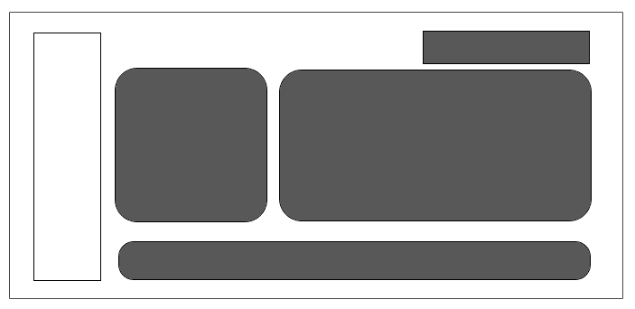

Teradata Vantage is the connected multi cloud data platform for enterprise analytics that enables you to solve complex data challenges. Here, you’ll learn about the parts of the VantageCloud Lake Console and see what’s possible!

## Navigation panel

Use this menu to access the primary features, including:

-   Monitoring queries, resources, and consumption.

-   Adding new users and configuring single sign-on (SSO).

-   Loading, copy, migrating, and backing up your data.

-   Using third-party and user-defined functions.

-   Getting started and launching the Resource center.

The available options may vary, depending on your role, permissions, and environment.

## Toolbar

Here, you can access common features such as:

-   SQL editor

-   ask.ai, our AI-powered chatbot

-   Context-specific help

-   Your user settings

-   Other common tasks

You can use the Environments menu to quickly jump between different environments.

<menu image>

## Learning resources

Use the **Learn** option and **Resource center** to find how-tos, learn what’s new, and review step-by-step -guides and tours.

