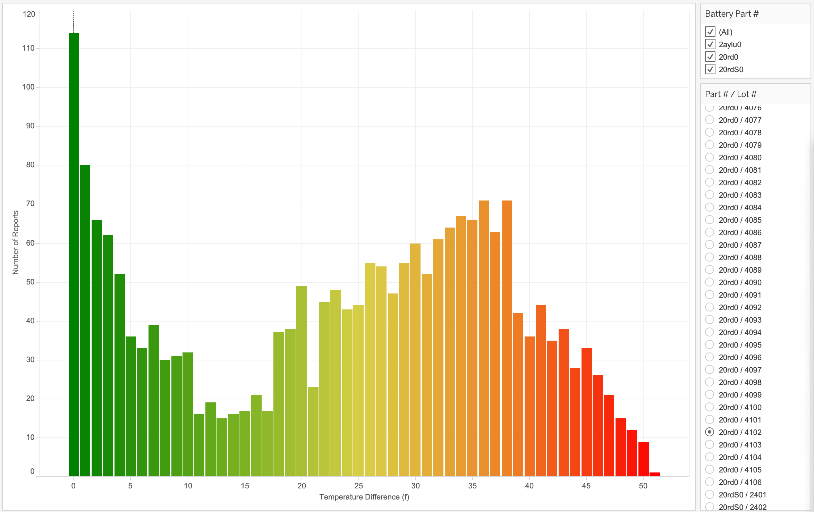
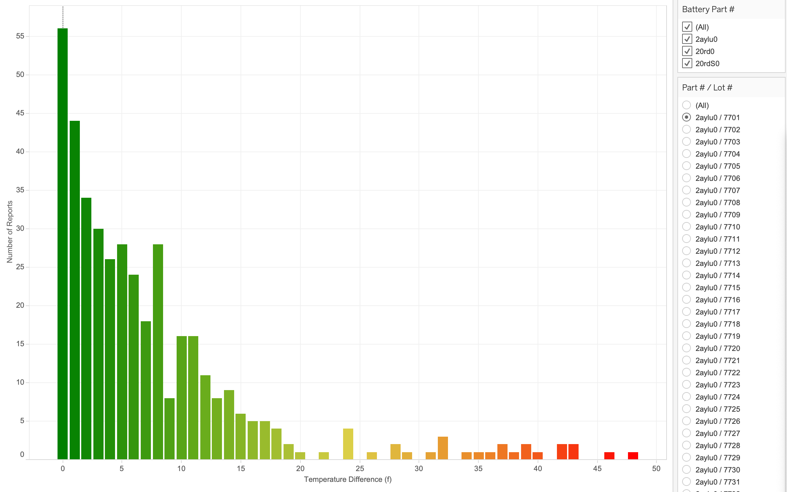

* [Manufacturing Defect Analysis](#manufacturing-defect-analysis)
* [Before You Begin](#before-you-begin)
* [Walkthrough](#walkthrough)
* [Dataset Reference](#dataset-reference)

## Manufacturing Defect Analysis

You are a business analyst for a major electric vehicle (EV) manufacturer. While running regular financial reports using Teradata Vantage, you discover a serious issue with increasing warranty repairs, primarily driven by battery pack replacements. The battery pack is one of the most expensive and critical components in a vehicle. Using Vantage and the data captured during the manufacturing process, you can determine the root cause and resolve the issue.


## Before You Begin

1. Open Editor and log in using your DBC credentials.

   [LAUNCH EDITOR]

2. Load the built-in dataset assets.

   [LOAD ASSETS]

## Walkthrough

* This use case takes approximately 15 minutes.
* Each step involves multiple actions that prepare you for the next step.
* Copy, paste, and run the code in Editor to follow along.

### Step 1: Determine the root cause.

Find out the vehicle identification number (VIN) for all cars that required a battery replacement under warranty:

```sql
SELECT d.company, count(*)
FROM retail_sample_data.ev_dealers d, retail_sample_data.ev_badbatts bb,
retail_sample_data.ev_vehicles v
WHERE bb.vin = v.vin
AND v.dealer_id = d.id
GROUP BY d.company order by 2 desc
```

Your company uses the same set of battery parts in several different models across the product line. Find out which car models use those batteries: 

```sql
SELECT v.model, count(*)
FROM retail_sample_data.ev_vehicles v, retail_sample_data.ev_badbatts bb
WHERE bb.vin = v.vin
GROUP BY v.model order by 2 desc
```

Identify the assembly plants from which the cars with battery issues are coming:

```sql
SELECT mfg.company, count(*)
FROM retail_sample_data.ev_mfg_plants mfg, retail_sample_data.ev_badbatts bb,
retail_sample_data.ev_vehicles v
WHERE bb.vin = v.vin
AND v.mfg_plant_id = mfg.id
GROUP BY mfg.company order by 2 desc
```

A very high number of cars with the battery-pack issue are coming from the same assembly plant. Find out exactly what battery cells are installed in the cars with bad batteries:


```sql
SELECT DISTINCT bom.part_no, p.description, count(*)
FROM retail_sample_data.ev_bom bom, retail_sample_data.ev_badbatts bb, retail_sample_data.ev_parts p
WHERE bb.vin = bom.vin
AND bom.part_no = p.part_no
AND p.description LIKE 'Battery Cell%'
GROUP BY bom.part_no, p.description
```

There is an issue with part number 20rd0. Using detailed manufacturing data stored in your integrated data warehouse, find out if there is a correlation with lot numbers for those battery cells:

```sql
SELECT bom.part_no, bom.lot_no, p.description, count(*)
FROM retail_sample_data.ev_bom bom, retail_sample_data.ev_badbatts bb, retail_sample_data.ev_parts p
WHERE bb.vin = bom.vin
AND p.part_no = bom.part_no
AND p.description LIKE 'Battery Cell%'
GROUP BY bom.part_no, bom.lot_no, p.description
ORDER BY count(*) DESC
```

Now you know the underlying issue with 20rd0. The majority of failures are from battery lot 4012 that was delivered to the Jackson Plant and associated with a huge number of faulty batteries and warranty replacements. These insights will show up even better in the dashboard of your favorite BI tool that is connected directly to Vantage. You can perform interactive and iterative analysis:


Your modern-connected EV cars provide detailed sensor data as well. Look at the temperature sensor data for the battery lot in question:



Compare the temperature sensor data to an average battery lot:



The occurances of higher temperatures and overheating in your battery packs depend on the battery pack model and lot number. You know the underlying cause of the increased warranty costs, but you need to dig deeper.  

### Step 2: Access test results from the Data Lake.

You want to detect bad batteries before they end up in customers' cars and avoid expensive warranty repair cycles and poor customer satisfaction. During the manufacturing process, you store detailed test reports for the various parts and subsystems that comprise the vehicle. These reports are voluminous, semi-structured data that is loaded directly into your Data Lake and housed in an object store. With Teradata Vantage, you can natively pull in and analyze this data. Create a foreign table to access the JSON-formatted data in Amazon S3:

```sql

CREATE FOREIGN TABLE retail_sample_data.test_reports , FALLBACK ,
     EXTERNAL SECURITY retail_sample_data.DEMO_AUTH_NOS
(
    Location VARCHAR(2048) CHARACTER SET UNICODE CASESPECIFIC,
    payload JSON(16776192) INLINE LENGTH 64000 CHARACTER SET LATIN)
USING (
    Location ('/s3/s3.amazonaws.com/trial-datasets/EVCarBattery/')
), NO PRIMARY INDEX;
```

```sql
SELECT TOP 10 *
FROM retail_sample_data.test_reports
```

Put a user-friendly view on top of the foreign table to shred the files and make the test report data easier to access:

```sql
REPLACE VIEW retail_sample_data.test_reports_v AS
(SELECT vin, part_no, lot_no, CAST(test_report AS JSON) test_report
FROM TD_JSONSHRED(
    ON (
                SELECT payload.vin as vin, payload
                FROM retail_sample_data.test_reports)
            USING
            ROWEXPR('parts')
            COLEXPR('part_no', 'lot_no', 'test_report') 
            RETURNTYPES('VARCHAR(17)', 'VARCHAR(1000)', 'VARCHAR(10000)')
        ) AS d1 (vin, part_no, lot_no, test_report)
    )
```

```sql
SELECT TOP 10 *
FROM retail_sample_data.test_reports_v
```

### Step 3: Access and join JSON manufacturing test data natively in Vantage.

Different data is reported during testing for the various vehicle parts. Check out the test results for the simplest parts:

```sql
SELECT TOP 1 test_report
FROM retail_sample_data.test_reports_v
WHERE part_no = '11400zn'
```

In contrast, look at the detailed data on the performance of the battery after it is assembled, but before it goes into the vehicle:

```sql
SELECT TOP 1 test_report
FROM retail_sample_data.test_reports_v
WHERE part_no = '20rdS0'
```

Using simple dot notation, drill into the JSON data to access important test results to compare the rated and measured capacities and part and lot numbers for just the batteries: 

```sql
SELECT TOP 10 tr.part_no, p.description, tr.lot_no, 
tr.test_report."Rated Capacity" AS rated_capacity,
tr.test_report."Static Capacity Test"."Measured Average Capacity" AS measured_capacity
FROM retail_sample_data.ev_parts p, retail_sample_data.test_reports_v tr
WHERE  p.part_no = tr.part_no
AND p.description LIKE 'Battery Cell%'
```

By visualizing results in your BI tool, you can see that these battery packs are within specifications, but the range is much lower than the other battery lots. With this insight, you can tighten up acceptance criteria and do proactive analysis to identify possible quality issues before the cars are completed and delivered to customers. These initiatives will increase product quality and make sure this doesn't happen again. Using Teradata Vantage to analyze both your integrated data and the Data Lake, you can get to the bottom of virtually any business problem quickly and easily!


### Step 4: Clean up objects.

Drop the objects you created in your database schema:

```sql
DROP TABLE retail_sample_data.test_reports;
```

```sql
DROP VIEW retail_sample_data.test_reports_v;
```

## Dataset Reference

The collection of data used in this use case includes the following:

### bom: Bill of materials that contains all major parts of each vehicle

- `id`: unique identifier
- `vin`: vehicle identification number
- `part_no`: part number
- `vendor_id`: vendor who produced the part (unused)
- `lot_no`: lot number from the vendor
- `quantity`: quantity of this part in the vehicle

### dealers: Vehicle sales and distributors

- `id`: unique identifier
- `Company`: company name
- `StreetAddress`: street address
- `City`: city
- `State`: state
- `ZipCode`: postcode
- `Country`: country
- `EmailAddress`: main email address
- `TelephoneNumber`: telephone number
- `DomainName`: URL for company website
- `Latitude`: latitude (location)
- `Longitude`: longitude (location

### mfg_plants: Manufacturing facilities

- `id`: unique identifier
- `Company`: facility name
- `StreetAddress`: street address
- `City`: city
- `State`: state
- `ZipCode`: postcode
- `Country`: country
- `EmailAddress`: main email address
- `TelephoneNumber`: telephone number
- `DomainName`: URL for plant website
- `Latitude`: latitude (location)
- `Longitude`: longitude (location

### parts: Master list of parts for all vehnicles

- `part_no`: unique part number
- `description`: part description

### vehnicles: Vehicles Built or Being Built

- `vin`: unique identifier
- `yr`: model year
- `model`: vehicle model code
- `customer_id`: customer / purchaser
- `dealer_id`: dealer where vehicle was sold/delivered
- `mfg_plant_id`: plant the vehicle was assembled
