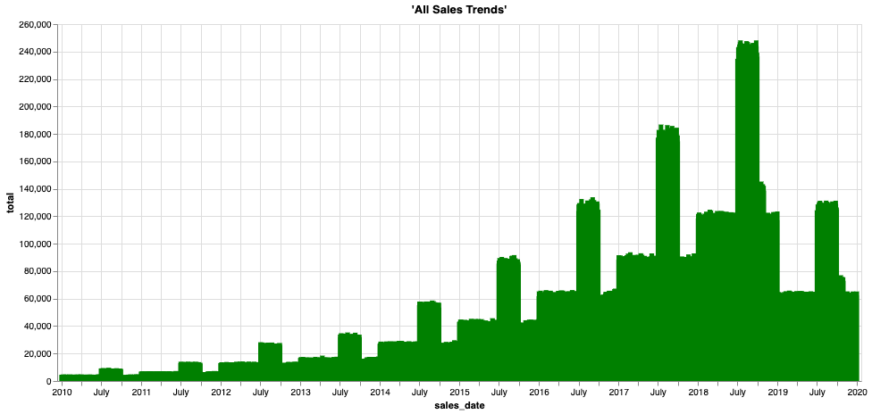

* [Historical Data Offload](#historical-data-offload)
* [Before You Begin](#before-you-begin)
* [Walkthrough](#walkthrough)
* [Dataset Reference](#dataset-reference)

## Historical Data Offload

As a business analyst, you are aware of the increasing compliance regulations about keeping data online and accessible for many years. Although the data accessed most frequently is the latest or most-common data, older data is still useful and relevant. Historical data provides a rich perspective of your business, such as long-term trends and cyclical patterns.

Teradata Vantage provides unmatched concurrency and performance analysis for the world's largest and most demanding enterprises. Analysis and concurrency needs for older information lessens substantially as the data ages. Because there is more accumulation of historical data that current or "hot" data over time, it makes sense to store historical data somewhere that has different performance and price characteristics, for example an object store such as Amazon S3 or Azure Blob storage.

Typically, keeping historical and current data in separate systems makes it a challenge to gain valuable insights. Teradata Vantage solves that challenge. You can seamlessly join together all historical and current information across the data warehouse and object storage, without having to change the basic data structures and queries. You can cost-effectively answer questions that could not be answered before and plan better for the future.

### Before You Begin

1. Open Editor and log in using your DBC credentials.

   [LAUNCH EDITOR]

2. Load the built-in data set assets.

   [LOAD ASSETS]

## Walkthrough

* This use case takes approximately 10 minutes.
* Each step involves multiple actions that prepare you for the next step.
* Copy, paste, and run the code in Editor to follow along.

#### Step 1: Query the data.

Grab some sample rows from the current sales data to see customer, store, basket, and discount information:

```sql
SELECT TOP 10 * 
FROM retail_sample_data.so_sales_fact
```

```sql
SELECT sales_date, sum(sales_quantity) as total 
FROM retail_sample_data.so_sales_fact
GROUP BY sales_date
ORDER BY sales_date ASC
```


```sql
SELECT MIN(sales_date) AS min_date, MAX(sales_date) AS max_date FROM retail_sample_data.so_sales_fact
```

Find out how many records you have in the data warehouse:

```sql
SELECT COUNT(*)
FROM retail_sample_data.so_sales_fact
```

#### Step 2: Explore the offloaded historical data.

You have only have one year of sales data in your data warehouse, which is the data queried the most. Like many companies, you need to keep up to 10 years of historical data for compliance. Vantage exports the older data on a monthly basis and loads into Amazon S3 for long-term storage. With Teradata Vantage, you can seamlessly access the offloaded data and join it with the rest of the data to get insights over long-term trends and handle audit requests with ease. You can use existing queries and reports that would otherwise need to be rewritten. Use the READ_NOS function to get a list of files and sizes from the offloaded data:

```sql
SELECT location(char(255)), ObjectLength 
FROM (
 LOCATION='/s3/s3.amazonaws.com/trial-datasets/SalesOffload'
 AUTHORIZATION=retail_sample_data.DEMO_AUTH_NOS
 RETURNTYPE='NOSREAD_KEYS'
) as d 
ORDER BY 1
```
Find out the total number of files and directories:

```sql
SELECT COUNT(location(char(255))) as NumFiles
FROM (
 LOCATION='/s3/s3.amazonaws.com/trial-datasets/SalesOffload'
 AUTHORIZATION=retail_sample_data.DEMO_AUTH_NOS
 RETURNTYPE='NOSREAD_KEYS'
) as d 
ORDER BY 1
```

Get a better understanding of the file format by looking at one of the files:

```sql
SELECT * FROM (
      LOCATION='/s3/s3.amazonaws.com/trial-datasets/SalesOffload/2010/1/object_33_0_1.parquet'
      AUTHORIZATION=retail_sample_data.DEMO_AUTH_NOS
      RETURNTYPE='NOSREAD_PARQUET_SCHEMA'
      )
AS d
```

#### Step 3: Create a simple abstraction layer for easy access.

Create a foreign table with a view in Vantage so you can easily access the offloaded historical data:

```sql
CREATE FOREIGN TABLE retail_sample_data.sales_fact_offload
, EXTERNAL SECURITY retail_sample_data.DEMO_AUTH_NOS
USING
       (
LOCATION  ('/s3/s3.amazonaws.com/trial-datasets/SalesOffload')
STOREDAS  ('PARQUET')
       )
NO PRIMARY INDEX
PARTITION BY COLUMN;
```

Take a look at some of the rows in the offloaded files: 

```sql
SELECT TOP 10 *
FROM retail_sample_data.sales_fact_offload;
```

Find out how much data you have out there:

```sql
SELECT COUNT(*)
FROM retail_sample_data.sales_fact_offload;
```

You're getting close. Apply a view to split the data into colummns so it looks like a native table:

```sql
REPLACE VIEW retail_sample_data.sales_fact_offload_v as (  
SELECT 
    sales_date,
    customer_id,
    store_id,
    basket_id,
    product_id,
    sales_quantity,
    discount_amount
FROM retail_sample_data.sales_fact_offload);
```

Now you can query the data like any other table in Teradata Vantage, but the data is pulled at query runtime directly from the object store! Because correlation of object store-based data sets with structured data sets is supported in Teradata relational tables using existing SQL skills and workflows, you have a seamless analytic experience.

Now you can query the data like any other table in Teradata Vantage and the data is pulled directly from the object store at query runtime. By supporting the correlation of object store-based data sets with structured data sets in Teradata relational tables using existing SQL skills and workflows, you have a seamless analytic experience.

```sql
SELECT TOP 10 *
FROM retail_sample_data.sales_fact_offload_v;
```

That looks great! Now you can access all the historical data in the object store.

You can do everything in a view over a foreign table that you would do with a standard database view. This includes returning only a subset of the underlying table columns and adding a WHERE clause in the view to limit what rows are made available using the view.

Frequently, you want to be able to look at just a portion of the vast amount of data, which is why it's stored by year and month. In the next step, you will redefine the foreign table so you can pre-filter data when reading it.

#### Step 4: Optimize the foreign table and view for efficient access.

When creating an object store, designing an object store bucket and path structure are important first steps. That requires knowledge of the business needs, expected patterns in accessing the data, understanding of the data, and sensitivity to the tradeoffs. Typically, you know the approximate date you are looking at, which can be an advantage. You have a lot of data in S3. Optimize the foreign table and view to minimize the data you have to read when querying the object store: 

```sql
DROP TABLE retail_sample_data.sales_fact_offload;
```

```sql
CREATE FOREIGN TABLE retail_sample_data.sales_fact_offload
, EXTERNAL SECURITY retail_sample_data.DEMO_AUTH_NOS
USING
       (
LOCATION  ('/s3/s3.amazonaws.com/trial-datasets/SalesOffload')
PATHPATTERN ('$dir1/$year/$month')
STOREDAS  ('PARQUET')
       )
NO PRIMARY INDEX
PARTITION BY COLUMN;
```

The foreign table was redefined to include a <b>PATHPATTERN</b> clause to read only the files you need when looking at historical data by date. Recreate the user-friendly view to allow for this path filtering:

```sql
REPLACE VIEW retail_sample_data.sales_fact_offload_v as (  
SELECT 
    CAST($path.$year AS CHAR(4)) sales_year,
    CAST($path.$month AS CHAR(2)) sales_month,
    sales_date,
    customer_id,
    store_id,
    basket_id,
    product_id,
    sales_quantity,
    discount_amount
FROM retail_sample_data.sales_fact_offload);
```

```sql
SELECT TOP 10 *
FROM retail_sample_data.sales_fact_offload_v
WHERE sales_year = '2010'
AND sales_month = '9';
```

This is great for use cases when you know the date, at least to the month. Suppose you need to see what a customer bought many years ago or you want to report on historical store sales. You can easily query this with no IT intervention and no going to backups or other hard-to-reach data silos. Take a look at what store 6 did for sales back in August 2012:

```sql
SELECT store_id, SUM(sales_quantity)
FROM retail_sample_data.sales_fact_offload_v
WHERE store_id = 6
AND sales_year = '2012'
AND sales_month = '8'
GROUP BY 1;
```

Join the historical data with the current data to get the full picture:

```sql
REPLACE VIEW retail_sample_data.sales_fact_all as (
SELECT sales_date,
    customer_id,
    store_id,
    basket_id,
    product_id,
    sales_quantity,
    discount_amount
    FROM retail_sample_data.so_sales_fact
    UNION ALL
SELECT 
    sales_date,
    customer_id,
    store_id,
    basket_id,
    product_id,
    sales_quantity,
    discount_amount
FROM retail_sample_data.sales_fact_offload_v);
```

Rerun your sales over time report to analyze all the sales data, not just the most recent year.


```sql
SELECT sales_date, sum(sales_quantity) as total 
FROM retail_sample_data.sales_fact_all
GROUP BY sales_date
ORDER BY sales_date ASC;
```



In the broader context, you can see that 2019 was an off year. You need to dig further to see what happened. Thanks to Teradata Vantage, you can cost-effectively analyze all your data by offloading the colder, less-queried data to object storage for safe keeping.

#### Step 5: Clean up objects.

Drop the objects you created in your database schema:


```sql
DROP VIEW retail_sample_data.sales_fact_all;
```

```sql
DROP VIEW retail_sample_data.sales_fact_offload_v;
```

```sql
DROP TABLE retail_sample_data.sales_fact_offload;
```

## Dataset Reference

The collection of data used in this use case includes approximately 43 million rows of sample sales data:

- `sales_date`: date the order was processed
- `customer_id`: customer identifier
- `store_id`: store identifier where the order was taken
- `basket_id`: grouping or order number
- `product_id`: identifier of the product
- `sales_quantity`: quantity of the product sold
- `discount_amount`: how much of a discount was given on this line item
